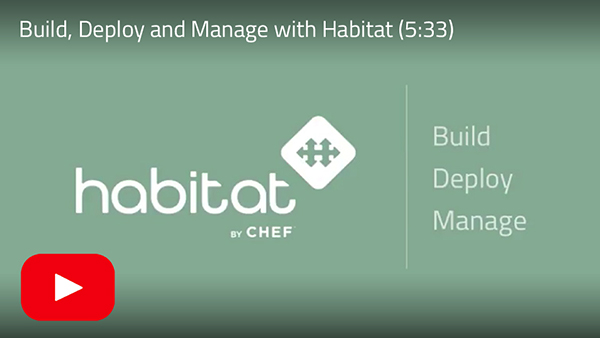

[](https://buildkite.com/chef/habitat-sh-habitat-master-verify?branch=master)
[](https://forums.habitat.sh)
[](https://www.codetriage.com/habitat-sh/habitat)


[Habitat](http://habitat.sh) is open source software that creates platform-independent build artifacts and provides built-in deployment and management capabilities.

The goal of Habitat is to allow you to automate your application behavior when you create your application, and then bundle your application with the automation it needs to behave with the correct run time behavior, update strategies, failure handling strategies, and scaling behavior, wherever you choose to deploy it.

See a quick demo of how to build, deploy and manage an application with Habitat:


**Project State**: [Active](https://github.com/chef/chef-oss-practices/blob/master/repo-management/repo-states.md#active)

**Issues Response Time Max**: 5 business days

**Pull Request Response Time Max**: 5 business days

[](http://www.youtube.com/watch?v=VW1DwDezlqM)

# Table of Contents
* [Diagrams](#diagrams)
* [Training](#training)
* [Install](#install)
* [Contribute](#contribute)
* [Documentation](#documentation)
* [Code Organization](#code-organization)
* [Roadmap](#roadmap)
* [Community and support](#community-and-support)
* [Building](#building)
* [Native](#native-packages)
* [Further reference material](#further-reference-material)
* [Code of Conduct](#code-of-conduct)
* [License](#license)

## Diagrams
Graphics that will help you and your team better understand the concepts and how they fit together into the larger Habitat ecosystem.
### Where Habitat Fits

[](http://habitat.sh#reference-diagram)

Try the interactive infographics on the [website](http://habitat.sh#reference-diagram)!

### How Habitat Works
* [Architecture Overview](https://github.com/habitat-sh/habitat/raw/main/images/habitat-architecture-overview.png)
* [Initial Package Build Flow](https://github.com/habitat-sh/habitat/raw/main/images/habitat-initial-package-build-flow.png)
* [Application Rebuild Flow](https://github.com/habitat-sh/habitat/raw/main/images/habitat-application-rebuild-flow.png)
* [Dependency Update Flow](https://github.com/habitat-sh/habitat/raw/main/images/habitat-dependency-update-flow.png)
* [Promote Packages Through Channels](https://github.com/habitat-sh/habitat/raw/main/images/habitat-promote-packages-through-channels.png)

### Habitat and **Docker**
* [Initial Docker Container Publishing Flow](https://github.com/habitat-sh/habitat/raw/main/images/habitat-initial-docker-container-publishing-flow.png)
* [Automated Docker Container Publishing Flow](https://github.com/habitat-sh/habitat/raw/main/images/habitat-automated-docker-container-publishing-flow.png)

*View all diagrams in [Docs](https://www.habitat.sh/docs/diagrams/)*

## Training
*View all demos and tutorials in [Learn](https://www.habitat.sh/learn/)*


## Install

You can download Habitat from the [Habitat downloads page](https://docs.chef.io/habitat/install_habitat).

Once you have downloaded it, follow the instructions on the page for your specific operating system.

If you are running macOS and use [Homebrew](https://brew.sh), you can use our official [Homebrew tap](https://github.com/habitat-sh/homebrew-habitat).
```
$ brew tap habitat-sh/habitat
$ brew install hab
```

If you are running Windows and use [Chocolatey](https://chocolatey.org), you can install our [chocolatey package](https://chocolatey.org/packages/habitat)
```
C:\> choco install habitat
```

If you do _not_ run Homebrew or Chocolatey, or if you use Linux, you can use the Habitat [install.sh](https://github.com/habitat-sh/habitat/blob/main/components/hab/install.sh) or [install.ps1](https://github.com/habitat-sh/habitat/blob/main/components/hab/install.ps1) script.

Bash:
```
$ curl https://raw.githubusercontent.com/habitat-sh/habitat/main/components/hab/install.sh | sudo bash
```

Powershell:
```
C:\> Set-ExecutionPolicy Bypass -Scope Process -Force
C:\> iex ((New-Object System.Net.WebClient).DownloadString('https://raw.githubusercontent.com/habitat-sh/habitat/main/components/hab/install.ps1'))
```

## Contribute

We are always looking for more opportunities for community involvement. Interested in contributing? Check out our [CONTRIBUTING.md](CONTRIBUTING.md) to get started!

## Documentation

Get started with the [Habitat tutorials](https://www.habitat.sh/learn/) or plunge into the [complete documentation](https://www.habitat.sh/docs/).

## Code Organization

### Core Plans

The Habitat plans that are built and maintained by Habitat's Core Team are in [their own repo.](https://github.com/habitat-sh/core-plans)

### Habitat Supervisor and other core components

The code for the Habitat Supervisor and other core components are in the [components directory](https://github.com/habitat-sh/habitat/tree/main/components).

### Docs

Habitat's website and documentation source is located in the `www` directory of the Habitat source code. See [its README](www/README.md) for more information.

## Roadmap

The Habitat project's roadmap is public and is on our [community page](https://www.habitat.sh/community/).

The Habitat core team's project tracker is also public and on [Github.](https://github.com/habitat-sh/habitat/projects/1)

## Community and support

* [Chef Community Slack](https://community-slack.chef.io/)
* [Forums](https://forums.habitat.sh)
* The Chef Community meeting is every Thursday at 9am Pacific.  More information can be found in the Connect section of [Chef Community](https://community.chef.io/)

## Building

See [BUILDING.md](BUILDING.md) for platform specific info on building Habitat from source.

## Native Packages

See [README.md](https://github.com/habitat-sh/habitat/blob/main/components/hab/src/command/studio/README.md) for info on Native Packages.

## Further reference material

* [The Rust Programming Language](http://doc.rust-lang.org/book/)
* [Rust by Example](http://rustbyexample.com/)
* [Introduction to Bash programming](http://tldp.org/HOWTO/Bash-Prog-Intro-HOWTO.html)
* [Advanced Bash-Scripting Guide](http://www.tldp.org/LDP/abs/html/)
* [Bash Cheat Sheet](http://tldp.org/LDP/abs/html/refcards.html)
* [Writing Robust Bash Shell Scripts](http://www.davidpashley.com/articles/writing-robust-shell-scripts/)
* [Wikibook: Bourne Shell Scripting](https://en.wikibooks.org/wiki/Bourne_Shell_Scripting)
* [What is the difference between test, \[ and \[\[ ?](http://mywiki.wooledge.org/BashFAQ/031)
* [POSIX Shell Command Language](http://pubs.opengroup.org/onlinepubs/9699919799/utilities/V3_chap02.html)

## Code of Conduct
Participation in the Habitat community is governed by the [code of conduct](https://github.com/habitat-sh/habitat/blob/main/CODE_OF_CONDUCT.md).

## License

Licensed under the Apache License, Version 2.0 (the "License");
you may not use this file except in compliance with the License.
You may obtain a copy of the License at

     http://www.apache.org/licenses/LICENSE-2.0

Unless required by applicable law or agreed to in writing, software
distributed under the License is distributed on an "AS IS" BASIS,
WITHOUT WARRANTIES OR CONDITIONS OF ANY KIND, either express or implied.
See the License for the specific language governing permissions and
limitations under the License.

# Copyright
See [COPYRIGHT.md](./COPYRIGHT.md).