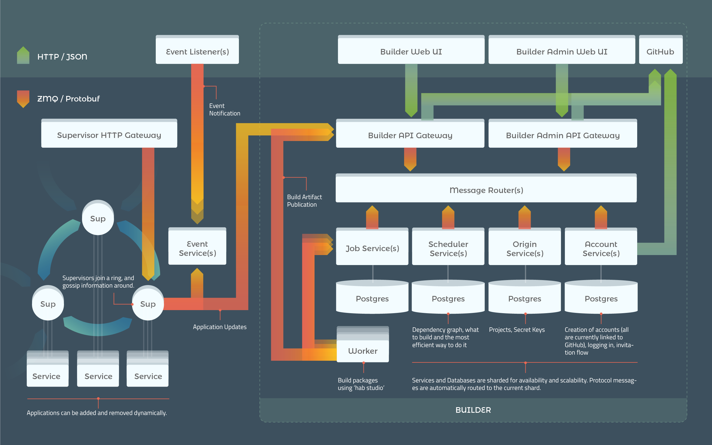

When we launched Chef Habitat last June we also announced that we had begun development of a build service which, in conjunction with the Chef Habitat Supervisor, would round out our vision for the future of continuous integration and deployment of applications. Today we are pleased to announce the general availability of our open source build server - Chef Habitat Builder - for open source projects.

# What Is Chef Habitat Builder?

If you've visited this site before today and clicked on [sign-in](https://bldr.habitat.sh/#/sign-in) or [search packages](https://bldr.habitat.sh/#/pkgs/core) you've actually already seen and used Builder, albeit a much earlier iteration, but the service has been live since last June. Builder performs three jobs for the Chef Habitat community - it builds packages, hosts them, and helps you discover them.

## Market Place & Artifact Repository

The goal of our initial offering of Builder was to provide just enough functionality to fulfill discovery and an API for the Supervisor and Chef Habitat CLI clients for storing and retrieving artifacts. Since these were the only two features available at launch, Builder colloquially became known as "The Depot" after its artifact repository component.

## Hosted Build Service

In today's milestone release we finally enable the namesake feature of Builder: the ability to build packages from plan definitions from a GitHub repository and publish them back to public Builder. This feature is now available for all packages in white-listed origins starting with the [core origin](https://bldr.habitat.sh/#/pkgs/core). If you're working on an open source project that you'd like to package for Chef Habitat we'd love to add your origin to the white-list to enable build functionality for your packages too! Send an email to <humans@habitat.sh> to apply for access.

# Why Build Builder?

There are plenty of great build servers to choose from which cover every combination of hosting option, monetization model, and license agreement, so why build another build service? The answer lies within a principle of our packaging system itself.

Chef Habitat packages are **immutable**, **atomic**, and **isolated** - you cannot change their contents - the services they may contain execute in their own process environment and don't share filesystem resources; and they are either fully installed and available on their host machine or they are not. It is not possible through regular use of Chef Habitat to have a partially installed or modified Chef Habitat package installation. The immutability of these packages also extends to what they are linked to.

## Dependency Linking

Chef Habitat packages dynamically link to explicitly defined dependencies and they will only ever link to the exact version of their dependency they were built against when the package was generated. This gives Chef Habitat packages the feeling of static linking but significantly reduces compilation times by allowing you to download your dependencies as pre-built, cryptographically signed, checksummed packages and dynamically link to them.

We chose this approach as a means to answer the problem of **isolation** in multi-tasking operating systems. Containers accomplish this with an equally effective strategy by ensuring that all software intended to be in a container be included at its build time.

> **COOL ALERT:** An added benefit of isolating software at the packaging layer means it's incredibly easy to have software which depends on different versions of core libraries such as `glibc` on the same machine at once. Cool

The Chef Habitat packaging system guarantees a smooth installation and unimpeded runtime experience because packages are immutable, atomic, and isolated, but these deploy and runtime benefits come at a build time cost, summed up in [Dependent-Builds](#dependent-builds).

## Dependent Builds

Given the following three packages and the scenario:

    Package-C -> Package-B -> Package-A
    Package-C -> Package-A

Package-C depends on Package-B which, in turn, depends on Package-A. Package-C _also_ depends on Package-A. This sample above is a simple and small example of a _dependency graph_. Packages to the left of each `->` are known as a *Dependent* while packages to the right are a *Dependency*.

If Package-A was rebuilt and published to public Builder and then, shortly after, a new build of Package-C would most likely not succeed due to a dependency mediation error. Package-C very likely would have a lenient enough of a dependency on Package-A for the latest build of Package-A which was just published to Builder to be fulfilled. Since Package-B has not been rebuilt just yet with the latest version of Package-A the version that Package-B was built against would conflict with Package-C's desire to have the latest of Package-A. To solve this problem we created Builder.

> **SUPER DUPER**: It's especially super duper that Chef Habitat requires all dependencies to be remediated because it ensures that your application is up to date with the latest bug fixes and security fixes

> **EXTRA DUPER:** In every process started by Chef Habitat you know exactly what packages are present and which ports they open

## Automatic Dependent Rebuilds

The driving force for getting Builder done was to ease the pain of "rebuilding the world". This is the phrase the team has used when something *deep* in the global package graph needs to be rebuilt. [core/glibc](https://app.acceptance.habitat.sh/#/pkgs/core/glibc) is a likely culprit to force this scenario.

To accomplish a world rebuild before Chef Habitat was ready, we would ask an engineer to babysit a set of executing scripts in a very large EC2 instance which traverse the dependency graph from the base branching up and outwards to rebuild every piece of dependent software. In serial :sad_emoji:.

From this need we created the concept of Automatic Dependent Builds which, given the scenario in [Dependent-Builds](#dependent-builds), when Package-A was uploaded would have automatically queued a build for both Package-B and Package-C with Package-B happening before Package-C. If we were to use a larger dependency graph:

    Package-C -> Package-B -> Package-A
    Package-C -> Package-A
    Package-D -> Package-A

In this scenario Package-B and Package-D would rebuild in parallel before Package-C.

> **PRETTY FLY:** If Package-A was rebuilt due to a critical bug or security vulnerability then your application would automatically be rebuilt for you. And if you're using channels... well, you could wake up in the morning with a pretty fly acceptance environment that's been updated overnight without any intervention from you. Just connect all of an environment's supervisors to the channel these packages will be published to start the newly rebuilt package with an [update-strategy](/docs/using-habitat#using-updates). Once you've woken up, had some coffee, and seen that your acceptance environment's Chef Habitat supervisors have successfully downloaded the new package, passed their smoke tests, their health checks, and their compliance tests, you can promote that package from your acceptance channel to your production channel, and see the magic happen again in that environment.

# Architecture

Builder performs its various duties through a set of services written and assembled into a [service-oriented architecture](https://en.wikipedia.org/wiki/Service-oriented_architecture). Each component performs a particular job at a particular point of the lifecycle of a request.

> **Inceptional**: Builder's services are all run by the Chef Habitat Supervisor and Builder is self hosted. That is, Builder's build service produces packages of Builder's services and publishes those packages to itself. The Chef Habitat Supervisor running the Builder services is configured with the rolling update strategy and receives updates from Builder that is running in its Supervision Ring.

## Request Dispatch

Requests originate from a `Web-UI` and through a `Gateway` or directly at a `Gateway`. All requests are translated into our internal messaging format and communicated over [ZeroMQ](http://zeromq.org/) sockets using a binary protocol generated with [Protocol Buffers](https://developers.google.com/protocol-buffers/) through a `Message Router`.

The `Message Router`'s job is to act as a sorting facility by peeking at the envelope of a message and sending it not only to the appropriate back-end service, but also to the correct *instance* of that back-end service. In Builder, some of our back-end services are [sharded](https://en.wikipedia.org/wiki/Shard_(database_architecture)), which means that every message contains some information which acts as a hint for the router to randomly - but deterministically - send each message to the correct instance of a back-end service.

## Job Dispatch

Let's say a GitHub hook has been triggered because the master branch of your project has just been pushed to. This GitHub hook sends a build request to the `Builder API Gateway` for the package associated with that GitHub hook's payload. The message goes to the `Job Service` and a job request would be enqueued for a `Worker` to rebuild your project and publish to Builder. A response from the `Job Service` confirming that the job has been successfully queued is sent back to the `Builder API Gateway` which translates the response into a RESTful HTTP response.

## Studio Worker

A pool of ephemeral `Worker`s are connected to the `Job Service` waiting to accept work. These workers are connected to OS specific queues and only accept work for their OS. When a `Worker` receives a new job it creates a new [Chef Habitat Studio](/docs/glossary#glossary-studio) and clones the source tree for the package's [Plan](/docs/glossary#glossary-plan) into it.

Once the Plan is in the Studio's workspace the [package is built](/docs/developing-packages#plan-builds) and the `Worker` will perform any additional post-processing steps configured for the Plan's job and then publish the built package to a particular release channel in Builder. Additional publishing steps may also be configured. For example, you may want to export your package into a container format and then upload the container to its native artifact repository.

The `Job Service` is notified of success or failure from the `Worker` and it's ready to pick up its next job. Maybe it will pick up a rebuild of a dependent package of the software it just published to Builder... [spoooooky](https://www.youtube.com/watch?v=qu6L9pG_E6o).

# Next Up: Builder Neighborhood

This is the next big iteration of Builder, but there's still a lot more that we want to tackle. Starting after ChefConf we'll be digging into a feature to allow developers and operators to run a configuration of Builder services in their own Personal Neighborhood. This Neighborhood can optionally be connected to another to subscribe to update notifications for packages in it's dependency graph of packages that are in its global package graph. This will allow closed-source projects to be built with all the same benefits of the open source offerings we're releasing today.

If you're interested in tracking our progress on Builder Neighborhoods you can do so by checking out our [project tracker](https://github.com/habitat-sh/habitat/projects/1) or our [roadmap](https://habitat.sh/roadmap). Both Chef Habitat and Builder are [open-source](https://github.com/habitat-sh/habitat) and we'd love to have you join the development efforts!
