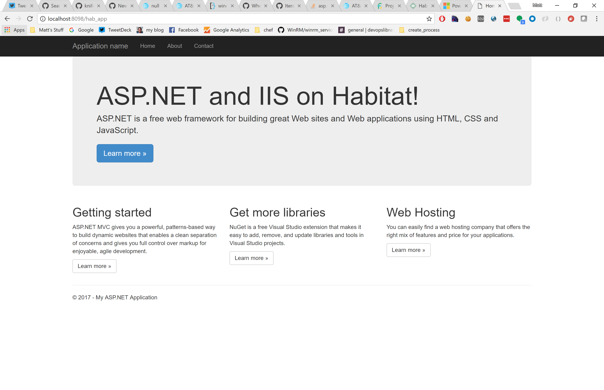
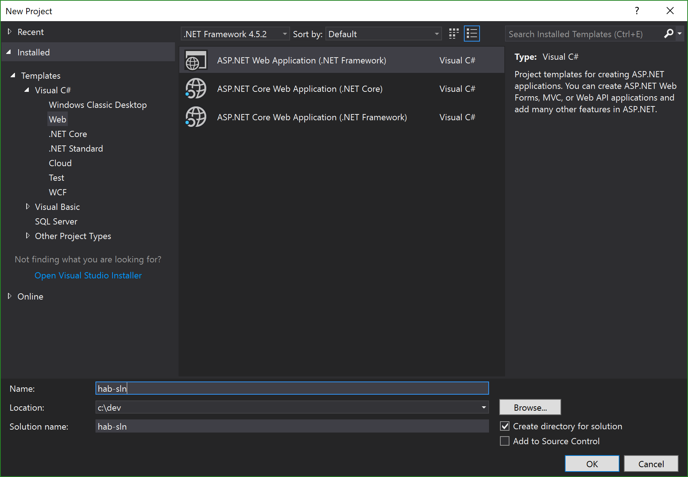
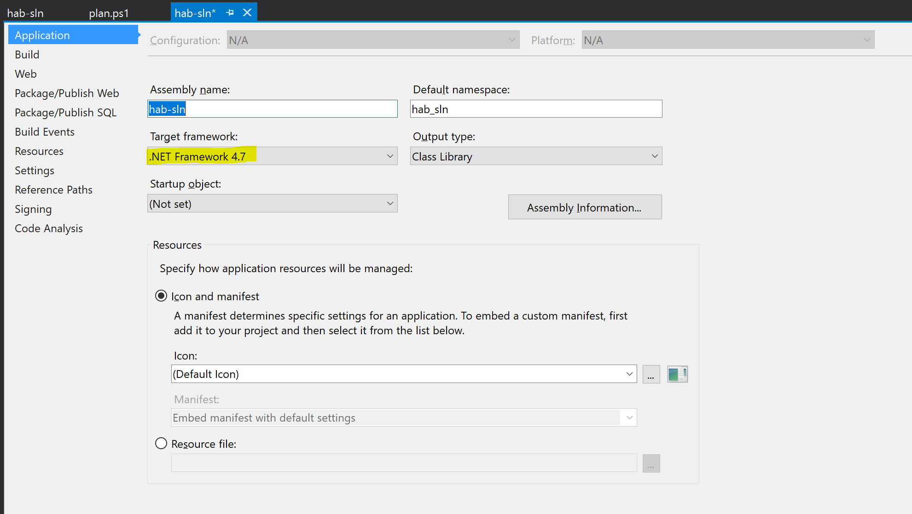
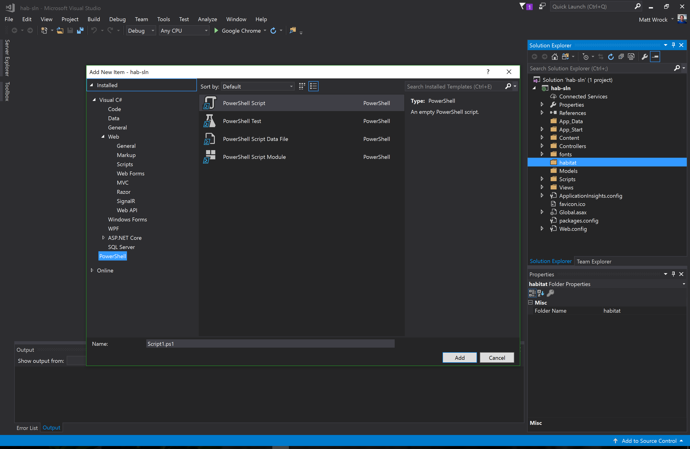

For the past several months we have been working hard to provide full feature parity accross all Habitat components on Windows. We often use an [ASP.NET Core plan](https://github.com/habitat-sh/habitat-aspnet-sample) to test Windows functionality because building and running a [.NET Core](https://www.asp.net/core/overview/aspnet-vnext) application is very similar to developing a Node application not to mention many other runtimes that others use Habitat for building and running their applications. The .NET Core runtime is extremely portable and easy to isolate within a Habitat environment. It does not require machine scoped configuration like its "full framework" cousin. I'm personally excited about .NET Core and really hope others come to adopt it.

However, today, the world's .NET applications run on the .NET full framework and ASP.NET applications run inside IIS and not the lightweight [Kestrel](https://github.com/aspnet/KestrelHttpServer) web server. How do we build and run these inside of Habitat? How would we create packages for the .NET full framework or IIS like we do for Node or nginx? These are truly challenging scenarios because the .NET full framework needs to reside in a specific location on disk and IIS is a feature of the Windows operating system.

This post will walk you through how to work around these challenges and create a plan that builds and runs an ASP.NET full framework application inside of an IIS application pool.

You can find a complete Github repo of this application along with its Habitat plan, hooks and config [here](https://github.com/habitat-sh/habitat-aspnet-full).

## .NET Full Framework and IIS as Infrastructure

First and foremost, we will not be creating Habitat packages for the .NET framework or IIS. We are going to let our configuration management or provisioning system of choice ensure that the .NET framework is installed and that the appropriate IIS features are enabled. When we author our Habitat plan, we will assume that the .NET framework and IIS pieces are already in place. Our plan will focus on our individual .NET application. It will build the application on any machine where the .NET 4.0 CLR is installed, it will setup the IIS application pool and web site, and deploy our app binaries and web artifacts to our nodes where the Habitat supervisor will ensure it is running and update it as updates are available.

So lets get started!

## An ASP.NET application

The first thing we need is an actual ASP.NET application. You may already have one and if so, that's great. Because I don't right now (but I did spend 10 years of my career building them), I'm gonna cheat. I'll open [Visual Studio 2017](https://www.visualstudio.com/) and select file/new/project and then create the stock ASP.NET MVC application template. Earlier Visual Studio like 2015 should work too.



Finally, and mainly to illustrate how to adjust our Habitat plan to target different .NET framework versions, we will target version 4.7.



## Building with a plan.ps1

Right in Visual Studio I'll add a `habitat` folder to my project and then right click on that folder and select Add/New Item. Because I have the [PowerShell Tools Visual Studio Extension](https://poshtools.com/), I have the option to add a PowerShell script and I will add a `plan.ps1` file.



Now I'll add the codes for building this project:

```powershell
$pkg_name="hab-sln"
$pkg_origin="mwrock"
$pkg_version="0.1.0"
$pkg_source="nosuchfile.tar.gz"
$pkg_maintainer="Matt Wrock"
$pkg_license=@('MIT')
$pkg_description="A sample ASP.NET Full FX IIS app"
$pkg_build_deps=@(
  "core/nuget",
  "core/dotnet-47-dev-pack"
)

function invoke-download { }
function invoke-verify { }

function Invoke-Build {
  Copy-Item $PLAN_CONTEXT/../../* $HAB_CACHE_SRC_PATH/$pkg_dirname -recurse -force
  nuget restore $HAB_CACHE_SRC_PATH/$pkg_dirname/$pkg_name/packages.config -PackagesDirectory $HAB_CACHE_SRC_PATH/$pkg_dirname/packages -Source "https://www.nuget.org/api/v2"
  nuget install MSBuild.Microsoft.VisualStudio.Web.targets -Version 14.0.0.3 -OutputDirectory $HAB_CACHE_SRC_PATH/$pkg_dirname/
  $env:TargetFrameworkRootPath="$(Get-HabPackagePath dotnet-47-dev-pack)\Program Files\Reference Assemblies\Microsoft\Framework"
  $env:VSToolsPath = "$HAB_CACHE_SRC_PATH/$pkg_dirname/MSBuild.Microsoft.VisualStudio.Web.targets.14.0.0.3/tools/VSToolsPath"
  ."$env:SystemRoot\Microsoft.NET\Framework64\v4.0.30319\MSBuild.exe" $HAB_CACHE_SRC_PATH/$pkg_dirname/$pkg_name/${pkg_name}.csproj /t:Build /p:VisualStudioVersion=14.0
  if($LASTEXITCODE -ne 0) {
      Write-Error "dotnet build failed!"
  }
}

function Invoke-Install {
  ."$env:SystemRoot\Microsoft.NET\Framework64\v4.0.30319\MSBuild.exe" $HAB_CACHE_SRC_PATH/$pkg_dirname/$pkg_name/${pkg_name}.csproj /t:WebPublish /p:WebPublishMethod=FileSystem /p:publishUrl=$pkg_prefix/www
}
```

This bit of PowerShell script essentially leverages `nuget` and `msbuild` to grab dependencies, compile our code and publish it to our Habitat `pkgs` directory which will be archived to a Habitat `hart` package. It should also be noted that in order for Habitat to build this plan, one does NOT need to have Visual Studio installed. Rather you just need a recent framework version of .NET installed which ships by default on Windows Server 2012R2 and forward. 

Lets build and package our `hart` for this application:

```
C:\dev\hab-sln> hab studio enter -w
   hab-studio: Creating Studio at /hab/studios/dev--hab-sln
» Importing origin key from standard input
★ Imported secret origin key core-20170318210306.
   hab-studio: Entering Studio at /hab/studios/dev--hab-sln
** The Habitat Supervisor has been started in the background.
** Use 'hab svc start' and 'hab svc stop' to start and stop services.
** Use the 'Get-SupervisorLog' command to stream the supervisor log.
** Use the 'Stop-Supervisor' to terminate the supervisor.

[HAB-STUDIO] Habitat:\src> build .\hab-sln\
   : Loading C:\hab\studios\dev--hab-sln\src\hab-sln\\habitat\plan.ps1
   hab-sln: Plan loaded
   hab-sln: Validating plan metadata
   ...
```

This should compile and package our `hab-sln` project. Lets drill in a bit closer on a few of the moving parts of the plan.

### The Nuget Command Line Utility

Note that our plan takes a build dependency on `core/nuget`. That is a core Habitat plan that packages the `nuget.exe` utility. Our build will use that to do a "package restore" of all packages declared in our project's `packages.config` file. Visual Studio would essentially do the same if we were building inside the IDE.

### Using the Right .NET Reference Assemblies

When you build a .NET project, `msbuild` searches for reference assemblies matching the framework version you are targeting. You can build a .NET assembly against any framework version compatible with the CLR version you are using regardless of the version of the .NET framework you have installed. You just need the right reference assemblies. We use the `core/dotnet-47-dev-pack` because we are targeting 4.7 and set the `TargetFrameworkRootPath` to its contents. This may be optional since if the reference assemblies are not present, the build will use the assemblies in your Global Assembly Cache. However, the build could fail if there are APIs used that are not in your locally installed assemblies so it is good practice to reference the appropriate targeting pack.

### Getting the VisualStudio.Web.targets

Most of the `MSBUILD` targets, `.prop` files, and the `msbuild.exe` needed to build .NET assemblies can be found in your local `c:\windows\Microsoft.NET` folder. However, the web targets are not. The easiest way to get those without installing Visual Studio is to use `nuget` to install the `MSBuild.Microsoft.VisualStudio.Web.targets` package and then point `VSToolsPath` to its location.

## Configuring IIS Pools, Sites and Applications

As mentioned earlier, we won't rely on Habitat for the installation of .NET or the right IIS features. However, it makes sense that Habitat should be able to configure IIS so that the application can run and behave as expected. We will leverage our run hook to do this.

There are two approaches we can take in our hook. One is a bit dated and clunky, but works everywhere. The other is more elegant, but limited to machines where [WMF 5](https://www.microsoft.com/en-us/download/details.aspx?id=50395) (or higher) is installed.

### appcmd.exe

This is the old-fashioned `appcmd.exe` of yore. For our purposes in our little sample app, it can get the job done:

```powershell
."$env:SystemRoot\System32\inetsrv\appcmd.exe" list apppool "{{cfg.app_pool}}" | Out-Null
if($LASTEXITCODE -ne 0) {
    Write-Host "Creating App Pool {{pkg.app_pool}}" -ForegroundColor Yellow
    ."$env:SystemRoot\System32\inetsrv\appcmd.exe" add apppool /name:"{{cfg.app_pool}}"
    ."$env:SystemRoot\System32\inetsrv\appcmd.exe" set apppool /apppool.name:"{{cfg.app_pool}}" /managedRuntimeVersion:v4.0
}

."$env:SystemRoot\System32\inetsrv\appcmd.exe" list site "{{cfg.site_name}}" | Out-Null
if($LASTEXITCODE -ne 0) {
    Write-Host "Creating Web Site {{cfg.site_name}}" -ForegroundColor Yellow
    ."$env:SystemRoot\System32\inetsrv\appcmd.exe" add SITE /name:"{{cfg.site_name}}" /PhysicalPath:"$((Resolve-Path '{{pkg.svc_path}}').Path)" /bindings:http://*:{{cfg.port}}
    Write-Host "Binding Web Site {{cfg.site_name}} to pool {{cfg.app_pool}}" -ForegroundColor Yellow
    ."$env:SystemRoot\System32\inetsrv\appcmd.exe" set site /site.name:"{{cfg.site_name}}" "/[path='/'].applicationPool:{{cfg.app_pool}}"
}

."$env:SystemRoot\System32\inetsrv\appcmd.exe" list app /site.name:"{{cfg.site_name}}" | Findstr "{{cfg.app_name}}" | Out-Null
if($LASTEXITCODE -ne 0) {
    Write-Host "Creating Application {{cfg.app_name}} at path /{{pkg.name}} with physical path '$((Resolve-Path `"{{pkg.svc_var_path}}`").Path)'"
    ."$env:SystemRoot\System32\inetsrv\appcmd.exe" add app /site.name:"{{cfg.site_name}}" /path:"/{{cfg.app_name}}" /PhysicalPath:"$((Resolve-Path '{{pkg.svc_var_path}}').Path)" /applicationPool:"{{cfg.app_pool}}"
}

."$env:SystemRoot\System32\inetsrv\appcmd.exe" start apppool "{{cfg.app_pool}}"
."$env:SystemRoot\System32\inetsrv\appcmd.exe" start site "{{cfg.site_name}}"
```

This uses values in our configuration to create the app pools, site and application folders needed to run our site.

### DSC

If you are familiar with [DSC](https://docs.microsoft.com/en-us/powershell/dsc/overview) (particularly the resources in `xWebAdministration`), then using Habitat to configure IIS should come naturally. We will create a `config` folder in our `habitat` directory and a `website.ps1` inside of that. Here you might have the following configuration:

```powershell
Configuration NewWebsite
{
    Import-DscResource -Module xWebAdministration
    Node 'localhost' {

        xWebAppPool {{cfg.app_pool}}
        {
            Name   = "{{cfg.app_pool}}"
            Ensure = "Present"
            State  = "Started"
        }
        
        xWebsite {{cfg.site_name}}
        {
            Ensure          = "Present"
            Name            = "{{cfg.site_name}}"
            State           = "Started"
            PhysicalPath    = Resolve-Path "{{pkg.svc_path}}"
            ApplicationPool = "{{cfg.app_pool}}"
            BindingInfo = @(
                MSFT_xWebBindingInformation
                {
                    Protocol = "http"
                    Port = {{cfg.port}}
                }
            )
        }

        xWebApplication {{cfg.app_name}}
        {
            Name = "{{cfg.app_name}}"
            Website = "{{cfg.site_name}}"
            WebAppPool =  "{{cfg.app_pool}}"
            PhysicalPath = Resolve-Path "{{pkg.svc_var_path}}"
            Ensure = "Present"
        }
    }
}
```

This uses Habitat's templating capabilities to ensure that IIS points to where our application is stored in the Habitat `svc` folder and uses the configured port.

Our `run` hook will apply this configuration whenever we start our ASP.NET application and make sure everything is configured according to our DSC or `appcmd.exe` calls.

## Running our Application in the Habitat Supervisor

In full framewoerk apps, IIS is often in charge of the process lifecycle of our app, unlike Node or .NET Core where we would simply invoke `node.exe` or `dotnet.exe` to run our app in a lightweight web server. So instead of handing off our run hook to call into a runtime, we just need to make sure IIS is configured and the site and app pool are both in the "running" state. We already covered IIS configuration above. However if the `run` hook terminates, the supervisor assumes our service has terminated. As a result, we will have PowerShell loop and check that our application endpoint is responsive:

```powershell
try {
    Write-Host "{{pkg.name}} is running"
    $running = $true
    while($running) {
        Start-Sleep -Seconds 1
        $resp = Invoke-WebRequest "http://localhost:{{cfg.port}}/{{cfg.app_name}}" -Method Head
        if($resp.StatusCode -ne 200) { $running = $false }
    }
}
catch {
    Write-Host "{{pkg.name}} HEAD check failed"
}
finally {
    # Add any cleanup here which will run after supervisor stops the service
    Write-Host "{{pkg.name}} is stoping..."
    ."$env:SystemRoot\System32\inetsrv\appcmd.exe" stop apppool "{{cfg.app_pool}}"
    ."$env:SystemRoot\System32\inetsrv\appcmd.exe" stop site "{{cfg.site_name}}"
    Write-Host "{{pkg.name}} has stopped"
}
```

As you can see, we simply call `Invoke-Webrequest` to send a `HEAD` request to our app. If the response is not a `200`, then we assume things have gone horribly wrong and exit the loop. Furthermore, if the supervisor stops our service (`hab svc stop mwrock/hab-sln`), execution will move to the `finally` block, where we tell IIS to shut down our application.

So let's run our application. If you are not already in a Windows studio, enter `hab studio enter -w` from the root of our solution. Assuming that the plan has been built as shown above, We can stream the supervisor log and start our service:

```
[HAB-STUDIO] Habitat:\src> Get-SupervisorLog
[HAB-STUDIO] Habitat:\src> hab svc start mwrock/hab-sln
hab-sup(MN): Supervisor starting mwrock/hab-sln. See the Supervisor output for more details.
```

Our supervisor log should look something like this:

```
hab-sup(MR): Supervisor Member-ID 883fe61fe11b4e64b20245adc9830bed
hab-sup(MR): Starting gossip-listener on 0.0.0.0:9638
hab-sup(MR): Starting http-gateway on 0.0.0.0:9631
hab-sup(MR): Starting mwrock/hab-sln
hab-sln.default(SR): Hooks recompiled
default(CF): Updated website.ps1 945a1ab52bb3ad41211cd77625dd870244be1a81b822e7db171795c4f22ade86
hab-sln.default(SR): Configuration recompiled
hab-sln.default(SR): Initializing
hab-sln.default(SV): Starting service as user=matt, group=
hab-sln.default(O): Ensuring xWebAdministration DSC resources are installed...
hab-sln.default(O): Compiling DSC mof...
hab-sln.default(O): WARNING: The names of some imported commands from the module
hab-sln.default(O): 'PSDesiredStateConfiguration' include unapproved verbs that might make them less
hab-sln.default(O): discoverable. To find the commands with unapproved verbs, run the Import-Module
hab-sln.default(O): command again with the Verbose parameter. For a list of approved verbs, type
hab-sln.default(O): Get-Verb.
hab-sln.default(O): Applying DSC configuration...
hab-sln.default(O):
hab-sln.default(O): hab-sln is running
```

and browsing to `http://localhost:8099/hab_app` should bring up our ASP.NET web site.

Now let's go crazy and change the web site port:

```
[HAB-STUDIO] Habitat:\src> 'port = 8098' | hab config apply hab-sln.default 1
» Applying configuration for hab-sln.default incarnation 1
Ω Creating service configuration
✓ Verified this configuration is valid TOML
↑ Applying to peer 127.0.0.1:9638
★ Applied configuration
```

and our supervisor log reads:

```
hab-sln.default(SR): Hooks recompiled
default(CF): Updated website.ps1 9d47f71105cd9971a516c3be4567dec3779f156cfaa72910304f3a79aca056f4
hab-sln.default(SR): Configuration recompiled
hab-sln.default(O): hab-sln is stoping...
hab-sln.default(O): "hab_pool" successfully stopped
hab-sln.default(O): "hab_site" successfully stopped
hab-sln.default(O): hab-sln has stopped
hab-sln.default(O): Ensuring xWebAdministration DSC resources are installed...
hab-sln.default(O): Compiling DSC mof...
hab-sln.default(O): WARNING: The names of some imported commands from the module
hab-sln.default(O): 'PSDesiredStateConfiguration' include unapproved verbs that might make them less
hab-sln.default(O): discoverable. To find the commands with unapproved verbs, run the Import-Module
hab-sln.default(O): command again with the Verbose parameter. For a list of approved verbs, type
hab-sln.default(O): Get-Verb.
hab-sln.default(O): Applying DSC configuration...
hab-sln.default(O):
hab-sln.default(O): hab-sln is running
```

Our port change forces an application restart and now we can reach our application on `http://localhost:8098/hab_app`.

```powershell
C:\dev\habitat-aspnet-full [master]> Invoke-WebRequest http://localhost:8098/hab_app -Method Head


StatusCode        : 200
StatusDescription : OK
```

Of course changing a port is just one small example of a multitude of possible configuration change scenarios where we can inject a configuration change into our Habitat ring and every service can respond. 

## What's Next?

Here we have seen how we can build and run our IIS .NET full framework applications but it would be much better if all you needed to do was add a 5 line `plan.ps1` without all the msbuild goo and also write much more concise hooks. We'll be looking at scaffolding next to make it just that easy.

In the mean time, we'd love to hear what you think! Do you have ASP.NET applications that you'd like to build and run with Habitat? Do you think this pattern would work for your applications and tour team's work flows? Do you think it would need some tweaking. We'd love to hear! You can talk with us in the #windows [Habitat slack](http://slack.habitat.sh/) channel.
