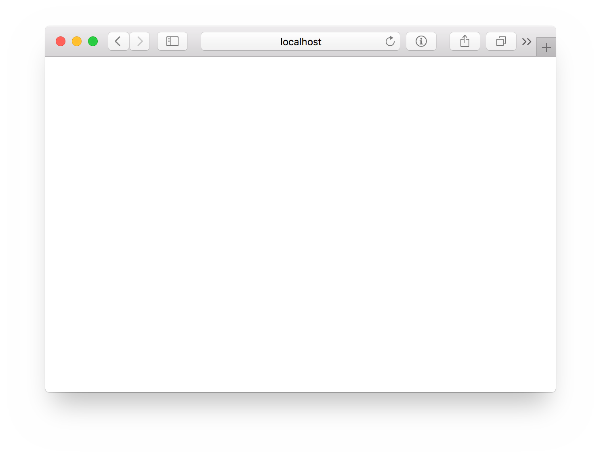
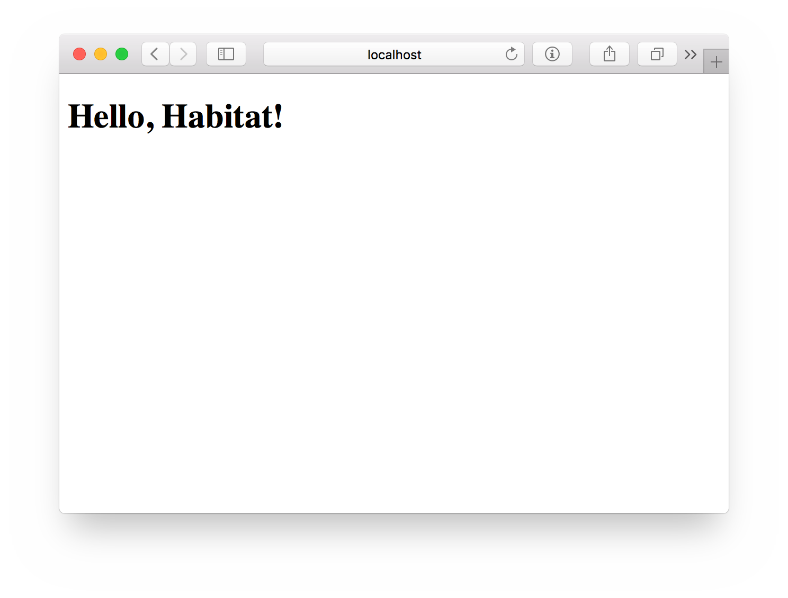

I build a lot of websites, and until somewhat recently, my workflow would usually go something like this:

1. Have an idea.
1. Build a website.
1. Fumble through getting version 1 of the website out into the world.
1. Briefly celebrate before wondering how to get version 2 out into the world to fix all the bugs I shipped in version 1.

Fortunately, I work on the Habitat project, so these days I spend less time wondering how I'm going to ship my web projects, and more time actually developing them (although I still ship more than my fair share of bugs).

In this post, I'll show you how to package a simple website with Habitat and serve it with the [Nginx web server](http://nginx.org/en/).

## Start with a Simple Website

We'll compose our website by building two Habitat packages &mdash; one for the website, one for the server. We want to be able to ship these packages independently of one another, so let's start by creating a folder with a subfolder for each of them:

    $ cd ~
    $ mkdir -p hello-hab/site hello-hab/server
    $ touch ~/hello-hab/site/index.html
    $ cd hello-hab

With your editor of choice, copy the markup below into `index.html` and save it:

    <!doctype html>
    <html lang="en">
      <head>
        <title>Hello!</title>
        <meta charset="utf-8">
      </head>
      <body>
        <h1>Hello, Habitat!</h1>
      </body>
    </html>

Excellent &mdash; we have a website! We're just about ready to start packaging.

## Get Set Up with Habitat

Before we go further, we need to make sure you've been through the [Download and Install](/download/) docs and set up your machine to build Habitat packages. By now, you'll need to have:

* Downloaded and installed Habitat
* Created an account on the Habitat Depot
* Created an Origin for your Habitat packages
* Configured your workstation by running through `hab setup` (and generated your origin keys, since we'll be using them here to sign the packages we make)

Ideally, you've also made it through some [tutorials](/tutorials/) and [docs](/docs/) (particularly the [packaging-related ones](/docs/create-packages-overview/)), so you've got some understanding of Habitat plans, packages and services.

As a quick test, try running `hab --version`. Here's what I see when I do that today:

    $ hab --version
    hab 0.29.1/20170810235219

I mentioned the need for your origin's public and private keys; we'll need those on your machine as well. I'm presently on a Mac, so when I ran `hab setup` for the first time, Habitat created those keys for me and placed them at `~/.hab/cache/keys`:

    $ ls ~/.hab/cache/keys
    cnunciato-20170304222818.pub cnunciato-20170304222818.sig.key

If what you see when you run these commands looks significantly different, take a pass through [Download and Install](/download) and doublecheck that you covered everything, then come back here when you're done. (And as always, if you run into trouble, hop into the **#general** channel [on the Habitat Slack](http://slack.habitat.sh/) and we'll help get you unstuck.)

All right! Let's do some packaging.

## Package the Website

Let's start in the containing folder we created a moment ago:

    $ cd ~/hello-hab
    $ ls
    server site

We'll begin by creating a plan for the site. The goal for this plan is to produce a Habitat package containing just our humble little HTML page, so we can keep our plan pretty simple by creating just [a `plan.sh` file](/docs/create-plans/):

    $ mkdir site/habitat
    $ touch site/habitat/plan.sh

In `site/habitat/plan.sh`, place the following plan definition (substituting your own values for `pkg_origin` and `pkg_maintainer`, of course):

    pkg_name="hello-hab-site"
    pkg_origin="cnunciato"
    pkg_version="0.1.0"
    pkg_maintainer="Chris Nunciato <chris@nunciato.org>"

    do_build() {
      return 0
    }

    do_install() {
      mkdir -p "${pkg_prefix}/dist"
      cp -v index.html "${pkg_prefix}/dist/"
    }

As noted in [the plan docs](/docs/reference/plan-syntax/), the `do_build` step runs `make` by default &mdash; but since we don't have a Makefile in our source code (and don't really have any processing to do on it otherwise), we can bypass this step by providing our own "do nothing" implementation and return `0` to indicate success. (Yay!)

Our `do_install` step also overrides Habitat's default behavior, this time by copying `index.html` from its location in our source tree into its final destination in the rendered package &mdash; a folder I've named, somewhat web-conventionally, `dist`). If our site were more complex, or if we'd performed some sort of a build step in `do_build` to produce a compiled web app, we might expand this step to do a bit more work &mdash; but for now, we've done all we need.

Now, Habitat recognizes a number of [environment variables](/docs/reference/environment-vars/) you can use to make your plan-authoring experience a little nicer. Since I do most of my plan development on a Mac, I often use `HAB_DOCKER_OPTS`, which passes whatever value I specify as a string of command-line arguments to Docker when I enter [the Habitat studio](https://www.habitat.sh/docs/concepts-studio/) (which runs in a Docker container on the Mac). So if I'm building a website package and would like to view my site in a browser, I'll need to map a port from the container to my Mac &mdash; for example, port 80 in the container to 8080 on my machine.  I can do that pretty easily by exporting that variable before running `hab studio enter`.

Let's do that now, as it'll come in handy later when we start the web server. And let's also make sure we enter the studio at a level *above* our two packages so we can work with them both in a single studio session:

    $ export HAB_DOCKER_OPTS="-p 8080:80"   # Maps localhost:8080 to port 80 in the studio
    $ cd ~/hello-hab
    $ hab studio enter

    hab-studio: Creating Studio at /hab/studios/src (default)
      hab-studio: Importing cnunciato secret origin key
    » Importing origin key from standard input
    ★ Imported secret origin key cnunciato-20170304222818.
      hab-studio: Entering Studio at /hab/studios/src (default)
      hab-studio: Exported: HAB_ORIGIN=cnunciato

Note that Habitat recognized my personal origin (`cnunciato`) and secret key, which I'll use for signing my site and server packages. Now I can tell Habitat to build the package we've defined at `./site/habitat/plan.sh`:

    [1][default:/src:0]# build site

Your output should look something like this (I've removed a few lines to point out the good parts):

    : Loading /src/site/habitat/plan.sh
      hello-hab-site: Plan loaded
    ...
      hello-hab-site: Preparing to build
      hello-hab-site: Building
    'index.html' -> '/hab/pkgs/cnunciato/hello-hab-site/0.1.0/20170810182846/site/index.html'
      hello-hab-site: Installing
    ...
    ★ Signed artifact /hab/cache/artifacts/cnunciato-hello-hab-site-0.1.0-20170810182846-x86_64-linux.hart.
    mkdir: created directory '/src/results'
    '/hab/cache/artifacts/cnunciato-hello-hab-site-0.1.0-20170810182846-x86_64-linux.hart' -> '/src/results/cnunciato-hello-hab-site-0.1.0-20170810182846-x86_64-linux.hart'
      hello-hab-site: hab-plan-build cleanup
      hello-hab-site:
      hello-hab-site: Source Path: /src/site
      hello-hab-site: Installed Path: /hab/pkgs/cnunciato/hello-hab-site/0.1.0/20170810182846
      hello-hab-site: Artifact: /src/results/cnunciato-hello-hab-site-0.1.0-20170810182846-x86_64-linux.hart
      hello-hab-site: Build Report: /src/results/last_build.env
      hello-hab-site: SHA256 Checksum: e52f40cac4e606683be94b3beccbd86a3c8e5e2a8a1e804351fc39c2564af6e3
      hello-hab-site: Blake2b Checksum: d08a05238de1341a1de23242e140ebe77ca59411dc69d1f4aabb5c35f4e06e6a
      hello-hab-site:
      hello-hab-site: I love it when a plan.sh comes together.
      hello-hab-site:
      hello-hab-site: Build time: 0m0s

Okay! According to this, we should now have a signed Habitat package containing our website:

    [2][default:/src:0]# ls ./results
    cnunciato-hello-hab-site-0.1.0-20170810182846-x86_64-linux.hart  last_build.env

Great! Our website is done. Let's move on to the server.

## Package the Web Server

Keeping the Habitat studio open, in a new terminal tab, change to the `server` folder and run `hab plan init` to generate a bare-bones Habitat plan and folder structure:

    $ cd ~/hello-hab/server
    $ hab plan init

That should leave you with some folders and files shaped generally like this:

    server
    └── habitat
        ├── config
        ├── hooks
        ├── default.toml
        └── plan.sh

With our server plan, the goal is to produce a package that defines a service capable of serving the pages of our website &mdash; specifically, the one we just built into our `hello-hab-site` package &mdash; and we can use [Habitat's `core/nginx` package](https://bldr.habitat.sh/#/pkgs/core/nginx) to do exactly that.

We'll do so by composing a new plan that *depends* on `core/nginx`, bundle an Nginx configuration file with it, and expose some configurable properties to allow us to set things like ports, document roots and so on according to our needs. Let's start with the plan file.

In `server/habitat/plan.sh`, modify the generated plan file to include only the parts we need for now (again, substituting your own values where appropriate):

    pkg_name="hello-hab-server"
    pkg_origin="cnunciato"
    pkg_version="0.1.0"
    pkg_maintainer="Christian Nunciato <chris@nunciato.org>"
    pkg_svc_user="root"
    pkg_deps=(core/nginx)

    do_build() {
      return 0
    }

    do_install() {
      return 0
    }

There are a couple of things worth pointing out here (all of which is detailed in the [plan-authoring docs](/docs/reference/plan-syntax/)). One is the specification of `pkg_svc_user`, which we set here as `root` because we'll need the [Nginx master process](http://nginx.org/en/docs/beginners_guide.html) to be able to bind to port 80, which typically requires elevated privileges. (Worker processes, as you'll see later, will be run as a different user.) Another is the declaration of `core/nginx` as a dependency, and then finally, since `core/nginx` takes care of building the Nginx server for us, we're left with nothing to do in our own build and install steps, so we can return zero for both of them.

Now let's run a build just to make sure we're on the right track. Back in our still-open Habitat studio:

    [3][default:/src:0]# build server

If all goes well, you should end up with a server package in `./results` now, too:

    [4][default:/src:0]# ls ./results
    cnunciato-hello-hab-server-0.1.0-20170810222842-x86_64-linux.hart
    cnunciato-hello-hab-site-0.1.0-20170810182846-x86_64-linux.hart
    last_build.env

We aren't done yet &mdash; we've just validated we can build &mdash; but we're well on our way. Two small steps remain: making our service configurable and describing how to start it.

## Configure the Web Server

Let's keep the configuration as simple as possible for now. (Amazing things can be done with an [Nginx config](http://nginx.org/en/docs/beginners_guide.html), but only a few of them matter to us today.) Make a new file to hold our initial configuration:

    $ cd ~/hello-hab
    $ touch server/habitat/config/nginx.conf

And inside that new file, place the following Habitat [configuration template](/docs/create-packages-configure/#sts=Add configuration to plans):

    daemon off;
    pid {{ pkg.svc_var_path }}/pid;
    worker_processes {{ cfg.worker_processes }};

    events {
      worker_connections {{ cfg.events.worker_connections }};
    }

    http {
      client_body_temp_path {{ pkg.svc_var_path }}/client-body;
      fastcgi_temp_path {{ pkg.svc_var_path }}/fastcgi;
      proxy_temp_path {{ pkg.svc_var_path }}/proxy;
      scgi_temp_path {{ pkg.svc_var_path }}/scgi_temp_path;
      uwsgi_temp_path {{ pkg.svc_var_path }}/uwsgi;

      server {
        listen {{ cfg.http.server.listen }};
        root {{ cfg.http.server.root }};
        index {{ cfg.http.server.index }};
      }
    }

A few things to note about what we've included here:

  * `deamon off`: Tells Nginx to run in the foreground, which allows it to be managed by the Habitat supervisor
  * `*_temp_path`: Directives that specify temporary file paths; these are currently required by `core/nginx`, so we specify them here as subpaths of `pkg.svc_var_path` (which ultimately ends up at `/hab/svc/hello-hab-server/var/`)
  * `listen`: The port on which we'll listen for HTTP requests
  * `root`: The fully qualified path to the files of our website
  * `index`: The default document of our website

When we start our web-server service, Habitat will combine the template above with metadata supplied by our package (the `pkg.*` expressions) and values we provide in our TOML files (the `cfg.*` ones) and produce a well-formed configuration file that `nginx` can consume when it starts. Let's finish this off by adding some default values to `server/habitat/default.toml`, which was created for you when you ran `hab plan init`:

    # Use this file to templatize your application's native configuration files.
    # See the docs at https://www.habitat.sh/docs/create-packages-configure/.
    # You can safely delete this file if you don't need it.

    worker_processes = 1

    [events]
    worker_connections = 512

    [http.server]
    listen = 80
    root = "/hab/svc/hello-hab-server/static"
    index = "index.html"

Perfect. All we have left are the scripts that start up the service.

## Add Some Service Hooks

The Habitat docs explain all there is to know about [service hooks and how to use them](/docs/reference/plan-syntax/#sts=Hooks), so we're going to continue keeping things simple and define only the hooks we need to get our server package running:

  * An **init** hook, which is a shell script run by the Habitat supervisor as a service starts up, and
  * A **run** hook, called afterward, which is responsible for starting the service that the supervisor will manage.

If you glance back at `config/nginx.conf` and `default.toml`, you'll see we're essentially telling Nginx that when it starts, it can expect to find a web page at `/hab/svc/hello-hab-server/static/index.html` &mdash; but we haven't done anything to make that happen yet. While our ultimate plan is to serve the file we bundled into `hello-hab-site`, we might also want to package a default home page *with* our web-server package, and the `init` hook gives us an opportunity to demonstrate one (slightly contrived) way to do that.

Make a new file, `server/hooks/init`, and give it the following contents:

    #!/bin/sh

    # Make an empty HTML file to be served by default.
    touch "{{ pkg.svc_static_path }}/index.html"

    # Apply permissions allowing Nginx workers to read what's in our static path.
    chown hab:hab "{{ pkg.svc_static_path }}"

It might seem a little wierd to serve up an empty web page like this, but my intention is just to explain why we need the *next* line, wherein we change the ownership of `pkg.svc_static_path`.

Recall that our server plan sets `pkg_svc_user` to `root` (we explained why earlier), so when the supervisor runs our init hook, it runs that hook as `root` as well, leaving `index.html` readable only by `root`. But since `core/nginx` is written to have Nginx spawn its worker processes as `hab` and not `root`, if we'd omitted that `chown`, started our server and browsed to it, we'd have been greeted with a not-so-friendly response of **403: Forbidden** and found a **Permission Denied** error in our service logs.

With our minimally helpful init hook in place, let's finish off with a `run` hook. Make a new file, `server/habitat/hooks/run`, containing:

    #!/bin/sh

    # Start the Nginx server, passing it our bundled configuration file.
    exec {{ pkgPathFor "core/nginx" }}/bin/nginx -c "{{ pkg.svc_config_path }}/nginx.conf" 2>&1

With this line, we're instructing the Habitat supervisor to:

  * Start `nginx` using the binary packaged in `core/nginx` (`exec` runs that command without creating a new process),
  * Pass it our now-rendered config file (with Nginx's `-c` option), and
  * Merge `stderr` into `stdout` so the supervisor can capture both of them as a single stream.

And that's it. We should now be able to build the server package:

    [5][default:/src:0]# build server

And when that's done, start it up:

    [6][default:/src:0]# hab start cnunciato/hello-hab-server
    hab-sup(MN): Supervisor starting cnunciato/hello-hab-server. See the Supervisor output for more details.

Success! We can tail the server logs by running `sl` (short for `sup-log`). `Ctrl-C` stops the tailing.

And because you exported `HAB_DOCKER_OPTS` earlier to map port 80 in the container to 8080 on your machine, you should also be able to browse to [http://localhost:8080](http://localhost:8080) and gaze in wonder at your creation:

## Hook Up the Website

That's great, and you should be proud &mdash; but a blank page isn't going to win you the Internet. Let's update our server's configuration to use `hello-hab-site`'s `dist` folder (where our HTML file lives now) as its new document root.

To do that, we'll [use `hab config apply` to send a bit of TOML](/docs/run-packages-apply-config-updates/) to our server's [service group](/docs/concepts-services/) (and mind that line break &mdash; it needs to be included, or you'll get complaints about malformed TOML, and the change wont' be applied):

    [7][default:/src:0]# echo "[http.server]
    root = '$(hab pkg path cnunciato/hello-hab-site)/dist'" | hab config apply hello-hab-server.default 1

In response, you should see that the change was applied successfully:

    » Applying configuration for hello-hab-server.default incarnation 1
    Ω Creating service configuration
    ✓ Verified this configuration is valid TOML
    ↑ Applying to peer 127.0.0.1:9638
    ★ Applied configuration

Now go ahead and give that browser a reload, and you should finally see what you've been waiting for:

## Summing Up

That was a whole bunch of words to explain what was really just a few lines of code (which, by the way, [is up on GitHub](https://github.com/cnunciato/hello-hab) if you'd like to see everything in context), and we've covered a lot. We've learned:

  * How to build a package for a static website and a web server, and how to enable those packages to interoperate and be shipped independently of one another
  * How to expose configurable aspects of a package, and how to apply configuration changes to a service at runtime
  * How to develop multiple packages in a Habitat studio

So what's next? In future posts, we might develop our website package into a more sophisticated single-page web app, package a REST API to support it, extend our web-server configuration, add a database, build some containers, deploy, scale ... so many things. In the meantime, you might try a few on your own, like:

 * [Uploading both packages](/docs/share-packages-overview/#uploading-packages-to-the-depot) to the Habitat Depot,
 * [Installing them](/docs/reference/habitat-cli/#hab-pkg-install) on a server,
 * [Running the web-server package](/docs/share-packages-overview/#running-packages-from-the-depot) from the Depot, and
 * Iterating on the website package by building and uploading revisions to the Depot.

In doing so, you may find that the pattern we've outlined here &mdash; using `hab config apply` to prompt the web server to pick up changes to the website package &mdash; works nicely, but does require the somewhat manual step of running that command (and remembering to increment the version number). It'd be better if the Habitat supervisor could detect a new version of that package on the Depot, install it for you, and have the web server pick up the change automatically.

One way to do that would be with [scaffolding](/docs/concepts-scaffolding/) to make it easier to package static websites or single-page JavaScript web applications. We've just started talking about this one, so expect to hear more about that here as it develops.

Until then, have fun! [We'll see you in Slack](http://slack.habitat.sh/).
