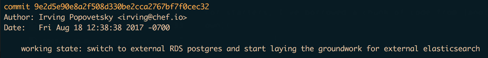
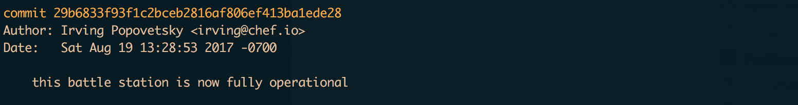
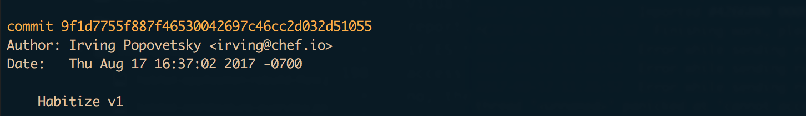
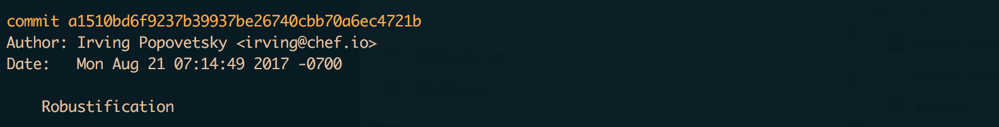

In the [first part of this
series](/blog/2017/09/a-journey-with-habitat-on-amazon-ecs-part1/)
we got the [Chef Automate
Pilot](https://learn.chef.io/modules/chef-automate-pilot/scan-for-compliance#/)
container stack up and running on ECS. Now let’s make it survive termination of
any container or EC2 instance without losing data by adding AWS RDS, EFS and
Elasticsearch. A story told in 3 git commits:

*****

## RDS and EFS

<a href="https://github.com/chef-customers/aws_native_chef_server/commit/9e2d5e90e8a2f508d330be2cca2767bf7f0cec32#diff-5defeeb087e0527b6a3ade7ca4a1af85" target="_blank">
</a>

We know that Chef Automate stores almost all of its state in PostgreSQL, but is
also a Git server and stores repositories on disk. We need to get all of that
data out of the disposable container volumes and into highly available
persistence stores.

### PostgreSQL

For starters, I’ve borrowed a chunk of code from [another template I
own](https://github.com/chef-customers/aws_native_chef_server/blob/master/backendless_chef.yaml#L609)
to add the `AWS::RDS::DBInstance` resource and friends — that was the easy part.
Trickier is to extract the `postgresql` and `postgresql-data` containers from
the stack.

Once you remove those two from the `ContainerDefinitions`, you have to take care
of two things:

1.  All of the other containers previously considered `postgresql` to be the
*Initial Peer*, so I’ll just re-point that to the `rabbitmq` container because
we’ll be keeping that one, and it is now the most depended-on container.
1.  Many of the containers also had binds to postgresql (`--bind
database:postgresql.default` passed to the Habitat Supervisor) which have to be
replaced with environment variables like so:

```yaml
            Environment:
            - Name: HAB_WORKFLOW_SERVER
              Value: !Sub |
                sql_user = "${DBUser}"
                sql_password = "${DBPassword}"
                [postgresql]
                vip = "${DBPostgres.Endpoint.Address}"
                port = 5432
```

This is where the magic of Cloudformation combines with the magic of Habitat — I
can easily pass information about the RDS instance (hostname, username,
password) in to Habitat’s runtime configuration and it does the right thing with
that. As you can see, [CloudFormation’s new-ish YAML
format](https://aws.amazon.com/blogs/aws/aws-cloudformation-update-yaml-cross-stack-references-simplified-substitution/)
makes variable interpolation delightful in multi-line strings, especially
compared to the JSON format.

Now you may wonder: how are you supposed to know what configuration to pass in
to a particular Habitat package? The awesome Habitat [depot site has the
answer](https://bldr.habitat.sh/#/pkgs/frog-hornets-nest/workflow-server/1.6.81/20170808114045)
(scroll down to the *Configuration* section to see all the variables Habitat’s
[TOML](https://github.com/toml-lang/toml) config format). The Habitat docs
describe the [methodology for passing in runtime configuration via environment
variables](/docs/using-habitat#config-updates)
although I was never able to get the JSON format to work reliably (Habitat
auto-detects the format of the variable).

Removing the [Habitat
bindings](/docs/developing-packages#pkg-binds) and switching to
environment variables worked fine for all of the services in the stack except
the new `notifications` service. I didn’t realize when making this first commit
that `notifications` didn’t need to talk to Postgres at all, so I passed in the
environment variables and then had to “fake it out” into skipping the
startup-time bind wait by passing in a phony bind: `--bind
database:rabbitmq.default` (friends, don’t try this at home, it’s a bad idea and
won’t work).

Later on I realized that `notifications` configuration file was missing an
important bit of code to make the binding conditional and used `pkg_binds`
instead of `pkg_binds_optional` in the plan. That led to this PR back to
automate:

```diff
From 4fb2f312c60cd10f57c08051d4243d3e62b1fbfb Mon Sep 17 00:00:00 2001
From: Irving Popovetsky <irving@chef.io>
Date: Fri, 18 Aug 2017 13:05:55 -0700
Subject: [PATCH] Fix notifications Habitat binds so that they can be optional
 and remove an unneeded one for database

---
diff --git a/notifications/habitat/config/env b/notifications/habitat/config/env
index faa23c642..19d70da22 100644
--- a/notifications/habitat/config/env
+++ b/notifications/habitat/config/env
@@ -1,9 +1,20 @@
+{{#if bind.elasticsearch}}
+  export ELASTICSEARCH_URL={{bind.elasticsearch.first.sys.ip}}
+{{else}}
+  export ELASTICSEARCH_URL={{cfg.elasticsearch_host}}
+{{/if}}
+
+{{#if bind.rabbitmq}}
+  export RABBITMQ_HOST={{bind.rabbitmq.first.sys.ip}}
+{{else}}
+  export RABBITMQ_HOST={{cfg.rabbitmq_host}}
+{{/if}}
+
+
 export HOME="{{pkg.svc_var_path}}"
-export RABBITMQ_HOST={{bind.rabbitmq.first.sys.ip}}
 export RABBITMQ_VHOST={{cfg.rabbitmq.vhost}}
 export RABBITMQ_USER={{cfg.rabbitmq.user}}
 export RABBITMQ_PASSWORD={{cfg.rabbitmq.password}}
-export ELASTICSEARCH_URL={{bind.elasticsearch.first.sys.ip}}
 export AUTOMATE_FQDN={{cfg.automate.fqdn}}
 export PORT="{{cfg.port}}"
 export REPLACE_OS_VARS="true"
diff --git a/notifications/habitat/plan.sh b/notifications/habitat/plan.sh
index a64ae9889..c339c2adb 100644
--- a/notifications/habitat/plan.sh
+++ b/notifications/habitat/plan.sh
@@ -11,8 +11,7 @@ pkg_deps=(
 pkg_build_deps=(
   core/make
 )
-pkg_binds=(
-  [database]="port"
+pkg_binds_optional=(
   [elasticsearch]="http-port"
   [rabbitmq]="port"
 )
```

While waiting for that to get accepted I build some of [my own docker
containers](https://hub.docker.com/r/irvingpop/) with those changes, which
Habitat makes easy with the `hab pkg export docker` command. That way I could
quickly test those changes in my stack and get feedback quickly.

### Volumes (EFS)

AWS EFS provides a way for persisting data across container restarts, and even
providing concurrent access to files across containers (if you can do that
safely) and that’s good old-fashioned NFS. Except it isn’t because EFS provides
multi-AZ availability and NFS 4.1 isn’t exactly old fashioned — providing
parallel access (pNFS), file locking and significant performance improvements.
You still shouldn’t use it [host your database
files](http://docs.aws.amazon.com/efs/latest/ug/performance.html#performance-overview)
but for low-intensity IO it is totally fine and buys us a ton of flexibility.

As [various AWS
articles](https://aws.amazon.com/blogs/compute/using-amazon-efs-to-persist-data-from-amazon-ecs-containers/)
demonstrate, there are a few slightly awkward things about integrating EFS in to
your ECS cluster:

* You have to add the commands to mount the EFS filesystem on each of your ECS
instances, as I do in the UserData section of the AutoScaling
LaunchConfiguration (AWS if you are listening, let’s make that automagical!)
* You have to create an `AWS::EFS::MountTarget` for each subnet you operate in.
That’s hard for shareable templates, where you may be operating in 2,3 or even
[SIX Subnets](https://twitter.com/irvingpop/status/881352166400606209) in your
region! (psst, AWS, please just let users pass in an array of subnets like you
do in most others services ;)

Once that’s done, you can now tell ECS exactly where to put those volumes on the
host (hint: on to the EFS mount) like so:

```yaml
          Volumes:
          - Name: maintenance
            Host:
              SourcePath: !Sub /mnt/efs/${AWS::StackName}/maintenance
```

It took some digging around to realize exactly what containers data I should be
mounting on EFS (I still don’t really know what that `maintenance` volume does),
but in later commits I start putting the Habitat `data` volume for key
containers there. So let’s move on to that!

## AWS ES, A Signing Proxy, and HTTPS
<a href="https://github.com/chef-customers/aws_native_chef_server/commit/29b6833f93f1c2bceb2816af806ef413ba1ede28" target="_blank">
</a>

Okay so sometimes I get a bit punchy with my commit messages. Just like that
Death Star, we’re hilariously not fully operational yet :D

What we’re doing here is replacing the `elasticsearch` container with AWS’s ES
(Elasticsearch) service, which is where all that sweet visualization and
reporting data is going to go. Now it would be super cool if ES had a simple
access control scheme like RDS (VPC SecurityGroups) but no, they just had to be
different!

AWS ES controls access by IAM roles, [and isn’t integrated with VPC at
all](https://www.reddit.com/r/aws/comments/3qcvss/is_there_really_no_way_to_safely_limit_access_to/)
(your traffic goes to a public IP). Each request to ES must be signed [the same
way that AWS API requests are
signed](http://docs.aws.amazon.com/general/latest/gr/signature-version-4.html).
Fortunately my team and I had already appropriated a useful bit of code for
that: the [aws-signing-proxy](https://github.com/nsdavidson/aws-signing-proxy)
(credit to Chris Lunsford for the original code).

All I needed to do was habitize that, which was super easy when using another
go-based application as an example:


<a href="https://github.com/nsdavidson/aws-signing-proxy/pull/5" target="_blank">
</a>

One thing I realized was that you need to export `http-port` instead of `port`
(in the plan.sh) just like the [Habitat elasticsearch
package](https://bldr.habitat.sh/#/pkgs/core/elasticsearch/5.5.0/20170726170852)
— that way binds that previously depended on `elasticsearch` could now depend on
the `aws-signing-proxy` service as a drop-in replacement.

### EFS-Mounted Volumes, Revisited
<a href="https://github.com/chef-customers/aws_native_chef_server/commit/a1510bd6f9237b39937be26740cbb70a6ec4721b" target="_blank">
</a>

Watching the container logs in Cloudwatch Logs, I noticed that other services
were taking a while to start up because they were re-creating various files at
init time. For example, the `automate-nginx` container had a bit of code like
this:

```handlebars
    # Generate a private key if one does not exist.
    cert_file="{{pkg.svc_data_path}}/cert"
    key_file="{{pkg.svc_data_path}}/key"
    if [[ ! -f "$cert_file" ]]; then
      openssl req \
        -newkey rsa:2040 -nodes -keyout "$key_file" \
        -x509 -days 3650 -out "$cert_file" \
        -subj "/C=US/O=Chef Software/OU=Chef Delivery/CN=#{{cfg.server_name}}"
      chmod 600 "$cert_file" "$key_file"
    fi
```

Thanks to some very forward-thinking developers, we can skip the expensive
`openssl`key generation step on subsequent starts by mounting the Habitat data
folder on EFS!

Habitat is already smart enough to instruct docker to mount the
`/hab/svc/servicename/data` directory as a separate volume, as I found digging
around via `docker inspect`. So instructing docker to mount that on EFS made
sense for most of the containers.

One debatable service was `rabbitmq`. I chose not to mount this on EFS because I
was concerned about the performance impact of doing so, particularly in high
scale scenarios (which is our ultimate goal, after all!) Also, in our experience
RabbitMQ tends to be greatly impacted by slow disk when handling large durable
queues, so let’s give it as fast disk as we can.

### Conclusion

Now we have a Chef Automate container stack that can survive a wide variety of
faults up to and including instance termination — and can recover with all of
its data in just a couple of minutes.

In the next post, I’ll start working on multi-host operations for even better
availability as well as options to scale-out.
