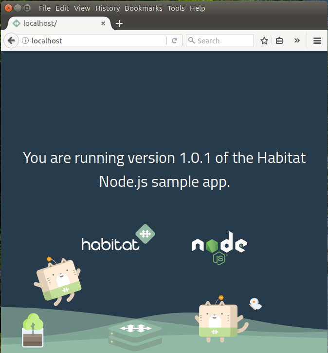

We're excited to talk about a new preview feature in Habitat that we feel will unlock some more interesting use cases that community members have been wanting for a while. In this post, we'll talk about _composite packages_ and how they might help you.

## What is a Composite Package?

As the name might suggest, a _composite package_ is a special kind of Habitat package that includes other Habitat packages, specifically _services_. A service is something you would actually run in a Habitat Supervisor: something like [core/redis](https://bldr.habitat.sh/#/pkgs/core/redis/latest), but not a library like, say, [core/linux-headers](https://bldr.habitat.sh/#/pkgs/core/linux-headers/latest). Composite packages allow you to group together services that should be run together on the same Supervisor, enabling you to take better advantage of [modern deployment patterns](http://blog.kubernetes.io/2015/06/the-distributed-system-toolkit-patterns.html) with your Habitat services.

## Why?

In the past, the intrepid Habitat user community has been finding all sorts of creative ways to use Habitat in a variety of ways. Since the sidecar pattern is becoming increasingly prevalent, particularly with microservice architectures and containerized deployments, users have tried to implement it in Habitat, but with limited success. Often, we would see users trying to start multiple services from the `init` or `run` hook of another coordinating service. Approaches like this may work initially, but won't work in the long run, because the Habitat Supervisor won't be properly supervising additional services that are spawned this way. In fact, shelling out to the `hab` binary within a hook is actually undefined behavior.

Composite packages allow you to express the relationship between different Habitat services in a way that lets the Habitat Supervisor properly manage each service. They allow you to continue to create small, focused services, while expressing relationships between them at a higher level.

## Okay, but what _is_ a Composite Package, Really?

When you boil it all down, a composite package is just another Habitat package, but one that is all metadata. It is also generated from a `plan.sh` file, so your standard Habitat workflow still applies. We'll take a look at the salient features by working through an example. We'll keep things at a fairly high level, in order to focus on the composite-specific details. We'll assume a basic working knowledge of Habitat, but never fear! Our [tutorials](https://www.habitat.sh/tutorials/) can bring you up to speed.

## A Sample Composite Package

Our example scenario is simple: we have a basic NodeJS application that we would like to put behind an Nginx proxy.
Both services are running on the same machine. They are clearly related services, but they are distinct enough to remain separate; they run separate processes, have separate development lifecycles, and so on. A key point for our discussion of composites is that they are deployed to the same machine. Many other scenarios can fit into this template: database and archiver (such as [WAL-E](https://github.com/wal-e/wal-e) for Postgres), service and service mesh proxy (such as [Envoy](https://github.com/envoyproxy/envoy)), service and log aggregation agent, and numerous others.

(The scenario we explore here is in fact an evolution of the pattern that Chris Nunciato demonstrated in his Habitat blog post [Packaging a Website with Nginx and Habitat](blog/2017/08/Packaging-a-Website-with-Nginx-and-Habitat/). You should read that article when you're done here to compare and contrast approaches.)

You can access the code for all these packages in the [habitat-composite-example](https://github.com/christophermaier/habitat-composite-example) repository.

### Our NodeJS Application

For our application, we'll use the NodeJS sample application introduced by Habitat core maintainer Nell Shamrell-Harrington in her blog post on [Node Scaffolding](blog/2017/10/node-scaffolding-habitat/).

This is a simple application, but for our purposes it will work perfectly, with one minor tweak.
The original application does not export the port the NodeJS server is listening on. Without this information, our proxy server won't know how to find our application server (and no, we are not going to hard code it!).

The [NodeJS scaffolding](https://github.com/habitat-sh/core-plans/blob/master/scaffolding-node/doc/reference.md) that the application uses will take an optional `app.port` configuration value to set the listening port. We will just add that to the application's `default.toml` file, and add a `pkg_export` entry into our `plan.sh`. When it's all said and done, the files will look like this:

```toml title:~/habitat-composite-example/sample-node-app/habitat/default.toml mark:5 linenos:true
# Message of the Day
message = "Hello, World!"

[app]
port = 8000     # <-- New!
```

```bash title:~/habitat-composite-example/sample-node-app/habitat/plan.sh mark:6
pkg_name=sample-node-app
pkg_origin=cm
pkg_scaffolding="core/scaffolding-node"
pkg_version="1.0.1"
pkg_exports=(
    [port]="app.port"       # <-- New!
)
declare -A scaffolding_env

# Define path to config file
scaffolding_env[APP_CONFIG]="{{pkg.svc_config_path}}/config.json"
```

With that change in place, we can move on to our proxy server.

### Our Nginx Proxy Server

For our proxy, we'll adapt the example Chris demonstrated in his post. His Nginx server served static content from another Habitat package, but we'll be serving _proxied_ content from another Habitat _service_.

Here's what our `composite-example-api-proxy` service's `plan.sh` looks like:

```bash ~/habitat-composite-example/composite-example-api-proxy/plan.sh
pkg_name=composite-example-api-proxy
pkg_origin=cm
pkg_version="0.1.0"
pkg_maintainer="Christopher Maier"
pkg_license=('Apache-2.0')
pkg_deps=(core/nginx)
pkg_binds=(
  [http]="port"
)
pkg_svc_user="root"

do_build() {
    return 0
}

do_install() {
    return 0
}
```

This is a standard Habitat plan file (we haven't gotten to the composite part yet!), but we'll point out some important aspects.

First, we have a dependency on the `core/nginx` package. This is where the binaries we'll run will come from, but we'll supply our own `run` hook and `nginx.conf` configuration file (we'll cover those next!).

Second, we have a required bind named `http` that is satisfied by an exported value of `port`. This is how we will connect to our NodeJS application; it exports the port that it is running on, and then our proxy consumes that information to generate its configuration files.

Finally, we have overridden the `do_build` and `do_install` callback functions since they are not required for this plan.

Next, let's look at this Nginx proxy's configuration file.

```handlebars title:~/habitat-composite-example/composite-example-api-proxy/config/nginx.conf
daemon off;
pid {{ pkg.svc_var_path }}/pid;
worker_processes {{ cfg.worker_processes }};

events {
  worker_connections {{ cfg.events.worker_connections }};
}

http {
  upstream backend {
    server localhost:{{bind.http.first.cfg.port}};
  }

  client_body_temp_path "{{ pkg.svc_var_path }}/client-body";
  proxy_temp_path "{{ pkg.svc_var_path }}/proxy";
  fastcgi_temp_path "{{ pkg.svc_var_path }}/fastcgi";
  scgi_temp_path "{{ pkg.svc_var_path }}/scgi";
  uwsgi_temp_path "{{ pkg.svc_var_path }}/uwsgi";

  server {
    listen {{ cfg.http.server.listen }};
    location / {
        proxy_pass http://backend;
        proxy_http_version 1.1;
        proxy_set_header Upgrade $http_upgrade;
        proxy_set_header Connection 'upgrade';
        proxy_set_header Host $host;
        proxy_cache_bypass $http_upgrade;
     }
  }
}
```

This is similar to the configuration file that Chris used in his blog post, but with some differences.

First, we've declared an upstream server named `backend`; this represents our NodeJS server. It is defined in terms of our `http` binding that we declared in our `plan.sh` file. Because of how Habitat works, if we were to change the port our NodeJS application was being served on, our Nginx proxy would be notified, and would rewrite and refresh its configuration appropriately. (Incidentally, notice that the host is hardcoded to "localhost", driving home the fact that this is expected to be running in the same Supervisor as our NodeJS application.)

Second, we define our `server` stanza to function as a proxy to our NodeJS backend. The `listen` value is taken from our proxy application's own configuration, and is the port that the proxy will be serving requests on.

Finally, note that we have set a number of `*_temp_path` variables. The current `core/nginx` packages have an `nginx` binary that was compiled with these paths rooted in `/hab/svc/nginx/var/`, which is the correct path assuming that the binary will be running as an `nginx` service. In our case, however, it'll be running as our `composite-example-api-proxy` service, so we need to set these values to paths that our service can actually write to.

(In reality, the `core/nginx` package dates from the early days of Habitat, before we knew what packaging patterns were good. Nginx should really never be running *as* an "nginx service" directly, but should instead be used as a dependency of your actual application, as illustrated here. While this is an interesting detail, it is not particularly germane to composites _per se_.)

Finally, let's take a look at the `run` hook of our `composite-example-api-proxy`.

```bash ~/habitat-composite-example/composite-example-api-proxy/hooks/run
#!/bin/sh

# Start the Nginx server, passing it our bundled configuration file.
exec {{ pkgPathFor "core/nginx" }}/bin/nginx -c "{{ pkg.svc_config_path }}/nginx.conf" 2>&1
```

This is exactly the same as the one that Chris used in his blog post. We simply call the `nginx` binary from the `core/nginx` package we depend on, but using _our_ configuration file.

### Our Composite Package (Finally!)

At last, we're ready to wrap all this up into a composite package. As mentioned earlier, composites are just another type of Habitat package, and are made from a `plan.sh` file. This file has a few additional features that we've not seen before, though. Let's take a look at what it would take to wire our NodeJS application up to our Nginx proxy.

```bash ~/habitat-composite-example/composite-example/plan.sh
pkg_origin="cm"
pkg_name="composite-example"
pkg_type="composite"
pkg_version="0.1.0"

pkg_services=(
    cm/sample-node-app
    cm/composite-example-api-proxy
)

pkg_bind_map=(
    [cm/composite-example-api-proxy]="http:cm/sample-node-app"
)
```

The `pkg_origin`, `pkg_name`, and `pkg_version` fields should look familiar, and serve the same role they do in other Habitat packages, but `pkg_type`, `pkg_services`, and `pkg_bind_map` are all new.

The `pkg_type` field is the simplest; a composite package is recognized as such by setting this field to the string `"composite"`. If you do _not_ include this field, Habitat will treat it as though it were a "standalone" package (which is what every other Habitat package until now has been).

The `pkg_services` array is where you enumerate all the services that are in your composite. Here, we provide the identifiers for our NodeJS application, and for the Nginx proxy we have created.

The final new field, `pkg_bind_map`, is also the most exciting. We have already seen how we are connecting the `http` binding of our Nginx proxy to the exported `port` from our NodeJS application. However, there's no reason that you, the user, should always have to specify this binding on the command line when you start this composite up. It's basically an implementation detail of this particular arrangement of services. It might not be that big of a deal in this particular example, but as you add more services with multiple binds, it really starts to become a challenge. That's where `pkg_bind_map` comes in. This lets you declare all the binding relationships between all the services in the composite. Here we are saying that our `cm/composite-example-api-proxy` has a bind named `http` that is satisfied by the `cm/sample-node-app` service. If our proxy had more than one bind, then we could add more mappings, separated by spaces, like so: `"http:cm/sample-node-app otherbind:other/service-in-the-composite"`.

A particularly fun part of composites is the fact that the build process is intelligent. If you list a package in your `pkg_services` array that isn't actually a service (i.e., it doesn't have a run hook), it will trigger a build error. Additionally, you must also provide at least two services; after all, a composite with a single service isn't providing you anything that the service by itself can't. Finally, you cannot build a composite if it specifies bindings that are not possible. For example, our proxy's `http` bind requires an exported value of `port` to be satisfied (see the proxy's `plan.sh` file above). If our NodeJS application exported a value of `http_port` instead, the composite package's build would fail when it detects this mismatch. This is another example of Habitat's overall philosophy of surfacing errors to the user as quickly as possible. It's much better to discover these kinds of issues at build time than at deploy time.

## Using the Composite Package

In many ways, using a composite package is not really different from using a standalone package. Let's see what happens when we try to load a composite package in a Habitat Supervisor.

```shell
$ hab svc load cm/composite-example --channel unstable
» Installing cm/composite-example from channel 'unstable'
→ Using cm/composite-example/0.1.0/20171005220452
★ Install of cm/composite-example/0.1.0/20171005220452 complete with 0 new packages installed.
hab-sup(MN): The cm/composite-example-api-proxy service was successfully loaded
hab-sup(MN): The cm/sample-node-app service was successfully loaded
hab-sup(MN): The cm/composite-example composite was successfully loaded
```

As we can see, it loads each individual service from the composite for us.

If we look at our supervisor's output, we can also see these services starting up. The fact that the proxy can start up at all is a sign that the binds have been properly satisfied, and we didn't have to specify anything on the command line when we loaded the composite!

```shell
hab-sup(MR): Supervisor Member-ID d6df5da3056146c281d5ccfa27c47efa
hab-sup(MR): Starting gossip-listener on 0.0.0.0:9638
hab-sup(MR): Starting http-gateway on 0.0.0.0:9631
hab-sup(MR): Starting cm/sample-node-app
hab-sup(MR): Starting cm/composite-example-api-proxy
sample-node-app.default(HK): init, compiled to /hab/svc/sample-node-app/hooks/init
sample-node-app.default(HK): Hooks compiled
sample-node-app.default(SR): Hooks recompiled
default(CF): Updated app_env.sh ba78899e39891feeadd2ce7bb1ec6a990f58b8dc22433f1b705ce8a610eaa97f
default(CF): Updated config.json 3f22842e8d737bbb107d9ac19afba42642eccf68a06ddfbdba70507b23b8498a
sample-node-app.default(SR): Configuration recompiled
sample-node-app.default(SR): Initializing
sample-node-app.default(SV): Starting service as user=hab, group=hab
composite-example-api-proxy.default(HK): run, compiled to /hab/svc/composite-example-api-proxy/hooks/run
composite-example-api-proxy.default(HK): Hooks compiled
composite-example-api-proxy.default(SR): Hooks recompiled
default(CF): Updated nginx.conf f4c9490bac250b99083f3c34c3863c2fb63368aa9d1ff0d67120857e3674a89a
composite-example-api-proxy.default(SR): Configuration recompiled
composite-example-api-proxy.default(SR): Initializing
composite-example-api-proxy.default(SV): Starting service as user=root, group=hab
```

To test, we can also visit the website on `localhost`:



And we can see in the logs that the proxy and the backend are both participating in servicing the requests:

```shell
composite-example-api-proxy.default(O): 127.0.0.1 - - [06/Oct/2017:14:28:17 +0000] "GET / HTTP/1.1" 304 0 "-" "Mozilla/5.0 (X11; Ubuntu; Linux x86_64; rv:56.0) Gecko/20100101 Firefox/56.0"
sample-node-app.default(O): GET / 304 480.246 ms - -
composite-example-api-proxy.default(O): 127.0.0.1 - - [06/Oct/2017:14:28:17 +0000] "GET /stylesheets/style.css HTTP/1.1" 304 0 "http://localhost/" "Mozilla/5.0 (X11; Ubuntu; Linux x86_64; rv:56.0) Gecko/20100101 Firefox/56.0"
sample-node-app.default(O): GET /stylesheets/style.css 304 2.034 ms - -
composite-example-api-proxy.default(O): 127.0.0.1 - - [06/Oct/2017:14:28:17 +0000] "GET /images/habitat-logo-by-chef.svg HTTP/1.1" 304 0 "http://localhost/" "Mozilla/5.0 (X11; Ubuntu; Linux x86_64; rv:56.0) Gecko/20100101 Firefox/56.0"
sample-node-app.default(O): GET /images/habitat-logo-by-chef.svg 304 3.461 ms - -
composite-example-api-proxy.default(O): 127.0.0.1 - - [06/Oct/2017:14:28:17 +0000] "GET /images/nodejs-logo.svg HTTP/1.1" 304 0 "http://localhost/" "Mozilla/5.0 (X11; Ubuntu; Linux x86_64; rv:56.0) Gecko/20100101 Firefox/56.0"
sample-node-app.default(O): GET /images/nodejs-logo.svg 304 5.307 ms - -
sample-node-app.default(O): GET /images/image-cat-jumping.svg 304 5.233 ms - -
composite-example-api-proxy.default(O): 127.0.0.1 - - [06/Oct/2017:14:28:17 +0000] "GET /images/image-cat-jumping.svg HTTP/1.1" 304 0 "http://localhost/" "Mozilla/5.0 (X11; Ubuntu; Linux x86_64; rv:56.0) Gecko/20100101 Firefox/56.0"
composite-example-api-proxy.default(O): 127.0.0.1 - - [06/Oct/2017:14:28:17 +0000] "GET /images/image-cat-set.svg HTTP/1.1" 304 0 "http://localhost/" "Mozilla/5.0 (X11; Ubuntu; Linux x86_64; rv:56.0) Gecko/20100101 Firefox/56.0"
sample-node-app.default(O): GET /images/image-cat-set.svg 304 4.477 ms - -
composite-example-api-proxy.default(O): 127.0.0.1 - - [06/Oct/2017:14:28:17 +0000] "GET /images/image-bg-footer.svg HTTP/1.1" 304 0 "http://localhost/stylesheets/style.css" "Mozilla/5.0 (X11; Ubuntu; Linux x86_64; rv:56.0) Gecko/20100101 Firefox/56.0"
sample-node-app.default(O): GET /images/image-bg-footer.svg 304 0.666 ms - -
sample-node-app.default(O): GET /favicon.ico 304 0.921 ms - -
composite-example-api-proxy.default(O): 127.0.0.1 - - [06/Oct/2017:14:28:17 +0000] "GET /favicon.ico HTTP/1.1" 304 0 "-" "Mozilla/5.0 (X11; Ubuntu; Linux x86_64; rv:56.0) Gecko/20100101 Firefox/56.0"
```

## What Composites _Aren't_

Composite packages are a new feature of Habitat, and there may be a few rough edges. The current implementation is intended as a way to explore this problem space for Habitat, but it is not necessarily the _final_ implementation. We are very curious to see how composite packages work (or don't!) for you and your particular use cases.

While you can install, start, stop, load, and unload composite packages, you should keep in mind that composite packages can behave differently from the Habitat packages you are used to. In particular, composite packages are not _quite_ a formal runtime construct of Habitat. The individual services are still available and addressable just as though you'd started them manually. The composite-as-a-whole is not directly addressable as though it were a service in its own right. It cannot do anything like export selected values from its constituent services as "composite-level exports", or map "composite-level binds" onto constituent service binds. A composite package as a whole does not update itself as an individual service can. Indeed, the constituent services of a composite can continue to update independently of each other.

While each of these potential behaviors are compelling, we're are looking to develop the overall feature of composites iteratively with feedback from our user community. We believe that the feature set we are unveiling is a suitable "first move", and provides a basis from which to discuss further improvements.

Finally, composite package support is available for Linux services only at this point, but support for Windows services is planned.

## Conclusion

We're excited to hear what you have to say about composite packages. What worked for you? What do you wish they did differently? How do you think you might use them in your own infrastructure? [Let us know!](http://slack.habitat.sh/)
