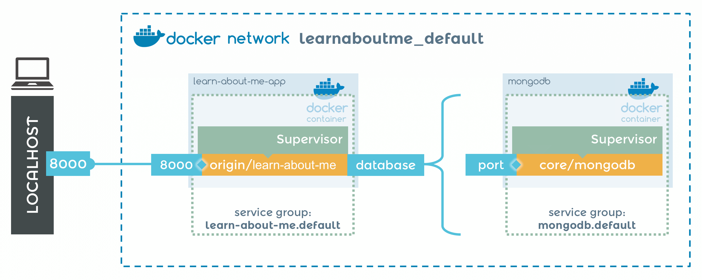

Greetings fellow Habicats! Good news today - you can use the Node scaffolding to Habitize Node applications that use a database!

One of my favorite resources on Node is ["Express in Action" by Evan Hahn](https://www.manning.com/books/express-in-action). In one of the chapters of the book, you create an application called "Learn About Me" - a simple social networking application that uses a MEN stack (MongoDB, Express, and NodeJS).  Let's Habitize this application.

## Pre-requisites
* A Github Account
* NodeJS installed on your workstation
* Habitat installed and set up on your workstation
* Docker installed and running on your workstation
* Text editor of your choice (in this post I use vim, but feel free to substitute your preferred editor)

## Setting up your application

Go ahead and clone the source code for "Learn About Me" with this command:

```console
$ git clone git@github.com:EvanHahn/Express.js-in-Action-code.git
$ cd Express.js-in-Action-code/Chapter_08/learn-about-me
```

Now install the application's dependencies

```console
$ npm install
```

If you'd like, go ahead and run the application locally:

```console
$ npm start
```

And you should be able to access the app at http://localhost:3000.

## Habitizing your application - Part I

```console
$ hab plan init -s node
```

There are two parts to this application - the application itself and the database.  We'll run these in two separate containers, but the application needs to be able to access and talk to the database.

Let's set up the default configuration for the application's connection to the database in habitat/default.toml - this file defines environmental variables that will be used by the application.

**habitat/default.toml**

```
# Use this file to templatize your application's native configuration files.
# See the docs at https://www.habitat.sh/docs/create-packages-configure/.
# You can safely delete this file if you don't need it.

[mongo]
host = "127.0.0.1"
port = "27017"
```

Save and close that file.

Now let's open up the plan file that was created when we ran "hab init", it should look like this:

**habitat/plan.sh**

```
pkg_name=learn-about-me
pkg_origin=your_origin
pkg_version="0.1.0"
pkg_scaffolding="core/scaffolding-node"
```

When we eventually start this application in a container, it will need to bind to the other container running MongoDB.  We need a port to bind them.  Add this content to your plan.sh.

**habitat/plan.sh**

```
pkg_binds=(
  [database]="port"
)
```

Now, let's define the value for that port in a configuration file - this will tell Habitat where to connect to the database when binding the two containers (unlike habitat/default.toml - which is used to define environmental variables within the application itself).

**default-config.json**

```
{
  "mongo": {
    "host" : "localhost",
    "port"   : "27017"
  }
}
```

## Habitizing your application - Part II

We need to make a few edits to the application code itself in order to make this work with Habitat. Open up your app.js file, the beginning of it should look like this:

**app.js**

```
var bodyParser = require("body-parser");
var cookieParser = require("cookie-parser");
var express = require("express");
var flash = require("connect-flash");
var mongoose = require("mongoose");
var passport = require("passport");
var path = require("path");
var session = require("express-session");

var setUpPassport = require("./setuppassport");
var routes = require("./routes");

var app = express();
mongoose.connect("mongodb://localhost:27017/test");
setUpPassport();
```


The initial source code of this application hard codes the url of the database we connect to. In our case, we will be using configuration files to provide the database info, so we need to make some changes to the source code.

First, delete this line:

```
mongoose.connect("mongodb://localhost:27017/test");
```

Now, add some content right after this line:

```
var app = express();
```

Like so:

**app.js**

```
var nconf = require('nconf');
const nconf_file = process.env.APP_CONFIG || './default-config.json';
nconf.file({ file: nconf_file });

console.log("Loading Configuration");

console.log(nconf.get('mongo'));
var dbConnectionString = 'mongodb://' + nconf.get('mongo')['host'] + ':' + nconf.get('mongo')['port'] + "/learn-about-me'";
console.log(dbConnectionString);

console.log("Connecting to Database");

var mongoose = require('mongoose');
mongoose.connect(dbConnectionString, { useMongoClient: true });
```

Wow, that's a lot.  Let's break this down:

```
var nconf = require('nconf');
```

First, we use an npm module called [nconf](https://www.npmjs.com/package/nconf).  Nconf is a tool to define configuration variables, then use them within the node application.


```
const nconf_file = process.env.APP_CONFIG || './default-config.json';
nconf.file({ file: nconf_file });
```

Then we read a configuration file and load it to nconf. This brings us to the question - where do we get this file?

Let's create a template for this config file at habitat/config/database.json

**habitat/config/database.json**

```
{
    "mongo": {
        "host" : "{{cfg.mongo.host}}",
		"port"   : "{{cfg.mongo.port}}"
	}
}
```

Now that we have this defined, we can use this config:

```
var dbConnectionString = 'mongodb://' + nconf.get('mongo')['host'] + ':' + nconf.get('mongo')['port'] + "/test'";
```

Here, we create a db connection string - pulling the ('mongo')['host'] and ('mongo')['port'] values from the configuration file we just loaded.

We also - if it is not already created - create a database called "learn-about-me" and connect to it.

```
var mongoose = require('mongoose');
mongoose.connect(dbConnectionString, { useMongoClient: true });
```

Finally, we use the mongoose node module to connect to the database. Go ahead and save and close the file.

Now, install the nconf module with:

```
$ npm install nconf --save
```

One more thing before we can build - we need to load the nconf config file from plan.sh - add this content:

**plan.sh**

```
pkg_name=learn-about-me
pkg_origin=your_origin
pkg_version="0.1.0"
pkg_scaffolding="core/scaffolding-node"

pkg_binds=(
  [database]="port"
)

pkg_exports=(
  [port]=app.port
)

declare -A scaffolding_env

# Define path to config file
scaffolding_env[APP_CONFIG]="{{pkg.svc_config_path}}/database.json"
```

Now, enter the Habitat studio with this command:

```console
$ hab studio enter
```

And, once you're in the studio, build the application:

```console
(studio) $ build
```

When the build is complete, export your new package as a Docker container image

```console
(studio) $ hab pkg export docker ./results/<your_new_package>.hart
```

And now run this command to pull down theecore/mongodb package from the public Habitat Builder and export it as a Docker image on your workstation:

```console
(studio) $ hab pkg export docker core/mongodb
```

Once that is complete, exit out of the studio

```console
(studio) $ exit
```

## Habitizing your application - Part III

Now let's set up a Docker compose file using the two container images we just created - one will run the application itself, and one will run the MongoDB database.

**docker-compose.yml**

```
version: '3'
services:
		mongodb:
				image: core/mongodb
				environment:
				  # The default bind_ip for mongodb is to 127.0.0.1. Overriding
				  # it here will allow our application to connect to through the
				  # ip that is discovered through the sys.ip.
				  HAB_MONGODB: "[mongod.net]\nbind_ip = '0.0.0.0'\n[mongod.security]\ncluster_auth_mode = ''"
		learn-about-me-app:
				image: your_origin/learn-about-me
				ports:
				  - 8000:8000
				# Find the container above named here by the peer
				# Set the binding 'database' to the mongdb.default service
				# group. Which the above mongodb is a member.
				command: --peer mongodb --bind=database:mongodb.default
```

Note that we define the ports for the "learn-about-me-app" as 8000:8000 - port 8000 is what we will be able to access this application over.

Here's a visual of how these two containers will work:



Now, start up these containers with this command:

```console
$ docker-compose up
```

And, once both containers are up, you can access your application on http://localhost:8000!
