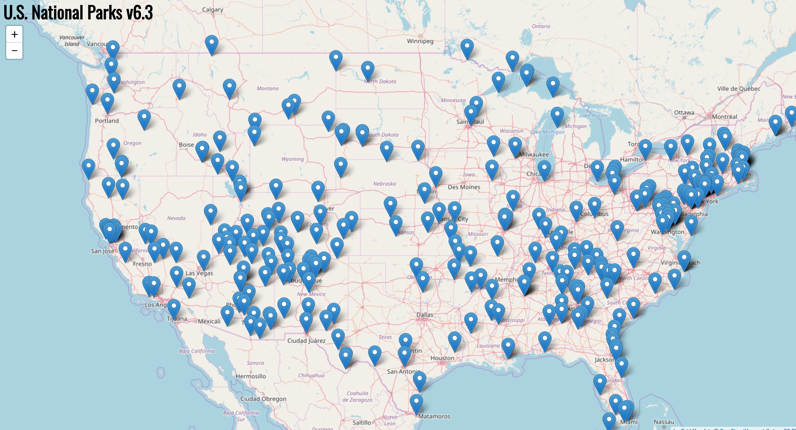
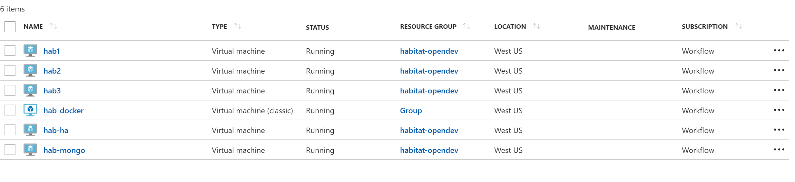
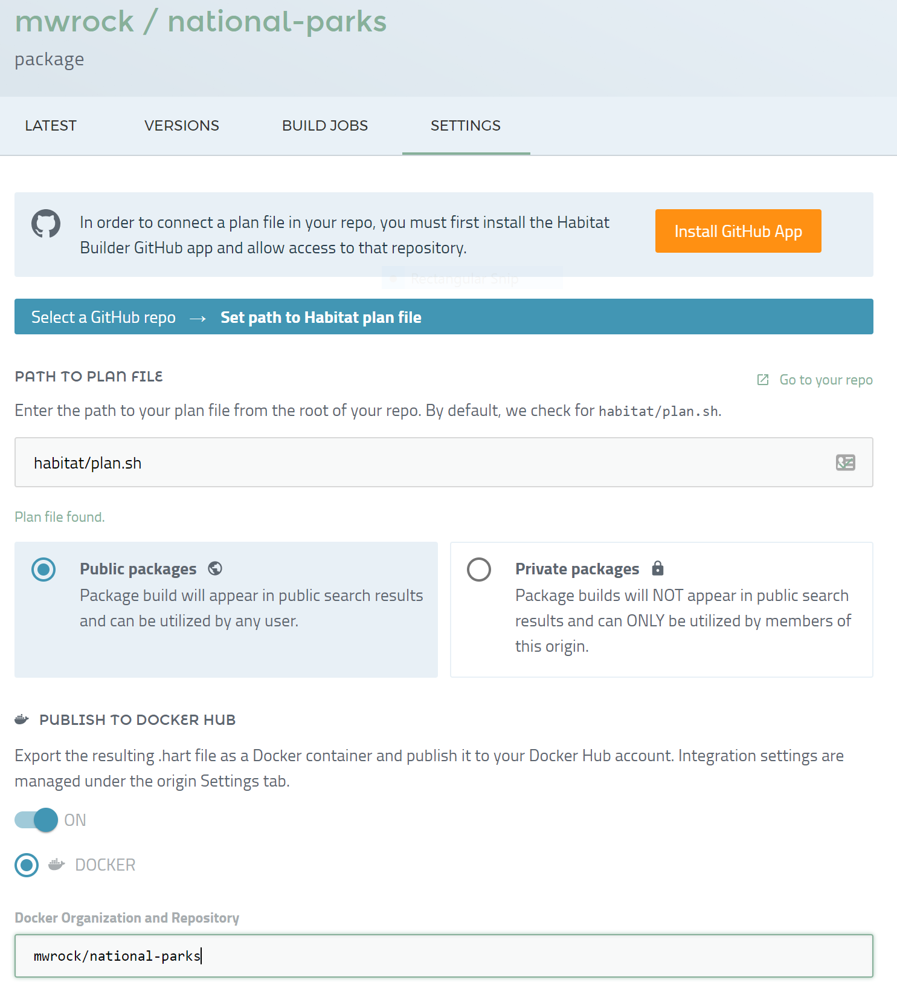
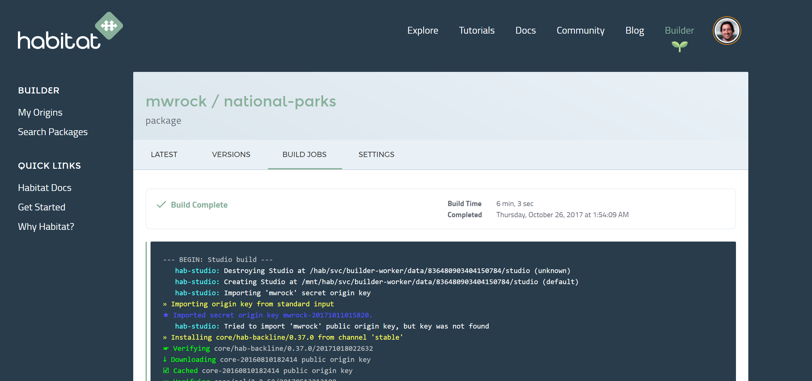

This week I had the honor of speaking at Microsoft Azure's [Opendev](https://azure.microsoft.com/en-us/opendev/), which hosted a variety of speakers from various cool open source projects and I represented Habitat. I raced through a tour of building a distributed Java web application in Habitat. I showed the application running in a local Habitat Supervisor and also had it perform a rolling update across three nodes in Azure. Finally I demonstrated the same application running in a container on an Azure deployed Docker host. You can listen to the presentation which starts at about 1:22:20 into the recorded video.

In this post I'd like to cover the same tour in blog format which might allow this information to sink in more effectively for those who better digest written material (like myself) and for the benefit of the google indexing servers. This is very much a beginner level post and I hope that those who have little to no Habitat knowledge will walk away with an understanding of what Habitat is and how it can help step up their development workflow in this age of distributed computing.

## What is Habitat?

As an intro level topic, we are going to start at the very beginning and ask what Habitat is. I have been working on the Habitat code base for a year now and have been working for the company who created Habitat - [Chef](https://www.chef.io/) -  since its beginning and even I still find this a difficult question to answer. I think it can be tough to do the question justice because:

1. There is no other project quite like Habitat. I can't say "Oh Habitat? Its a blang bloom system. Ya know just like jitter bug - that other blang bloom system."
2. It covers a lot of ground and thus I cant simply say "it's a build system" or a "service discovery component" even though it can be both of those things and more.
3. Certain features like its Docker image exporter can distract people and makes them quickly draw inaccurate conclusions that Habitat is a container runtime.

So here it goes: Habitat provides an environment (a "Habitat") that builds, packages and runs your applications. This environment isolates both the internal (library) and external (service) dependencies of your core application so that packages that run in one environment are guaranteed to run in any other environment. Further, It does not matter what platform the environment runs on. On linux, any modern 64 bit kernel can play. These packages, running inside of Habitat can easily discover and share information about one another making it natural for distributed systems to "bind" together and form your complete application.

It is precisely because of this portability and dependency isolation that Habitat can easily make an application "container ready." Habitat's container story is really more of a happy byproduct of such a "habitat" rather than its "end game."

Ok. That's the elevator speech and I'm sticking to it. Now lets build and run a real Java application which should hopefully bring these points home.

## The Key Habitat Components

To provide all of its build and runtime services, Habitat is comprised of the following systems:

* Build System - Primarily shell scripts that process a Habitat Plan (discussed below) and creates a Habitat Package (a `.hart` file)
* Build Studio - This could be considered part of the build system but building Habitat packages does not require a Studio. The Studio is the clean room environment that ensures that dependencies not managed by Habitat do not leak into a build.
* Depot - An online centralized repository that stores Habitat packages.
* Supervisor - A process manager that runs on the application servers that run the various services of an application.

We'll be interacting with each of these components throughout this post.

## Building a Java application

Habitat's surface area governs the application lifecycle all the way back to building your application's source code. Some may wonder why that is important. It's actually crucial in order to uphold the guarantees Habitat promises but it's also far less magical than one might imagine.

Any application built by Habitat starts with a "plan." This is the script that tells Habitat *about* our application and also tells it how to build it. Depending on whether the application is targeting Windows or Linux, the plan will be named `plan.ps1` (Powershell) or `plan.sh` (Bash). Here is our [plan.sh](https://github.com/mwrock/national-parks/blob/master/habitat/plan.sh) (we will be targeting Linux) for our Java application:

```bash plan.sh
pkg_name=national-parks
pkg_description="A sample JavaEE Web app deployed in the Tomcat8 package"
pkg_origin=mwrock
pkg_version=6.2.0
pkg_maintainer="Bill Meyer <bill@chef.io>"
pkg_license=('Apache-2.0')
pkg_deps=(core/tomcat8 core/jre8)
pkg_build_deps=(core/jdk8/8u131 core/maven)
pkg_svc_user="root"
pkg_binds=(
  [database]="port"
)
pkg_exports=(
  [port]=tomcat_port
)
pkg_exposes=(port)

do_prepare()
{
    export JAVA_HOME=$(hab pkg path core/jdk8)
}

do_build()
{
    cp -r $PLAN_CONTEXT/../ $HAB_CACHE_SRC_PATH/$pkg_dirname
    cd ${HAB_CACHE_SRC_PATH}/${pkg_dirname}
    mvn package
}

do_install()
{
    cp ${HAB_CACHE_SRC_PATH}/${pkg_dirname}/target/${pkg_name}.war ${PREFIX}/
}
```

The plan holds two kinds of information: Metadata describing the application and callback functions invoked by Habitat's build system to build the source code. For details on plan syntax and all of the metadata and callbacks one can use, see [the Habitat Reference and Syntax guide](https://www.habitat.sh/docs/reference/).

The top section of the plan defines the metadata and is made up of simple variable assignments. Many of these are straightforward and don't require explanation. A couple that I think are of keen interest are dependencies and bindings because both tap into some of Habitat's most powerful functionality.

### Plan Dependencies

Habitat divides dependency metadata into build time dependencies (`pkg_build_deps`) and runtime dependencies (`pkg_deps`). This is great because there are many tools and dependencies that we need in order to build our application but will never be necessary at runtime. For example, we will need Maven to build our `.war` file but there is no need for the Habitat Supervisor to have knowledge of this dependency when it runs our application. When Habitat runs our build, it will put all `bin` tools declared by the packages in both dependency categories (as well as those declared by their dependencies and so on) on the `PATH`. This is how our `do_build` can call the Maven cli `mvn package`. What is also interesting here if your plan builds lower level native libraries like openssl, is that the `lib` and `include` paths of the entire runtime dependency tree declared in `pkg_deps` get added to the compiler flags which links all of your dependencies to Habitat resident packages. When Habitat is done building your application, it will include a manifest listing the EXACT versions of all dependencies the application was built with. This is included inside the metadata maintained in the final `.hart` file - Habitat's package format. The Habitat Supervisor will examine all these dependencies in the manifest and ensure that they are present in the Habitat local package repository and download them if they are not.

### Service Bindings

Bindings, expressed by `pkg_binds` and `pkg_exports` facilitate interaction between multiple services. Let's face it, most applications are comprised of more than a single service. When we think of our core Java application, we may think of the Tomcat process running on a web server. However if that was all Habitat ran, we'd likely all walk away disappointed. Our particular Java application shows all of the national parks in the United States. However, without a database service, there would be no parks to display. Furthermore, because our application will be very popular (Right?!) we will need a load balancer to fan traffic out accross multiple web servers. So our application will need to "find" other services that provide a database and our load balancer service will need to find all of the instances running our application to load into its configuration.

`pkg_binds` and `pkg_exports` constitute two sides of a contract between services. `pkg_binds` declares the **consumer** side of this contract and specifies what configuration properties a consuming service expects a **provider** service to expose. Our plan above states that it requires a `database` service and that service must expose a `port` property. If we were to run our application in a Habitat Supervisor and a service could not be found that fulfills the contract, our service would not start until our database service shows up.

`pkg_exports` declares what configuration we want to expose as public properties to external services. Here we want to expose a property called `port` and we will map our internal `tomcat_port` property to that external `port` alias. The `tomcat_port` configuration property here comes from a file that exists alongside our plan, [`default.toml`](https://github.com/mwrock/national-parks/blob/master/habitat/default.toml).

```toml default.toml
tomcat_port = 8080
mongodb_service_host = "localhost"
mongodb_service_port = 27017
```

This `toml` file defines default configuration values that can be referenced in our plan bindings and other package files not discussed in this post. All of these values can be overriden by injecting a `user.toml` file in the Supervisor's `svc` directory or with the `hab config apply` command. However a discussion of service configuration is out of scope for this post. Have a look at the [Config Updates](https://www.habitat.sh/docs/using-habitat/#config-updates) section of the Habitat reference docs for more detailed information.

In our distributed Java application, the `haproxy` service is going to need this. In fact, if were were to look at the [`haproxy` plan](https://github.com/habitat-sh/core-plans/blob/master/haproxy/plan.sh), we would find:

```bash plan.sh url:https://github.com/habitat-sh/core-plans/blob/master/haproxy/plan.sh
pkg_binds=(
  [backend]="port"
)
```

The services that haproxy will bind to MUST export a `port` property. I know it may seem odd that we do not also expect an IP or hostname. However because Supervisors always know the IP and hostname that its services run on, the service does not need to explicitly expose it, rather the Supervisor provides that data on its own.

For a more detailed explanation of binding and its forms of syntax and expression see the [Runtime Binding](https://www.habitat.sh/docs/developing-packages/#pkg-binds) section of the Habitat documentation.

### Build Callbacks

Sure Habitat can build the source code of pretty much any application but that's not because Habitat has been imbued with special knowledge of all technology stacks. Habitat doesn't have inside information about Java (or Go, Ruby, C#, Node, etc.) and therefore we cannot expect it to magically know what to do with our source code. However as the developer of our application, we certainly know how to build it and we can tell Habitat how to do that. This is facilitated via several callback functions we can implement in our plan. There are lots of functions we can implement but our simple application here needs little implementation. We just implement a few to export the `JAVA_HOME` and package our `.war` file. For a complete list of possible callbacks see the [Build Phase Callbacks](https://www.habitat.sh/docs/reference/#reference-callbacks) in the Habitat reference.

Now I know I just said that Habitat lacks any knowledge about specific languages, but that is not entirely true. Habitat has a few special kinds of plans called Scaffolding plans. These are like templates and each Scaffolding plan is built around a specific language. Just think if we had 10 Java web applications we wanted to "Habetize". All 10 plans would probably look nearly identical. The main point of Scaffolding is to extract the "commonality" of a "flavor of plan" into a single Scaffolding plan and then just reference that plan in the plan of your individual application so that it likely only needs to include a few lines of metadata. Check out [this post](https://www.habitat.sh/blog/2017/05/Scaffolding-App-From-Scratch/) for more details about Scaffolding plans.

## Building the plan

Enough talk about the plan, let's act! Lets build our application.

First we will enter a Habitat build [Studio](https://www.habitat.sh/docs/glossary/#glossary-studio). If you are on a Mac or Windows machine, this will drop you into a shell running in a Docker container. If you are running Linux, then it will put you into a chroot where you get a "container-like" isolation level.

```powershell
C:\dev\national-parks [master]> hab studio enter
   hab-studio: Creating Studio at /hab/studios/src (default)
   hab-studio: No secret keys imported! Did you mean to set HAB_ORIGIN?
To specify a HAB_ORIGIN, either set the HAB_ORIGIN environment
variable to your origin name or run 'hab setup' and specify a
default origin.
   hab-studio: Entering Studio at /hab/studios/src (default)
   hab-studio: Exported: HAB_AUTH_TOKEN=[redacted]

--> Launching the Habitat Supervisor in the background...
    Running: hab sup run
    * Use 'hab svc start' & 'hab svc stop' to start and stop services
    * Use 'sup-log' to tail the Supervisor's output (Ctrl+c to stop)
    * Use 'sup-term' to terminate the Supervisor
    * To pass custom arguments to run the Supervisor, export
      'HAB_STUDIO_SUP' with the arguments before running
      'hab studio enter'.

--> To prevent a Supervisor from running automatically in your
    Studio, export 'HAB_STUDIO_SUP=false' before running
    'hab studio enter'.

[1][default:/src:0]#
```

The docker environment contains an extremely minimal Linux distribution, the Habitat build system, and a running Habitat Supervisor in the background. This is a great environment where you can build your Habitat packages and test running them. The thing that really makes this environment shine is that all of the dependencies and tools available to you all the way down to bash and glibc are exposed as Habitat packages. There is almost nothing on your path or in `/usr/bin`. This means that you don't risk having your build link to some library available on your build server but absent on your application server. We have all been there where things work great at dev or build time and then spontaneously combust in front of the whole wide world at run time. The Habitat Studio aims to not let that happen.

Now we'll kick off a build:

```studio
[1][default:/src:0]# build habitat/
   : Loading /src/habitat/plan.sh
   national-parks: Plan loaded
   national-parks: Validating plan metadata
   national-parks: Using HAB_BIN=/hab/pkgs/core/hab/0.38.0/20171026215954/bin/hab for installs, signing, and hashing
mkdir: created directory '/hab/cache/src'
mkdir: created directory '/hab/cache/src/national-parks-6.3.0'
mkdir: created directory '/hab/pkgs/mwrock'
mkdir: created directory '/hab/pkgs/mwrock/national-parks'
mkdir: created directory '/hab/pkgs/mwrock/national-parks/6.3.0'
mkdir: created directory '/hab/pkgs/mwrock/national-parks/6.3.0/20171027185153'
   national-parks: hab-plan-build setup
   national-parks: Writing pre_build file
   national-parks: Resolving build dependencies
» Installing core/jdk8/8u131 from channel 'stable'
```

Running `build habitat` invokes the Habitat build endpoint and gives it the name of the directory (`habitat`) containing our `plan.sh`. Note that when we "entered" the Habitat Studio, Habitat mounted the directory from where I ran `hab studio enter` to the `/src` directory inside the Studio. Typically we enter the Studio from the root of our [repository](https://github.com/mwrock/national-parks) which is where we entered from above. This is nice because we can remain in the Studio and simultaneously make edits to our plan in the editor of our choice which will be automatically manifested inside the studio.

Once the above `build` command completes, it will drop a `.hart` file inside the `/src/results` folder (also available outside of the studio) and also install that package in the Studio's local Habitat environment.

```studio
   national-parks: Source Path: /src/habitat
   national-parks: Installed Path: /hab/pkgs/mwrock/national-parks/6.3.0/20171027185153
   national-parks: Artifact: /src/results/mwrock-national-parks-6.3.0-20171027185153-x86_64-linux.hart
   national-parks: Build Report: /src/results/last_build.env
   national-parks: SHA256 Checksum: 0d1d135bac5945d0a49927a48981c345198fe11105752226e853d38ee51aa9c0
   national-parks: Blake2b Checksum: c1aed4ee2bfe23df80602eb382a675f7f3b3cc086657968c5e703aba53ef0d0d
   national-parks:
   national-parks: I love it when a plan.sh comes together.
   national-parks:
   national-parks: Build time: 2m41s
[2][default:/src:0]#
```

## Locally Running our Java Application

So with our application freshly built, let's see if we can actually run it. As I mentioned above, the Studio includes a running Supervisor. Let's see what it's doing now:

```studio
[3][default:/src:0]# hab sup status
mwrock/np-mongodb/3.2.9/20171013092907 (standalone), state:up, time:PT238.002019600S, pid:539, group:np-mongodb.default, style:transient
[4][default:/src:0]#
```

I previously started my MongoDB service and `hab sup status` tells me that it is `up`. So now let's start the national-parks application we just built:

```studio
[4][default:/src:0]# hab start mwrock/national-parks --bind database:np-mongodb.default
hab-sup(MN): Supervisor starting mwrock/national-parks. See the Supervisor output for more details.
```

See that `--bind` argument I passed to `hab start`? When the Supervisor attempts to start our application, it knows a bunch about it already from the metadata we supplied in our `plan.sh`. For instance it knows that we require a `database` binding that MUST provide a `port` configuration property. If I were to simply start my application without that `--bind` then I would get:

```studio
hab-sup(MR): Starting mwrock/national-parks
hab-sup(MR): Unable to start mwrock/national-parks, hab-sup(SS)[src/manager/service/spec.rs:210:23]: Missing required bind(s), database
```

By using the `--bind` arg I am telling the supervisor which service it can expect to fulfill the provider side of the required binding contract. If for some reason the Supervisor did not find my mongodb service, then it would wait to start my service until it found one. This is one way we can enforce the order in which services are started in a Habitat ecosystem. BUT it DID find one and my service starts. By running `sup-log` in the Studio it will follow the tail of the Supervisor log which gives me more detailed information on what is happening. Here is just a sampling:

```studio
national-parks.default(O): 27-Oct-2017 19:16:44.107 INFO [localhost-startStop-1] org.apache.catalina.startup.HostConfig.deployDirectory Deployment of web application directory /hab/pkgs/core/tomcat8/8.5.9/20170514144202/tc/webapps/host-manager has finished in 27 ms
national-parks.default(O): 27-Oct-2017 19:16:44.107 INFO [localhost-startStop-1] org.apache.catalina.startup.HostConfig.deployDirectory Deploying web application directory /hab/pkgs/core/tomcat8/8.5.9/20170514144202/tc/webapps/docs
national-parks.default(O): 27-Oct-2017 19:16:44.134 INFO [localhost-startStop-1] org.apache.catalina.startup.HostConfig.deployDirectory Deployment of web application directory /hab/pkgs/core/tomcat8/8.5.9/20170514144202/tc/webapps/docs has finished in 27 ms
national-parks.default(O): 27-Oct-2017 19:16:44.140 INFO [main] org.apache.coyote.AbstractProtocol.start Starting ProtocolHandler [http-nio-8080]
national-parks.default(O): 27-Oct-2017 19:16:44.154 INFO [main] org.apache.coyote.AbstractProtocol.start Starting ProtocolHandler [ajp-nio-8009]
national-parks.default(O): 27-Oct-2017 19:16:44.154 INFO [main] org.apache.catalina.startup.Catalina.start Server startup in 2000 ms
```

If that's not some Tomcaty Java goodness then I don't know what is. Ladies and gentleman, I do believe a JVM is afoot.

Lets check the ultimate authority: the browser:



Now those are some national parks!!

## Deploying to Azure

So now that I am more than satisfied with how this renders locally, its time to share it with the world. Lets take a peek at my sweet Azure infra:



I have three nodes running my Java Tomcat service: `hab1`, `hab2`, and `hab3`. I have `hab-mongo` running my mongodb service and lastly `hab-ha` is running my Habitat [`core/haproxy`](https://github.com/habitat-sh/core-plans/tree/master/haproxy) package and load balancing hab1 to hab3. It is the only node externally exposing port 8080 and what I expect external traffic to hit directly.

I have the Supervisors on hab1 to hab3 configured with an [update strategy](https://www.habitat.sh/docs/using-habitat/#using-updates) set to `rolling`. In fact I "loaded" the Supervisors with this command:

```shell
$ sudo hab sup load --channel unstable mwrock/national-parks --bind database:np-mongodb.default --strategy rolling --topology leader
```

This told the Supervisor to `load` the application and not just `start` it. That means that the Supervisor will consider my service to be `persistent` and in the event that the Supervisor goes down, it will automatically start my service when it comes back online. The [`topology`](https://www.habitat.sh/docs/using-habitat/#topologies) tells the Supervisor to run my service in a `leader`/follower role. This essentially makes my service "cluster aware." It is a great topology for services that expect to run in a leader or "single-writer/multi-reader" modes. It is also required to support the `rolling` update `strategy`. That strategy will elect an "update leader" among the three Supervisors running the national-parks application - and there must be at least three members (or peers). That update leader will be watching the Habitat Depot for upated packages in the `unstable` `channel`. The `unstable` channel is the default channel where packages are placed when first uploaded. Naturally, there is also a `stable` channel which is the default channel where a Supervisor looks for updates. The idea is that you probably do not want production servers updating themselves with a package fresh off the build server. However for the sake of our demo, we'll happily update ourselves with an unstable package.

As the term `rolling` suggests, our Supervisors will update one by one. When the "update leader" finds an updated package, it will coordinate the update of each of its followers in single file and lastly update itself. This ensures that multiple (or all) services do not update at the same time which may incur an outage. Habitat is all about "no tears" deployments!

So uploading our built package to the Depot is trivial:

```studio
[11][default:/src:0]# hab pkg upload results/mwrock-national-parks-6.3.0-20171027185153-x86_64-linux.hart
✓ Signed artifact with mwrock-20170810012708.pub
» Uploading public origin key mwrock-20170810012708.pub
    77 B / 77 B | [=====================================================] 100.00 % 797 B/s
→ Using existing public origin key mwrock-20170810012708.pub
» Uploading results/mwrock-national-parks-6.3.0-20171027185153-x86_64-linux.hart
→ Using existing core/acl/2.2.52/20170513213108
→ Using existing core/attr/2.4.47/20170513213059
→ Using existing core/coreutils/8.25/20170513213226
→ Using existing core/gcc-libs/5.2.0/20170513212920
→ Using existing core/glibc/2.22/20170513201042
→ Using existing core/gmp/6.1.0/20170513202112
→ Using existing core/jre8/8u131/20170622181030
→ Using existing core/libcap/2.24/20170513213120
→ Using existing core/linux-headers/4.3/20170513200956
→ Using existing core/tomcat8/8.5.9/20170514144202
↑ Uploading results/mwrock-national-parks-6.3.0-20171027185153-x86_64-linux.hart
    5.73 MB / 5.73 MB / [=============================================] 100.00 % 4.69 MB/s
✓ Uploaded mwrock/national-parks/6.3.0/20171027185153
★ Upload of mwrock/national-parks/6.3.0/20171027185153 complete.
[12][default:/src:0]#
```

Running `hab pkg upload` with the path to the build's `.hart` artifact will send that off to the Depot. I could even pass `--channel stable` if I wanted the package to land directly in the `stable` channel. However a more typical flow would be to upload to `unstable` and then do some validation testing and upon success, I could `promote` the package with:

```studio
[12][default:/src:0]# hab pkg promote mwrock/national-parks/6.3.0/20171027185153 stable
» Promoting mwrock/national-parks/6.3.0/20171027185153 to channel 'stable'
✓ Promoted mwrock/national-parks/6.3.0/20171027185153
```

Now that version `6.3.0` is in the depot, my Azure VMs should start serving that up between 0 and 60 seconds.

## Containerizing my Java Application

Because Habitat has already created an isolated and portable environment for my application, embedding the application in a Docker image can be done in a single command.

```studio
[15][default:/src:0]# hab pkg export docker mwrock/national-parks
» Building a runnable Docker image with: mwrock/national-parks
...
...
...
Sending build context to Docker daemon  401.5MB
Step 1/7 : FROM scratch
 --->
Step 2/7 : ENV PATH /bin
 ---> Running in 53ceb612c800
 ---> 6f314e5da21a
Removing intermediate container 53ceb612c800
Step 3/7 : ADD rootfs /
 ---> 1edaa804e0b1
Step 4/7 : VOLUME /hab/svc/national-parks/data /hab/svc/national-parks/config
 ---> Running in 46e223303f90
 ---> 3086177045e5
Removing intermediate container 46e223303f90
Step 5/7 : EXPOSE 9631 8080
 ---> Running in 20fb7935ba94
 ---> afdf222a8abf
Removing intermediate container 20fb7935ba94
Step 6/7 : ENTRYPOINT /init.sh
 ---> Running in b7b6d3015597
 ---> 763ec7003505
Removing intermediate container b7b6d3015597
Step 7/7 : CMD start mwrock/national-parks
 ---> Running in d21506d51c03
 ---> e86ccef6be11
Removing intermediate container d21506d51c03
Successfully built e86ccef6be11
Successfully tagged mwrock/national-parks:6.3.0-20171027185153
Successfully tagged mwrock/national-parks:6.3.0
Successfully tagged mwrock/national-parks:latest
☒ Deleting temporary files
★ Docker image 'mwrock/national-parks' created with tags: 6.3.0-20171027185153, 6.3.0, latest
Ω Creating build report /src/results/last_docker_export.env
```

!BAM!

```powershell
C:\dev\HabService [master]> docker image ls
REPOSITORY                                  TAG                     IMAGE ID            CREATED             SIZE
mwrock/national-parks                       6.3.0                   e86ccef6be11        2 minutes ago       395MB
```

So now I can launch my application in container format with a `docker run`:

```shell
$ docker run -it -p 8080:8080 mwrock/national-parks --peer 172.17.0.2 --bind database:np-mongodb.default
```

All the arguments after the image name will be forwarded on to the Supervisor running in the container. We have already seen the `--bind` argument but what about the `--peer` argument?

The `--peer` argument is how Supervisors connect to one another to form a "ring."  We can have many many Supervisors running on different VMs, containers or bare metal and running different parts of our distributed application. To start up a new Supervisor to connect to a ring, we only need the IP or hostname of a single supervisor. By connecting to that one Supervisor, Habitat's [gossip protocol](https://www.habitat.sh/docs/internals/#supervisor-internals) will start to share information about all running Supervisors and their services with the newly joined Supervisor. In our case, we'd expect MongoDB and other services to be running in their own containers. One of those containers has an IP of `172.17.0.2` and therefore we use that address as our `--peer`.

## Making it easier with Builder

While the primary intent of the Opendev talk and this post is to illustrate how Habitat can modernize your development workflow, I do feel compelled to share about our new SaaS product that can run your builds for you as well as push your packages to the Habitat Depot and even upload your exported Docker images to your Docker hub registry. This is very new and extremely free!!!!

Its super easy to set up. I just need to connect my `plan.sh` sitting in my github repo to Builder:



Now any time that I push to this repository, Builder will start to build my application:



When it finishes, my packages will be in the Depot for my Supervisors to consume and I can also `docker pull mwrock/national-parks` to get the build into my Docker environment.
