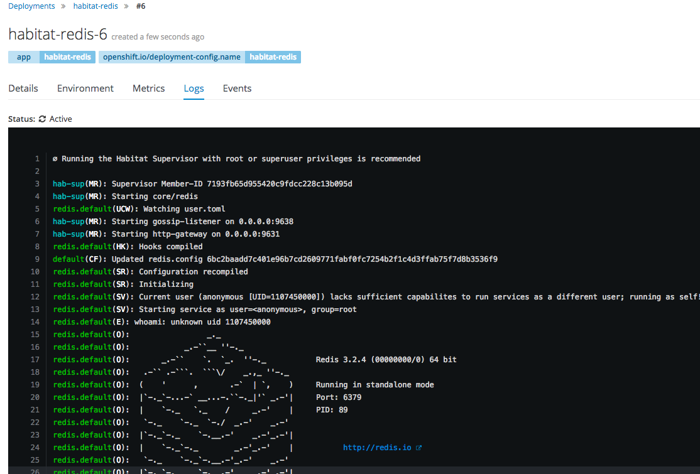

With the 0.53.0 release of Habitat, we're happy to announce that users can now run their Habitat-exported Docker containers on the [OpenShift](https://openshift.com) platform! In this post we'll show you what you need to do to run your own apps in OpenShift, as well as what prevented Habitat from running on OpenShift until now and how we solved this particular issue.

## Background

OpenShift is a container application system built by [RedHat](https://redhat.com) on top of [Kubernetes](https://kubernetes.io/). While Habitat has been able to run on Kubernetes [for a while](https://www.habitat.sh/get-started/kubernetes/), it was not able to run in OpenShift generally, due both to assumptions made by the Habitat Supervisor itself, as well as the default security stance that OpenShift takes when running container workloads.

Until now, it has always been necessary for the Habitat Supervisor to run as the `root` user. This means that any Docker containers exported from Habitat packages also need to run as the `root` user. OpenShift, however, has a default practice of _not_ running containers as `root`; instead, it will run the container as an effectively random nameless user ID. This means that if a process is somehow able to break out of the confines of the container, it will not have meaningful access to anything on the host machine. Users managing their own OpenShift clusters can customize this behavior, but some operators may want to maintain this security stance. Furthermore, users running on hosted OpenShift platforms, such as [OpenShift Online](https://manage.openshift.com/) may not even have the authorization to modify these secrity settings in the first place.

OpenShift helpfully provides [documentation](https://docs.openshift.com/container-platform/3.3/creating_images/guidelines.html#openshift-container-platform-specific-guidelines) around "best practices" for containers to implement in order to better operate on the OpenShift platform. Reviewing these, along with the Habitat Supervisor source code, revealed two core issues that would need to be addressed in order for Habitat to work in OpenShift. First, containers exported by Habitat would need to be modified in order to allow an arbitrary user appropriate access. Secondly, the Habitat Supervisor itself would not only have to run as a non-`root` user, but as an _anonymous_ non-`root` user.

## Docker Container Changes

The Docker exporter changes were relatively straightforward. When you specify a user ID to run a container as, that user's primary group will be the `root` group if no group information can be found in `/etc/passwd` within the container or (failing that) if no group exists with that same ID. Since OpenShift chooses large random user IDs (such as `18848190`), the primary group is effectively always the `root` group. As such, if all the files within the container that your process needs access to can be written and / or read by members of the `root` group, then that will remove a main stumbling block for running in OpenShift.

For Habitat, this means that the `/hab` directory hierarchy is now readable and writable by the `root` group. This is done in such a way that a new image layer is _not_ created, meaning that container sizes are not affected.

## Habitat Supervisor Changes

More extensive changes were made to the Habitat Supervisor. Now, the Supervisor is aware of which Linux capabilities it needs to operate, and can adjust its behavior in the absence of those capabilities. Capabilities, for those unfamiliar with them, are a way of decomposing the all-powerful `root` user permission into a collection of largely orthogonal traits that can be individually granted to processes and files as a way of implementing the security principle of "least privilege". It turns out that to operate as a `root` user, the Supervisor only needs a small number of capabilities (`CAP_SETUID`, `CAP_SETGID`, and `CAP_CHOWN`, for the curious), which are related to spawning supervised services as a different service user, and ensuring that user can write the various state files needed by the service. When the Supervisor recognizes that it does not have these capabilities, it simply runs services as the same user that it is running as. In the context of a Docker container, this means that all services are running as the same user the container itself is running as.

Additionally, the Supervisor and underlying Launcher were modified to allow processes to be run as _anonymous_ users. As stated earlier, OpenShift will run containers with large random user IDs that are all but guaranteed to not map to any named user that may exist within the container. Previously, we would take the `pkg_svc_user` and `pkg_svc_group` name that a service should run as and pass them to the Launcher, which would in turn resolve their corresponding IDs and spawn processes with them. Now, since we ignore those names and can be run as a non-`root` anonymous user, we need to resolve the IDs before they get to the Launcher, allowing us more flexibility in how to proceed.

## Conclusion

At the end of all this, we have a Habitat Supervisor that can successfully be run in OpenShift! By generalizing how the Supervisor behaves (and how our Docker containers are generated), we can also run in a larger variety of deployment scenarios, which gives our users even more freedom in how they choose to run their Habitat applications.

For further container deployment details, please refer to [our documentation](https://www.habitat.sh/docs/best-practices/#running-habitat-linux-containers).

If you're using Habitat in OpenShift, or in other scenarios that are now unblocked as a result of these changes, we'd love to [hear from you](http://slack.habitat.sh/)!
