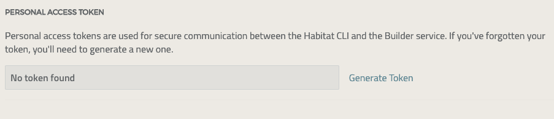

### What are Habitat tokens?
With a recent revision of the Habitat builder site, some brand new functionality has now become available for Habitat users.

Currently, when you are using the Habitat client for operations that require you to be authenticated as a Habitat user and/or origin owner or member, the  way you can do this is by using a Github personal access token. However, the use of a Github token may have some downsides - for example, you may not want your token usage to count against any rate limits that Github might impose. Or you may have security practices that lock down the use of Github personal access tokens. There are additional downsides for the Habitat infrastructure as well - due to the way that Github apps work, it is also easier for the Habitat system to reach rate limits with Github as well.

We are now making available a Habitat-native version of a bearer token that can serve the same purpose. In addition to not having the downsides above, it is also a first step toward a path of greater flexibility for Habitat users. Over time, we expect to provide more choices in how you authenticate with Habitat, where you elect to keep your source control, and so on.

### How to use Habitat Tokens
The *Habitat Personal Access Token* can be easily used as drop-in replacement for Github tokens in your Habitat client workflow.

Here's how to use it:
1. Log into the [Habitat Builder site](https://bldr.habitat.sh)
2. Click on your user icon on the top right of the page and select the *Profile* link
3. Once on the Profile page, you will see a section for *Personal Access Tokens* at the bottom of the page
4. Click on the _Generate_ button to create a new token
5. Click on the small _Copy_ icon to copy the token to your clipboard, and then save it to a secure location.



Once you have the token, you can then use it in exactly the same way as you use the Github access tokens with the Habitat client.
For example, you may choose to assign it to the `HAB_AUTH_TOKEN` environment variable:
```
export HAB_AUTH_TOKEN=<your token>
```

Now, you can test out that the token works by issuing an authenticated client command. For example, you can search for a private package by issuing a search command:
```
hab pkg search <your private package>
```

That's all there is to it!

### Providing Feedback

We expect to phase out usage of the Github token in the not too distant future, so please try out the new Habitat tokens and let us know how they work for you. If you have any questions or feedback, drop a message in the [Habitat Forum](https://forums.habitat.sh/latest), or on our [Slack channel](https://habitat-sh.slack.com), or even open an issue on the [Builder repo](https://github.com/habitat-sh/builder/issues)
