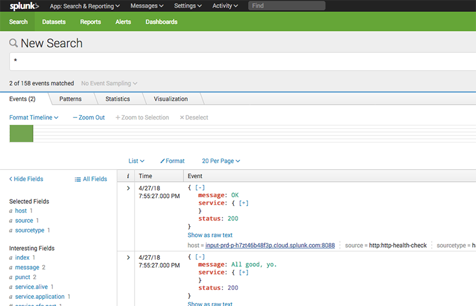

<style>
  img[alt="Splunk dashboard"] {
    border-radius: 8px;
    border: 1px solid #ccc;
    padding: 2px;
  }

  iframe {
    max-width: 100%;
    border-radius: 4px;
    width: 640px;
    height: 390px;
    margin-bottom: 32px;
  }
</style>

One of the many useful features of Habitat is its built-in support for [health checks](/docs/reference/#health_check). Every application defines what it means to be healthy in its own way, but common to most of them (or more accurately, to those of us who maintain them) is the need to know how they're performing over time, and the health-check hook is a great way to do that.

There are generally a few steps involved in setting up application health monitoring. If you were interested in tracking the health of a web application, for example, you might begin by giving it an API endpoint to respond with some indication of uptime, connectivity to other services, or the like. Such an API might look something like this:

```
$ curl -v http://your-service.com/health
> GET / HTTP/1.1
...
< HTTP/1.1 200 OK
< Content-Type: application/json
...
{
  "status": 200,
  "message": "♬ Everything is awesome. ♬"
}
```

Once your application is able to report how it's doing, the next step is usually to come up with some way to request that report, typically on some regular interval. The health-check hook is built for this. When an application is running under Habitat, the Habitat Supervisor runs the application's `health_check` hook (if there is one) once every 30 seconds &mdash; a great opportunity to run a little code to check in on how things are going.

And then finally, you need to capture and organize the data you gather in a way that makes it comprehensible and actionable. One way to do that is to forward it to a third-party service like [Splunk](https://www.splunk.com/), which can index it, make it searchable, and allow you to do all sorts of interesting things with it.

## Sending Health-Check Data to Splunk

As an example of one way to use Splunk with Habitat, I’ve set up [a GitHub repository](https://github.com/cnunciato/habitat-splunk-hec) composed of a few packages that work together to capture and forward health-check data to a Splunk instance using its [HTTP Event Collector](https://docs.splunk.com/Documentation/Splunk/7.0.3/Data/AboutHEC) (HEC) feature. The example consists of the following packages (all of which are also available on the public [Builder Depot](https://bldr.habitat.sh/#/pkgs/cnunciato)):

* [hello-node](https://bldr.habitat.sh/#/pkgs/cnunciato/hello-node/latest), a simple Node.js application whose health we're interested in monitoring,
* [hello-nginx](https://bldr.habitat.sh/#/pkgs/cnunciato/hello-nginx/latest), a web server sitting in front of that application that we'd like to monitor as well,
* [http-health-check](https://bldr.habitat.sh/#/pkgs/cnunciato/http-health-check/latest), a "binary" package providing an executable we can use in the `health_check` hooks of both of these services, and
* [hello-splunk](https://bldr.habitat.sh/#/pkgs/cnunciato/hello-splunk/latest), a service that knows how to receive health-check data as JSON and forward it to Splunk over HTTP.

The README goes into some detail, and you should check out each package's plan to get a sense of it works, but the gist is that the  `health_check` hooks in **hello-node** and **hello-nginx** contain a bit of script that looks something like this:

```
#!/bin/sh

# Settings describing how to query this app's health-check endpoint. It's assumed
# that the endpoint will return a JSON payload. The port setting is derived from
# the service's Habitat configuration.
my_app='{
  "port": {{ cfg.http.server.listen }},
  "path": "/health"
}'

# Settings describing where to forward the health-check response. Rather than send it
# directly to Splunk, we pass it to a locally running instance of hello-splunk, which
# is Splunk HEC-aware, and which can be shared by all of our locally running services.
# Note that the hostname and port of the Splunk forwarder are derived using a `bind`
# relationship between this service and hello-splunk.
forwarder='{
  "hostname": "{{ bind.splunk.first.sys.ip }}",
  "port": {{ bind.splunk.first.cfg.port }},
  "path": "/",
  "method": "POST",
  "headers": {
    "Content-Type": "application/json"
  }
}'

# We'll probably also want to attach a representation of the service we're reporting on.
# The `svc.me` object, serialized as JSON, gives us a handy way to do that.
me='{{ toJson svc.me }}'

# The http-health-check command brings it all together.
exec http-health-check "$my_app" "$forwarder" "$me" 2>&1
```

When the Habitat Supervisor executes each service's `health_check` hook, `http-health-check` calls the service's `/health` endpoint, captures its status as JSON and passes it to **hello-splunk**, which then forwards it to Splunk using the hostname and token we received when we set up Splunk and [configured an HTTP Event Collector](https://docs.splunk.com/Documentation/Splunk/7.0.3/Data/UsetheHTTPEventCollector).

A quick look at the demo project's [Vagrantfile](https://github.com/cnunciato/habitat-splunk-hec/blob/master/Vagrantfile) should give you a sense of how this all comes together. With Habitat installed, we just install the forwarder, install our services (binding them to the forwarder), and specify our Splunk hostname and token:

```
#!/bin/sh

# Install our Splunk HEC forwarder
hab sup load cnunciato/hello-splunk

# Install our Node.js app, binding it to the Splunk forwarder
hab sup load cnunciato/hello-node --bind splunk:hello-splunk.default

# Install our web server, binding it both to our Node app and to the Splunk forwarder
hab sup load cnunciato/hello-nginx --bind app:hello-node.default --bind splunk:hello-splunk.default

# Configure our Splunk forwarder to find and authenticate with our instance of Splunk
mkdir -p /hab/user/hello-splunk/config/
echo "[splunk]
host = 'input-YOUR-HOST.cloud.splunk.com'
token = 'YOUR-TOKEN'
" > /hab/user/hello-splunk/config/user.toml
```

With our services installed and configured, all we have left to do now is run them:

```
hab sup run
```

And within a minute or so, we should begin seeing our services show up in Splunk:



That's it!

Of course, this is just one example of how this might be done; you'll probably come up with all sorts of ways to improve upon this example for your own real-world scenarios.

## See it in Action

Here's a short clip showing the steps covered  in this post, just so you can see how it all comes together.

<iframe src="https://www.youtube.com/embed/buHrAXd3NUM?rel=0" frameborder="0" allow="autoplay; encrypted-media" allowfullscreen></iframe>

Good luck, and happy monitoring!
