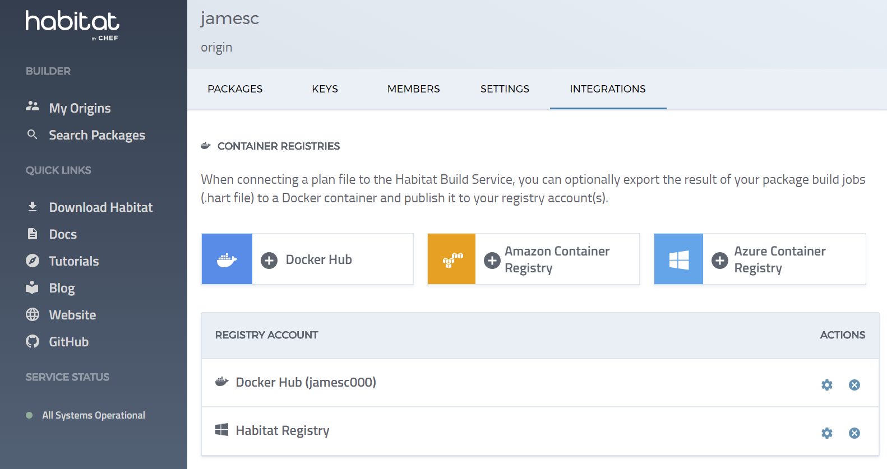
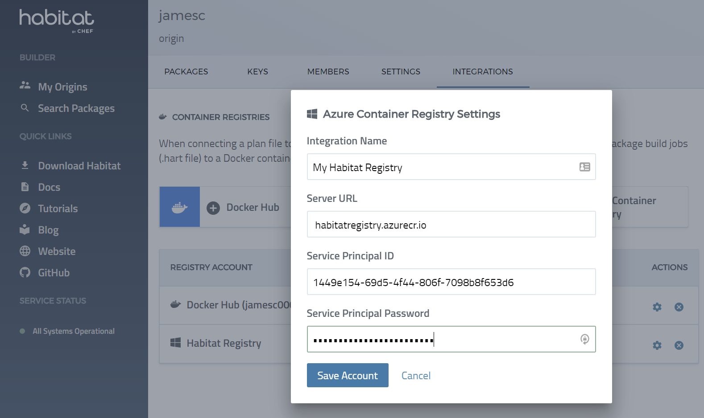
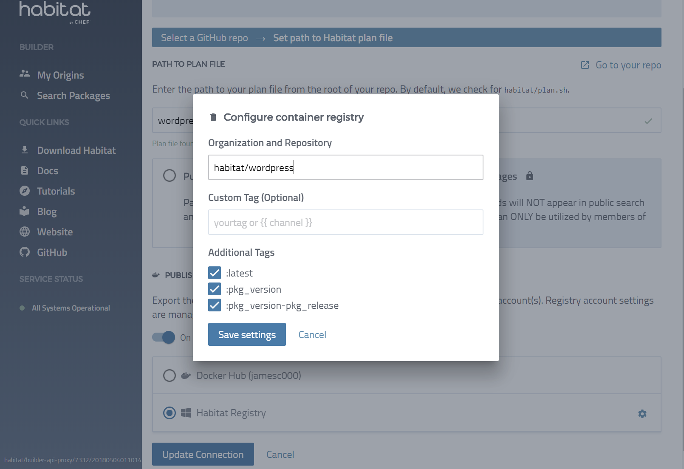
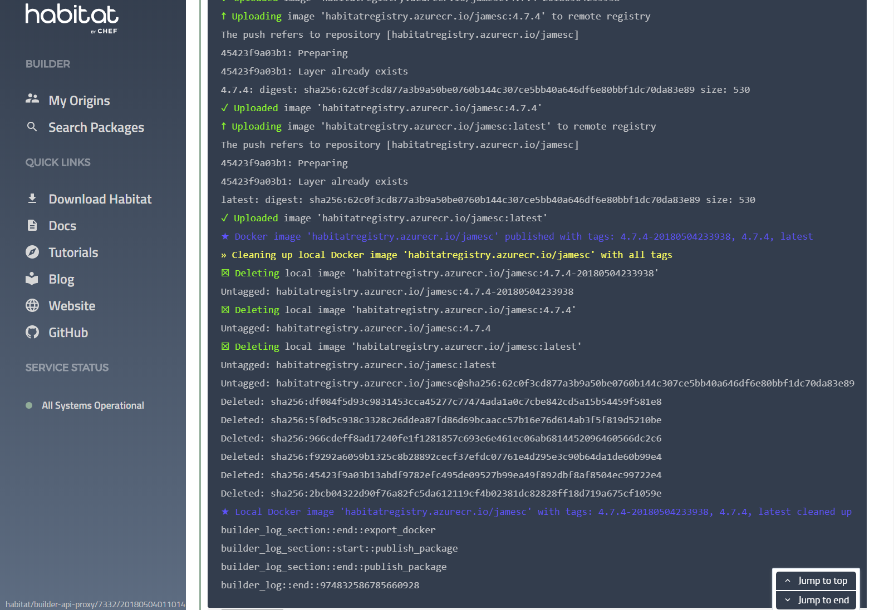
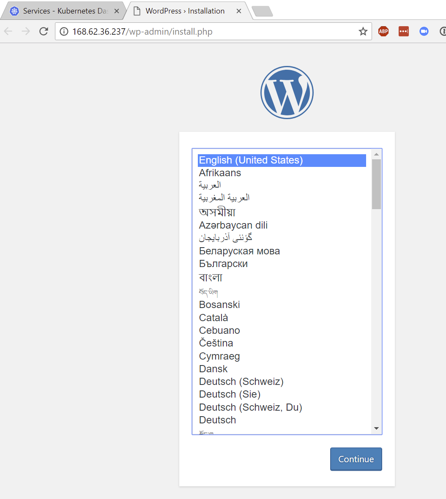

We recently added support in Habitat Builder for Azure Container Registry (ACR). With this integration you can export to Azure Container Registry as part of your build job and use those containers inside AKS.

In this walkthrough we'll show you how to setup the ACR integration in Habitat Builder and how to configure Azure Kubernetes Services to run the a sample Habitat application.

## What are the Azure Container Registry and Azure Kubernetes Service ?
Azure Container Registry is a managed Docker container registry service used for storing private Docker container images. It’s a fully managed Azure resource and gives you local, network-close storage of your container images when deploying to Azure.

Azure Kubernetes Service (AKS) is a fully managed hosted Kubernetes environment that makes it quick and easy to deploy and manage containerized applications without container orchestration expertise. It also eliminates the burden of ongoing operations and maintenance by provisioning, upgrading, and scaling resources on demand, without taking your applications offline.

Using both of them together allows you to quickly stand up a Kubernetes cluster along with a private repositgory to hold the containers.

## Walkthrough
We're going to use the `az` and `kubectl` command-line tools throughout this example. If you're using the Azure Cloud Shell both of these tools are already installed.

If you choose to install and use the CLI locally see  [Install Azure CLI](https://docs.microsoft.com/en-us/cli/azure/install-azure-cli?view=azure-cli-latest).  Once you have the Azure CLI installed it can download `kubectl`, the Kubernetes command line client, to manage the cluster:

```shell Azure CLI
$ az aks install-cli
```

All the code used in this example is available on GitHub at [https://github.com/jamesc/azure-habitat-example](https://github.com/jamesc/azure-habitat-example).

## Create AKS Cluster and ACR registry
First off we need to create a new cluster and registry. You can use the following script that will:

* Create a Azure Kubernetes Service Cluster
* Create a Azure Container Registry
* Grant access to the Registry for the service principal associated with the cluster
* Create a new Service Principal to be used by Habitat Builder to publish to the registry

The credentials for the Service Principal will be outputted by the script.  These will be used in the next step to configure Habitat Builder.

```shell setup-aks-acr.sh
#!/bin/sh
#
# Change these for your account
#
RESOURCE_GROUP="habitat-aks-demo"
AKS_CLUSTER_NAME="aks-demo"
ACR_NAME="habitatregistry"
BLDR_PRINCIPAL_PASSWORD="ThisIsVeryStrongPassword"
#
# No Need to change these
#
BLDR_PRINCIPAL_NAME="habitat-acr-registry"
AKS_NODE_COUNT=1
ACR_SKU="Basic"

#
# Setup AKS
#
az group create --name $RESOURCE_GROUP --location eastus
az aks create --resource-group $RESOURCE_GROUP --name $AKS_CLUSTER_NAME --node-count $AKS_NODE_COUNT --generate-ssh-keys
az aks get-credentials --resource-group $RESOURCE_GROUP --name $AKS_CLUSTER_NAME

#
# Setup ACR
#
az acr create --resource-group $RESOURCE_GROUP --name $ACR_NAME --sku $ACR_SKU

#
# Grant Reader access to ACR from AKS
#
CLIENT_ID=$(az aks show --resource-group $RESOURCE_GROUP --name $AKS_CLUSTER_NAME --query "servicePrincipalProfile.clientId" --output tsv)
ACR_ID=$(az acr show --name $ACR_NAME --resource-group $RESOURCE_GROUP --query "id" --output tsv)
az role assignment create --assignee $CLIENT_ID --role Reader --scope $ACR_ID

# Create Service Principal for Habitat Builder
az ad sp create-for-rbac --scopes $ACR_ID --role Owner --password "$BLDR_PRINCIPAL_PASSWORD" --name $BLDR_PRINCIPAL_NAME
BLDR_ID=$(az ad sp list --display-name $BLDR_PRINCIPAL_NAME  --query "[].appId" --output tsv)

echo "ID/Password for Habitat Builder Principal:"
echo "ID : $BLDR_ID"
echo "Password : $BLDR_PRINCIPAL_PASSWORD"
```


```shell Command Output
  $ ./setup-aks-acr.sh
Retrying role assignment creation: 1/36
Retrying role assignment creation: 2/36
...
...
...
Configuration Details for Habitat Builder:
  Server URL : habitatregistry.azurecr.io
  Service Principal ID : 1449e154-69d5-4f44-806f-7098b8f653d6
  Service Principal Password : ThisIsVeryStrongPassword

```
## Configure builder to export to the registry
Now that you have setup the registry you need to use the Habitat Builder user interface to add the Azure Container Registry to your origin.  This uses the configuration details outputted by the setup script.






## Connect your packages to the registry
The final step to be carried out in the Habitat Builder user interface is to connect a plan file (we're using the `wordpress` and `mysql` plans from the [GitHub repository](https://github.com/jamesc/azure-habitat-example)) and configure it to export it to our container registry.  First we do this for the `wordpress` package which has it's plan file at `wordpress/plan.sh`.



You can then trigger a new build of the package and follow progress in the live build output window of Habitat Builder.  You'll see a container being built and pushed to the registry.



Repeat these steps for the `mysql` package with a plan file at `mysql/plan.sh`. You can verify that the packages have been pushed using the `az` command-line.

```shell Verify Registry Contents
$ az acr repository list --name habitatregistry
[
  "habitat/mysql",
  "habitat/wordpress"
]
```
## Deploy the Habitat Operator to Kubernetes
The [Habitat Operator for Kubernetes](https://github.com/habitat-sh/habitat-operator) is the recommended way to integrate Habitat and Kubernetes into a unified whole. It leverages the Kubernetes API to unify communication between your Kubernetes clusters and Habitat Builder as it builds and manages your applications, and enables you to use both `kubectl` and the `hab` cli and keep all of your components in sync.

The following Kubernetes Deployment object installs the Habitat Operator in our cluster.

```yaml habitat-operator.yml
apiVersion: extensions/v1beta1
kind: Deployment
metadata:
  name: habitat-operator
spec:
  replicas: 1
  template:
    metadata:
      labels:
        name: habitat-operator
    spec:
      containers:
      - name: habitat-operator
        image: habitat/habitat-operator:v0.6.1
```

```shell Verify deployment of Habitat Operator
$ kubectl apply -f habitat-operator.yml
deployment.extensions "habitat-operator" created
$ kubectl get pods
NAME                                READY     STATUS    RESTARTS   AGE
habitat-operator-854d7dc494-jnf7n   1/1       Running   0          10s
```

## Deploy your application to AKS
Finally we're ready to deploy our application.  Our example Wordpress application consists of two components - the Wordpress server and the backend MySQL database.  The following Kubernetes configuration will:

* Create a Kubernetes secret with our MySQL credentials
* Deploy two Habitat packages (`habitat/wordpress` and `habitat/mysql`) from ACR
* Setup a Kubernetes load balancer to export our wordpress application port.

```yml deploy-wordpress.yml
apiVersion: v1
kind: Secret
metadata:
  name: mysql-user-toml
type: Opaque
data:
  # Each item needs to be base64-encoded.
  # Plain text content:
  #   app_username="wordpress"
  #   app_password="ThisIsSecret"
  #   bind='0.0.0.0'
  user.toml: YXBwX3VzZXJuYW1lPSJ3b3JkcHJlc3MiCmFwcF9wYXNzd29yZD0iVGhpc0lzU2VjcmV0IgpiaW5kPScwLjAuMC4wJwo=
---
apiVersion: habitat.sh/v1beta1
kind: Habitat
metadata:
  name: wordpress-db
customVersion: v1beta2
spec:
  v1beta2:
    image: habitatregistry.azurecr.io/habitat/mysql:latest
    count: 1
    service:
      name: mysql
      topology: standalone
      configSecretName: mysql-user-toml
---
apiVersion: habitat.sh/v1beta1
kind: Habitat
metadata:
  name: wordpress-app
customVersion: v1beta2
spec:
  v1beta2:
    image: habitatregistry.azurecr.io/habitat/wordpress:latest
    count: 1
    service:
      name: wordpress
      topology: standalone
      bind:
        - name: database
          service: mysql
          group: default
---
apiVersion: v1
kind: Service
metadata:
  name: wordpress-lb
spec:
  type: LoadBalancer
  ports:
  - name: web
    port: 80
    targetPort: 80
  selector:
    habitat-name: wordpress-app
```

Again we deploy this using `kubectl apply`.  After a few minutes both pods should be running:

```shell Verify deployment of the WordPress application and database pods
$ kubectl apply -f deploy-wordpress.yml
secret "mysql-user-toml" created
habitat.habitat.sh "wordpress-db" created
habitat.habitat.sh "wordpress-app" created
service "wordpress-lb" created
$ kubectl get pods
NAME                                READY     STATUS    RESTARTS   AGE
habitat-operator-854d7dc494-jnf7n   1/1       Running   0          2m
wordpress-app-0                     1/1       Running   0          2m
wordpress-db-0                      1/1       Running   0          2m
```

We can retrieve the external IP of the load balancer from Kubernetes:

```shell Check for load balancer details
$ $ kubectl get service wordpress-lb --watch
NAME           TYPE           CLUSTER-IP   EXTERNAL-IP     PORT(S)        AGE
wordpress-lb   LoadBalancer   10.0.91.26   168.62.36.237   80:32336/TCP   8m
```

And finally we can check that WordPress is up and running on the external IP.



## Summary
In this walkthrough you saw how to setup Habitat Builder, Azure Container Registry and Azure Container Services,creating a complete continuous deployment pipeline for your application.  This pattern can applied to any application packaged with Habitat creating a standard mechanism for you to run all your applications.

### Got questions?
* [Ask and answer questions on the Habitat forums](https://forums.habitat.sh/)
* [Chat with the Habitat Community on Slack](http://slack.habitat.sh/)
* [Learn more about Habitat](https://www.habitat.sh/)

### Read more:
* [Azure Kubernetes Service](https://azure.microsoft.com/en-us/services/container-service/kubernetes/)
* [Azure Container Registry](https://azure.microsoft.com/en-us/services/container-registry/)
* [Best Practices for Habitat and AKS](https://www.habitat.sh/docs/best-practices/#aks-and-habitat)
* [Sample code on GitHub](https://github.com/jamesc/azure-habitat-example)
