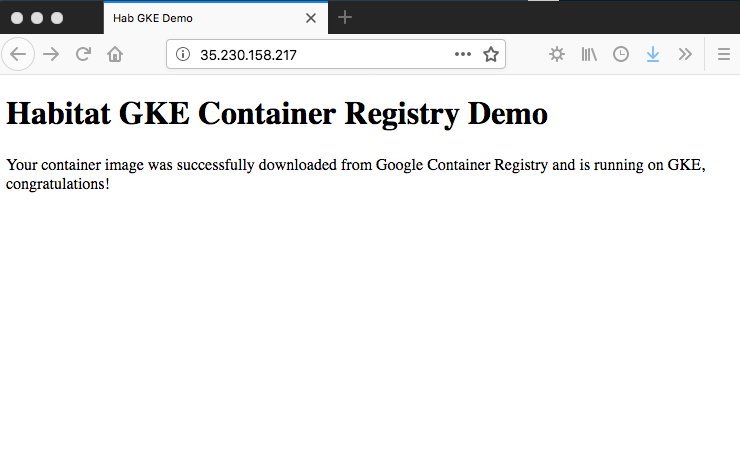

This short post will explore how we can use Chef Habitat and [Google Container Registry](https://cloud.google.com/container-registry/) to deploy a managed container to [Google Kubernetes Engine (GKE)](https://cloud.google.com/kubernetes-engine/) with [Chef Habitat Operator](https://github.com/habitat-sh/habitat-operator) already installed.

The example we will be following is [here](https://github.com/chef-partners/hab-gcr-demo).  Checking this out reveals the following structure:
```bash
$ tree hab-gcr-demo
hab-gcr-demo
├── README.md
├── config
│   ├── index.html
│   └── nginx.conf
├── default.toml
├── deploy-hab-gcr-demo.yml
├── hooks
│   ├── init
│   └── run
└── plan.sh
```

From a Chef Habitat perspective, the key lines of the `plan.sh` are as follows:
```
pkg_deps=(core/nginx)
pkg_exports=(
   [port]=http.server.port
)

do_build() {
  return 0
}

do_install() {
  return 0
}
```
This means we depend on the `core/nginx` maintained package and don't require any special build or installation setup.  This package will export a port which is important for us to see the `index.html` page when deployed at a later stage.  The configuration directory also includes a simple `nginx.conf` file.

## Build the Chef Habitat package and create the container image

With Chef Habitat installed locally, let's first trigger a build:
```
$ cd hab-gcr-demo/
$ hab pkg build .
   hab-studio: Creating Studio at /hab/studios/src (default)
   ...
```
This will create a `hart` file in the `results` folder according to the origin and package name e.g.
```
$ ls results/
habskp-hab-gcr-demo-0.1.0-20180711153450-x86_64-linux.hart	logs
last_build.env
```
From the Studio or otherwise, now execute the following to create a container image.  This is what we will upload to Google Container Registry.

```
$ hab pkg export kubernetes results/habskp-hab-gcr-demo-0.1.0-20180711153450-x86_64-linux.hart
```

This creates a Docker image with tags e.g.
```
$ docker images
REPOSITORY                                  TAG                     IMAGE ID            CREATED             SIZE
habskp/hab-gcr-demo                         0.1.0                   ed2580b52a3a        53 seconds ago      271MB
habskp/hab-gcr-demo                         0.1.0-20180711153450    ed2580b52a3a        53 seconds ago      271MB
habskp/hab-gcr-demo                         latest                  ed2580b52a3a        53 seconds ago      271MB
```

## Push the container image to GCR

The following command ensures we are authorized to push/pull images to Container Registry:
```
$ gcloud auth configure-docker
```
Now we run the following two commands to tag and push our image, note that the repository URI conforms to `[HOSTNAME]/[PROJECT-ID]/[IMAGE]:[TAG]`, more details [here](https://cloud.google.com/container-registry/docs/pushing-and-pulling):

```
$ docker tag habskp/hab-gcr-demo:latest eu.gcr.io/spaterson-project/hab-gcr-demo:latest
$ docker push eu.gcr.io/spaterson-project/hab-gcr-demo:latest
The push refers to repository [eu.gcr.io/spaterson-project/hab-gcr-demo]
567f6430b59f: Pushed
latest: digest: sha256:a9db7cc0cf186311eddde7d5f796b998b6aad5521d435ffa63ee572d0fb1d73a size: 529
```

## Deploy your application to GKE

With our image in the Container Registry we can deploy the application to Google Kubernetes Engine using the provided manifest:

```
$ cat deploy-hab-gcr-demo.yml
apiVersion: habitat.sh/v1beta1
kind: Habitat
metadata:
  name: hab-gcr-demo
customVersion: v1beta2
spec:
  v1beta2:
    image: eu.gcr.io/spaterson-project/hab-gcr-demo:latest
    count: 1
    service:
      name: hab-gcr-demo
      topology: standalone
---
apiVersion: v1
kind: Service
metadata:
  name: hab-gcr-demo-lb
spec:
  type: LoadBalancer
  ports:
  - name: web
    port: 80
    targetPort: 8080
  selector:
    habitat-name: hab-gcr-demo
```

This also creates a Kubernetes LoadBalancer to expose port `8080` from the container running nginx to a public IP address on port `80`.  This manifest can now be deployed to GKE:

```
$ kubectl apply -f deploy-hab-gcr-demo.yml
habitat "hab-gcr-demo" created
service "hab-gcr-demo-lb" created
$ kubectl get services hab-gcr-demo-lb
NAME              TYPE           CLUSTER-IP     EXTERNAL-IP      PORT(S)        AGE
hab-gcr-demo-lb   LoadBalancer   10.451.200.92   35.230.158.217   80:31696/TCP   1m
```

Navigating to the page we see the expected `index.html`:




## Summary
In this walkthrough you saw how to push a Chef Habitat managed application to GCR and how to deploy it to GKE.  Watch this space, Chef Habitat Builder integration for Google Container Registry is coming soon.  Thanks for reading!

### Got questions?
* [Ask and answer questions on the Chef Habitat forums](https://forums.habitat.sh/)
* [Chat with the Chef Habitat Community on Slack](http://slack.habitat.sh/)
* [Learn more about Chef Habitat](https://www.habitat.sh/)

### Read more:
* [Google Kubernetes Engine](https://cloud.google.com/kubernetes-engine/)
* [Google Container Registry](https://cloud.google.com/container-registry/)
* [Best Practices for Chef Habitat and GKE](https://www.habitat.sh/docs/best-practices/#gke-and-habitat)
* [Sample code on GitHub](https://github.com/chef-partners/hab-gcr-demo)
