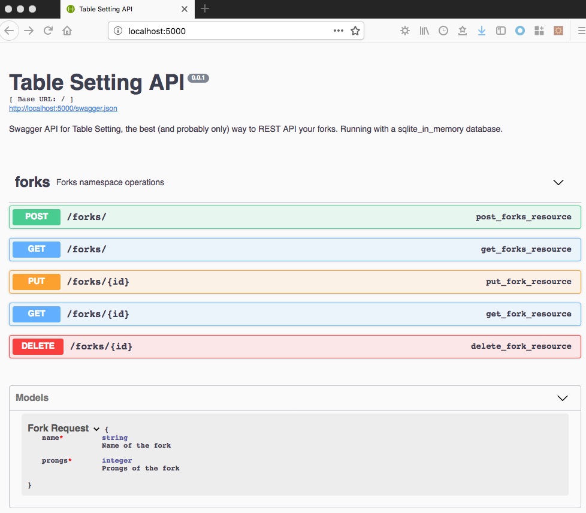
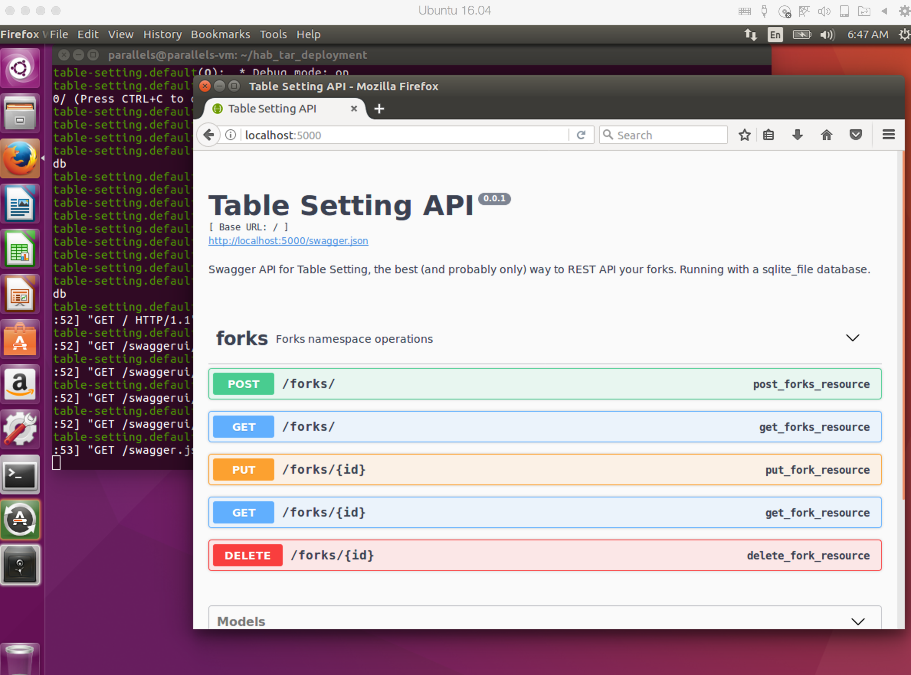
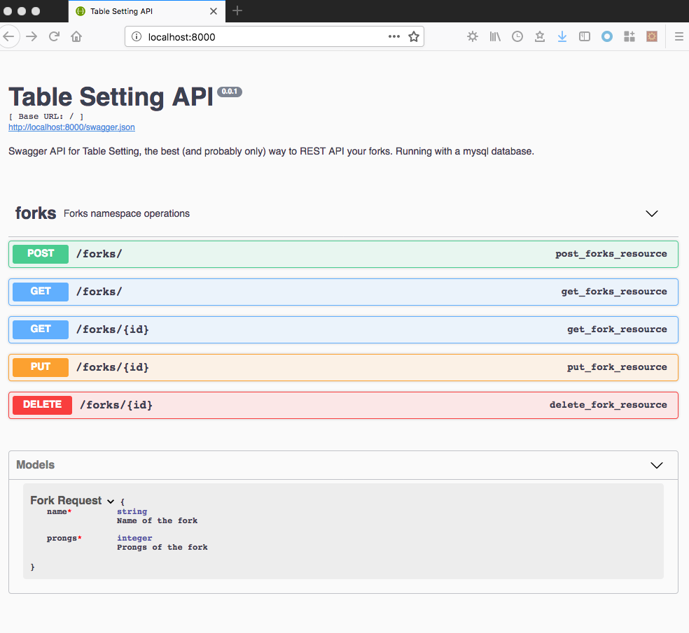
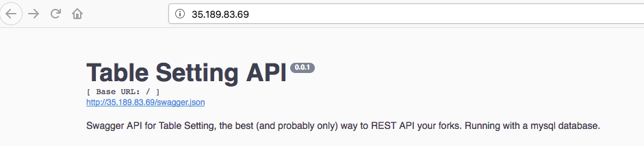
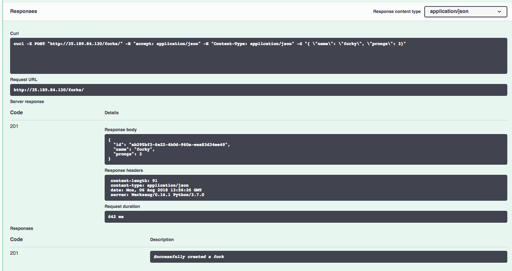
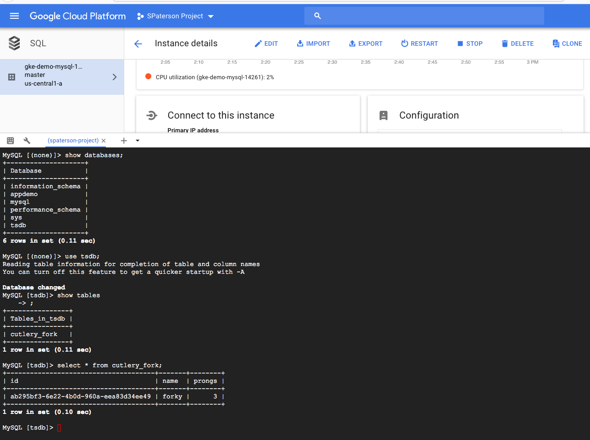

The world of application packaging and deployment can be viewed as a spectrum where at one end we have hand-crafted installation/run scripts on physical infrastructure and on the other are fully containerized applications making the most out of on Cloud native services.  Since most organisations don't start out fully Cloud-native or containerized a commonly heard phrase for increasing Cloud adoption is 'lift and shift'.  This is where applications are not re-architected but taken straight to the Cloud from an in-house deployment scenario.  The main advantage of 'lift and shift' is speed of Cloud adoption and reduction in physical infrastructure costs.  However, worth mentioning that this pattern often results in more expensive application deployments than those purpose-built to be there.  

In this post, the advantages of Habitat for application packaging will be explored by deploying the same application across several different contexts, including: 
* Bare metal or standalone VM 
* Running with docker-compose 
* Deploying to a Habitat-enabled Kubernetes cluster
* Deploying to a Habitat-enabled Kubernetes cluster using a Cloud-native database

There is extra effort required in packaging applications with Habitat. However, what you get in return is the ability to deploy almost anywhere different with relative ease at a later stage.  From installing  your application on a new physical box or choosing an entirely new Cloud provider, the process becomes simpler with Habitat packaged applications.  

## Setting the scene (or table)

The application we will be using is [here](https://github.com/skpaterson/table-setting).  Table Setting is a single-file Python web application that exposes a REST API for managing forks.  A Swagger user interface is exposed at the root URL to provide some interactivity.  For those interested, the application makes use of: Flask; Flask-RESTPlus; SQLAlchemy; Marshmallow and more. 

Table Setting can run with different backend databases, here we will use SQLite for an in-memory or file-based database and MySQL for a more realistic production example.  Whilst clearly not being production ready, Table Setting provides a realistic application plus database deployment scenario that could apply in many real-world cases. Since we are looking at a 'lift and shift' example, environment variables are used to convey configuration changes for simplicity.  

## Running Table Setting locally

Let's explore how to run Table Setting locally before getting started with Habitat.  As a prerequisite, Python 3.7 should be installed.  In fact Python 3.* should work but no promises!  This quickly brings us to the downside of shipping anything other than a single, executable artifact as disparity can easily creep in!  Quietly skipping over the potential trauma of ensuring we have the correct Python in our `PATH`, Table Setting can be run via:

````bash
$ git clone https://github.com/skpaterson/table-setting
$ cd table-setting
$ python -m venv tsenv
$ . tsenv/bin/activate
$ pip install -r requirements.txt
$ python run_app.py 
````

Navigating to [http://localhost:5000](http://localhost:5000) you should see the Table Setting Swagger UI:



Feel free to try creating some forks!  By default this runs with a clean SQLite in-memory database that is wiped on restart and fork CRUD operations are available. 

A user running even this simple application locally is perhaps unnecessarily exposed to several things:
* Source control with `git`
* Python language installation
* Virtual environment setup
* Python packaging with `pip` 
* Internal application structure e.g. where to find the thing to run

A similar list could likely be formulated for applications written in other languages.  In any case, this complicates life for performing any changes at a later stage e.g.
* Switching to a MySQL database backend
* Running on a new machine, or
* Moving to a (new) Cloud provider or service


## Packaging Table Setting with Habitat

The following directory structure within the Table Setting repository relates to Habitat packaging:

```bash
$ tree habitat/
habitat/
├── README.md
├── config
├── default.toml
├── hooks
│   ├── init
│   └── run
└── plan.sh
```
This incorporates a set of steps to install required dependencies, similar to those taken when running locally and also includes the MySQL library setup.  Table Setting explicitly depends on a known good Python version. Environment variables are used to convey runtime configuration to Table Setting, some are conditionally set when e.g. binding to a Habitat managed MySQL database.  

Let's concentrate for now on creating deployment artifacts with Habitat.  Below we use the Studio to export different package formats:
```bash
$ cd table-setting
$ hab studio enter
[STUDIO] build
[STUDIO] hab pkg export tar $(ls -1t results/*.hart | head -1)
[STUDIO] hab pkg export docker $(ls -1t results/*.hart | head -1)
```

We also use the Habitat maintained `core/mysql` image for some deployments, let's install and export that locally also:

```bash
[STUDIO] hab pkg install core/mysql
» Installing core/mysql
☁ Determining latest version of core/mysql in the 'stable' channel
☛ Verifying core/mysql/5.7.21/20180609181124
... output curtailed
★ Install of  core/mysql/5.7.21/20180609181124 complete with 25 new packages installed.
```

Note the package version from the installation command, we will now use this to export a Docker image locally:

```
[STUDIO] hab pkg export docker core/mysql/5.7.21/20180609181124
```

For reference, all of the plans built and maintained by the Habitat Core Team are [available here](https://github.com/habitat-sh/core-plans).

The resulting artifacts are all we need for the deployment scenarios below.

## Bare metal or standalone VM deployment

Let's assume we want to deploy Table Setting to an Ubuntu machine and use a file-based SQLite database backend.  In a real-world setup the versioned `tar` deployment file might be stored in a dedicated artifact repository but we will assume it is locally available on the target machine here.

Relying on the Habitat package naming convention, we can run the package as follows:

```bash
$ cat hab_tar_deployment_ubuntu.sh
#!/bin/bash
# one-time setup - packages can specify a linux user to run under, by default this is the hab user 
sudo adduser --disabled-password --gecos "" hab
# assumes local package file
sudo tar zxvf *-table-setting*.tar.gz -C /
# run app in SQLite file mode
export DB_TYPE=sqlite_file
# install and run with the habitat supervisor
sudo /hab/bin/hab sup run &
sudo /hab/bin/hab svc load habskp/table-setting
```

Running this on a locally running Ubuntu VM looks as follows:




This is arguably simpler than the steps in the previous section.  We've already successfully decoupled a lot of the package internals from the deployment process.  Although some knowledge is required to run the `tar` Habitat package locally, this would be a similar set of steps for *any* Habitat package.  Now let's see what else we can do. 

## Running with Docker Compose

For this case, let's take a look at the Docker Compose manifest in the root of the Table Setting repository:

```bash
$ cat docker-compose.yml
version: '3'
services:
    mysql:
        image: core/mysql
        environment:
          HAB_MYSQL: |
            bind = '0.0.0.0'
            app_username = 'tablesetting'
            app_password = 'tablesetting'
            root_password = 'notverysecure'
    tablesetting:
        image: habskp/table-setting
        ports:
          - 8000:8000
        environment:
          - APP_PORT=8000
          - DB_TYPE=mysql
          - DB_USER=tablesetting
          - DB_PASSWD=tablesetting
        command: --peer mysql --bind database:mysql.default
        restart: on-failure
        depends_on:
          - mysql
```

The `core/mysql` image previously exported is used 'as is' with some additional environment setup.  For this we use `HAB_MYSQL` and add the corresponding settings to the variables expected by the Table Setting application.  

Run this locally from the root of the repository via the following command:

```bash
$ docker-compose up
```

We can now see the application running on port `8000` against a `mysql` database backend:



At first this might seem like another variant of running locally but having a working setup with `docker-compose` makes it easy to deploy to e.g. AWS ECS, see [this post](https://blog.chef.io/2016/11/07/habitat-amazon-elastic-container-service/) for more details. 

## Prerequisites for Kubernetes cluster deployment 

Transitioning to a Kubernetes cluster at this point might seem like a big leap but to our advantage we have already exported the required Habitat package artifacts.
 
In the next two sections we will be deploying to [Google Kubernetes Engine (GKE)](https://cloud.google.com/kubernetes-engine/) with [Habitat Operator](https://github.com/habitat-sh/habitat-operator) already installed.  Similarly to the steps described [here](https://www.habitat.sh/blog/2018/07/habitat-gcr-and-gke/) we will upload our artifacts to [Google Container Registry](https://cloud.google.com/container-registry/) for convenience in our manifest.  As an example, the following commands would upload our exported Table Setting image to GCR:

```bash
# assumes docker and gcloud are installed locally
$ gcloud auth configure-docker
$ docker tag habskp/table-setting:latest eu.gcr.io/spaterson-project/table-setting:latest
$ docker push eu.gcr.io/spaterson-project/table-setting:latest
```

Also worthwhile to comment that although GCP was chosen for this post, the same artifacts could be deployed in the same way to other Cloud provider container registries and Kubernetes clusters simply by supplying the appropriate deployment manifest files. 

## Deploying to a Habitat-enabled Kubernetes cluster

The below manifest deploys the Habitat managed MySQL and Table Setting images uploaded to [Google Container Registry](https://cloud.google.com/container-registry/).  Similar environment variables as before are set to configure the database:

```bash
$ cat gke-gcr-hab-core-mysql-sample.yml
---
apiVersion: habitat.sh/v1beta1
kind: Habitat
metadata:
  name: database
  labels:
    app: table-setting-hab-db
customVersion: v1beta2
spec:
  v1beta2:
    image: eu.gcr.io/spaterson-project/mysql:latest
    count: 1
    env:
      - name: HAB_MYSQL
        value: "bind = '0.0.0.0'\napp_username = 'tablesetting'\napp_password = 'tablesetting'\nroot_password = 'notverysecure'"
    service:
      name: mysql
      topology: standalone
---
apiVersion: habitat.sh/v1beta1
kind: Habitat
metadata:
  name: table-setting-app
  labels:
    app: table-setting-hab
customVersion: v1beta2
spec:
  v1beta2:
    image: eu.gcr.io/spaterson-project/table-setting:latest
    count: 1
    env:
      - name: DB_TYPE
        value: mysql
      - name: DB_USER
        value: tablesetting
      - name: DB_PASSWD
        value: tablesetting
    service:
      name: table-setting
      topology: standalone
      bind:
        - name: database
          service: mysql
          group: default
---
apiVersion: v1
kind: Service
metadata:
  name: table-setting-lb
spec:
  type: LoadBalancer
  selector:
    habitat-name: table-setting-app
  ports:
  - port: 80
    targetPort: 5000
```

As a future improvement to the above, configuration could be conveyed via Habitat's `user.toml` mechanism, more details on that [here](https://github.com/habitat-sh/habitat-operator/tree/master/examples/config). 

Run the following to deploy this manifest on our Habitat enabled Kubernetes cluster:

```
$ kubectl create -f gke-gcr-hab-core-mysql-sample.yml
habitat "database" created
habitat "table-setting-app" created
service "table-setting-lb" created
```

Next, wait for an external IP address to be assigned:

```bash
$ kubectl get service table-setting-lb
NAME               TYPE           CLUSTER-IP      EXTERNAL-IP    PORT(S)        AGE
table-setting-lb   LoadBalancer   10.51.245.180   35.189.83.69   80:30871/TCP   2m
```

Navigating to this external IP shows the expected UI:



From here we could explore setting up a cluster of MySQL databases as described [here](https://blog.chef.io/2017/03/08/what-can-you-do-with-habitat-today/) or alternatively look to becoming more Cloud native.

## Deploying to a Habitat-enabled Kubernetes cluster using a Cloud-native database

Here we will demonstrate using [Kubernetes Service Catalog](https://kubernetes.io/docs/concepts/service-catalog/)
and a [Google Cloud Platform Service Broker](
https://cloud.google.com/kubernetes-engine/docs/concepts/add-on/service-broker),
an implementation of the [Open Service Broker](
https://www.openservicebrokerapi.org/) standard, to provision a Cloud SQL (MySQL) instance instead of relying on our own image from the last section.

In addition to the previous Kubernetes prerequisites, more steps are required to use Cloud SQL.  Thankfully these are described in detail [here](https://github.com/GoogleCloudPlatform/kubernetes-engine-samples/tree/master/service-catalog/cloud-sql-mysql).  For those interested, stopping at the end of Step 3.2 and replacing the service account and web container image link details in the below manifest should allow you to reproduce.  The manifest itself now looks like this and honours the `cloud-mysql` namespace used in the Kubernetes Engine sample:

```bash
$ cat gke-gcr-cloud-sql-sample.yml
apiVersion: apps/v1beta2
kind: Deployment
metadata:
  name: table-setting
  namespace: cloud-mysql
  labels:
    app: table-setting
spec:
  selector:
    matchLabels:
      app: table-setting
  template:
    metadata:
      labels:
        app: table-setting
    spec:
      containers:
        - name: web
          image: eu.gcr.io/spaterson-project/table-setting:latest
          ports:
            - containerPort: 5000
          env:
            - name: DB_TYPE
              value: mysql
        - name: cloudsql-proxy
          image: gcr.io/cloudsql-docker/gce-proxy:1.11
          env:
            - name: CONNECTION_NAME
              valueFrom:
                secretKeyRef:
                  name: cloudsql-credentials
                  key: connectionName
          command: ["/cloud_sql_proxy",
                    "-instances=$(CONNECTION_NAME)=tcp:3306",
                    "-credential_file=/secrets/cloudsql/privateKeyData"]
          volumeMounts:
            - name: mysql-service-account-6041
              mountPath: /secrets/cloudsql
              readOnly: true
      volumes:
        - name: mysql-service-account-6041
          secret:
            secretName: mysql-service-account-6041
        - name: cloudsql
          emptyDir:
---
apiVersion: v1
kind: Service
metadata:
  name: cloudsql-user-service
  namespace: cloud-mysql
  labels:
    app: table-setting
spec:
  selector:
    app: table-setting
  ports:
  - port: 80
    targetPort: 5000
  type: LoadBalancer
```

Deploy the application via:

```bash
$ kubectl create -f gke-gcr-cloud-sql-sample.yml
deployment "table-setting" created
service "cloudsql-user-service" created
```

As in the previous example, we wait until an external IP address is assigned:
 
```bash
$ kubectl get service cloudsql-user-service --namespace cloud-mysql
NAME                    TYPE           CLUSTER-IP      EXTERNAL-IP    PORT(S)        AGE
cloudsql-user-service   LoadBalancer   10.51.247.227   35.189.84.130   80:30712/TCP   2m
```
 
Navigating to our very familiar UI, let's create a fork:



Finally, let's use the cloud shell in GCP UI to explore the database and confirm things are working as expected:



So we're now successfully making use of a Cloud SQL database with our Habitat managed application, congratulations if you made it this far!

## Other Habitat Features

At this point it would be remiss not to mention the many complimentary Habitat features that were completely skipped over in the above e.g. we didn't touch upon Supervisor, Builder, Depot, Package updates, binds and exports ...  Thankfully there are plenty of [blog posts](https://www.habitat.sh/blog) and [other documentation](https://www.habitat.sh/docs) to remedy that!  

## Summary
In this post we explored several different deployment scenarios for a Habitat packaged application, from bare metal to running on a Kubernetes cluster with Cloud based database.  Whether your organisation is staying on-premise, in the middle of lifting and shifting, or even expanding to new Cloud providers, hopefully this has shown how Habitat can make packaging and deployment easier. Thanks for reading! 

### Got questions?
* [Ask and answer questions on the Habitat forums](https://forums.habitat.sh/)
* [Chat with the Habitat Community on Slack](http://slack.habitat.sh/)
* [Learn more about Habitat](https://www.habitat.sh/)

### Read more:
* [Blog Post - Habitat, GCR and GKE](https://www.habitat.sh/blog/2018/07/habitat-gcr-and-gke/)
* [Best Practices for Habitat and GKE](https://www.habitat.sh/docs/best-practices/#gke-and-habitat)
* [Sample Table Setting code on GitHub](https://github.com/skpaterson/table-setting)