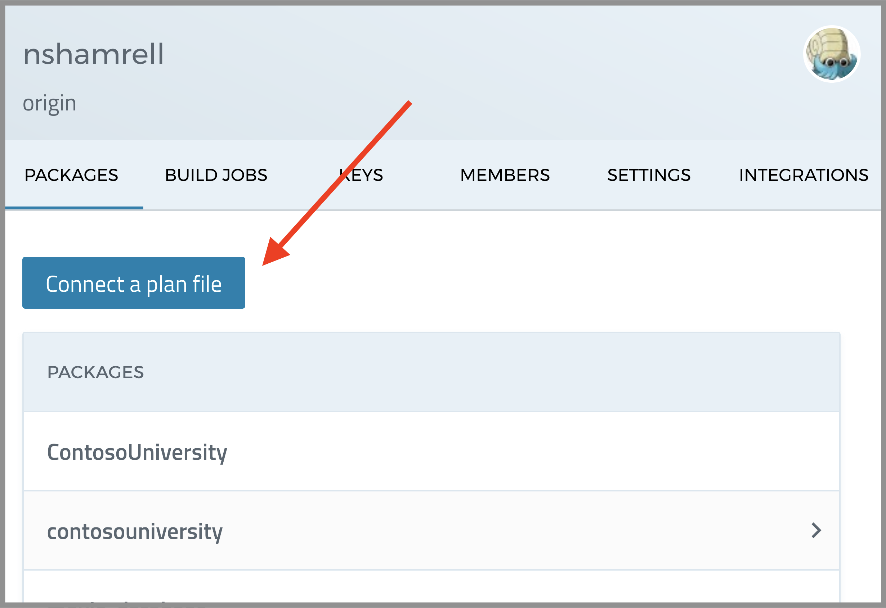
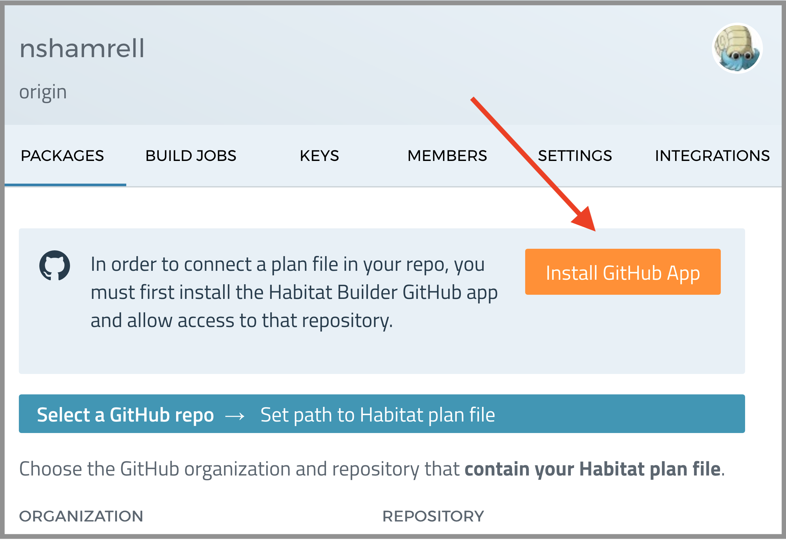
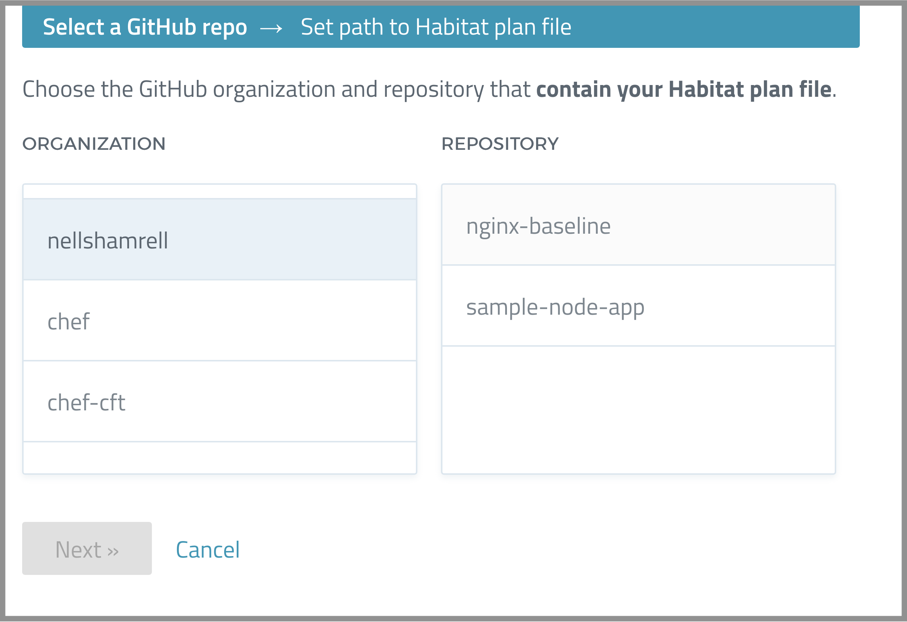
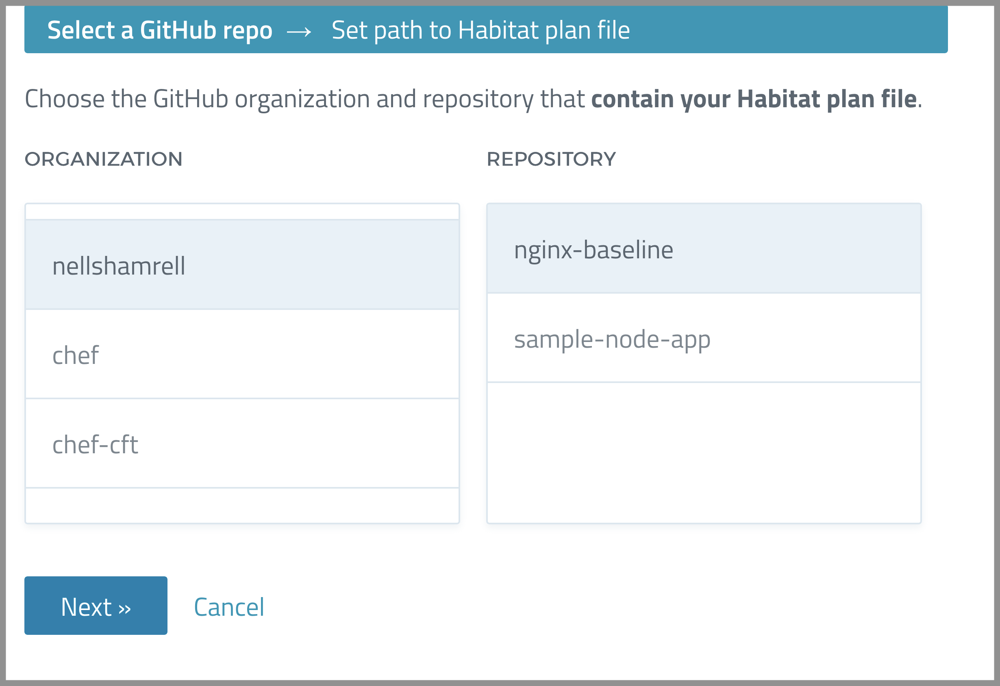
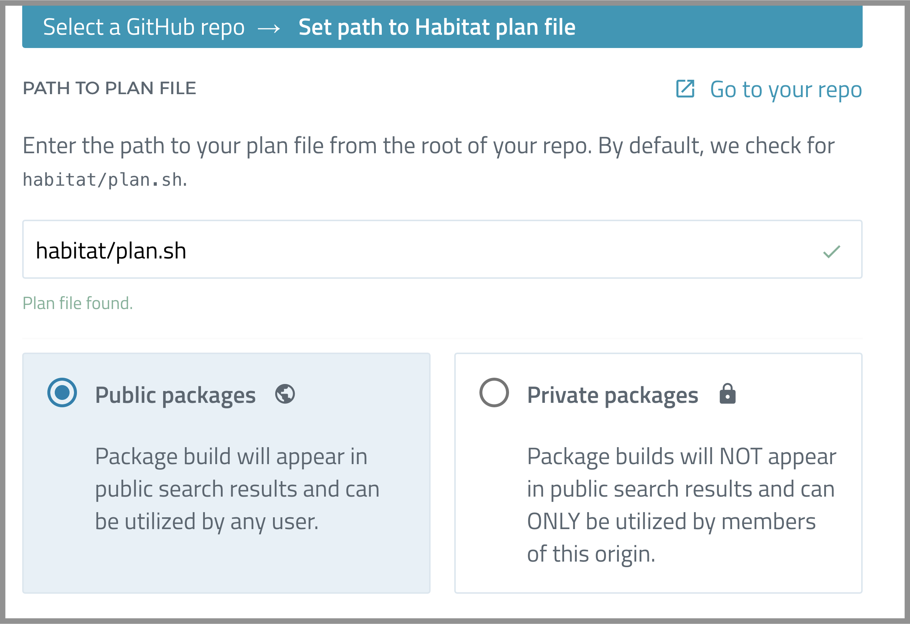
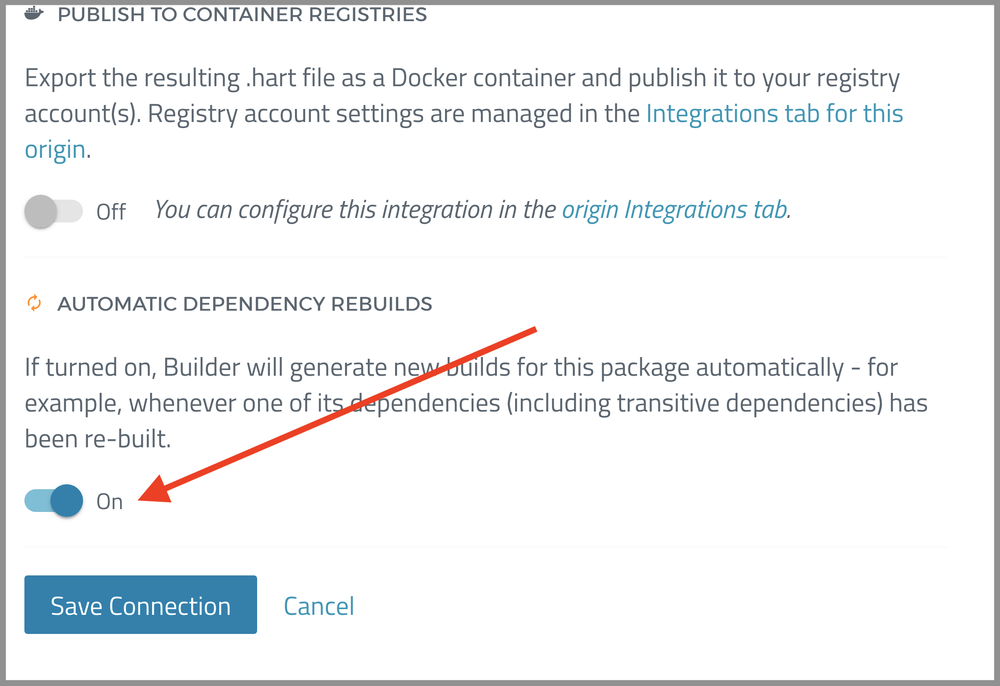
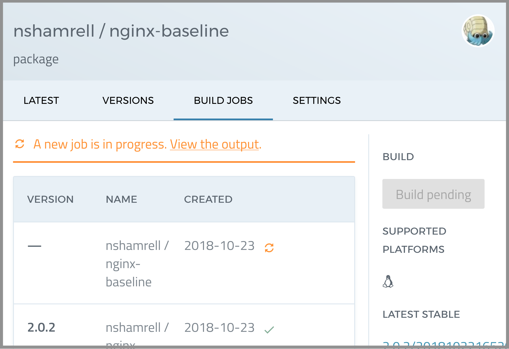
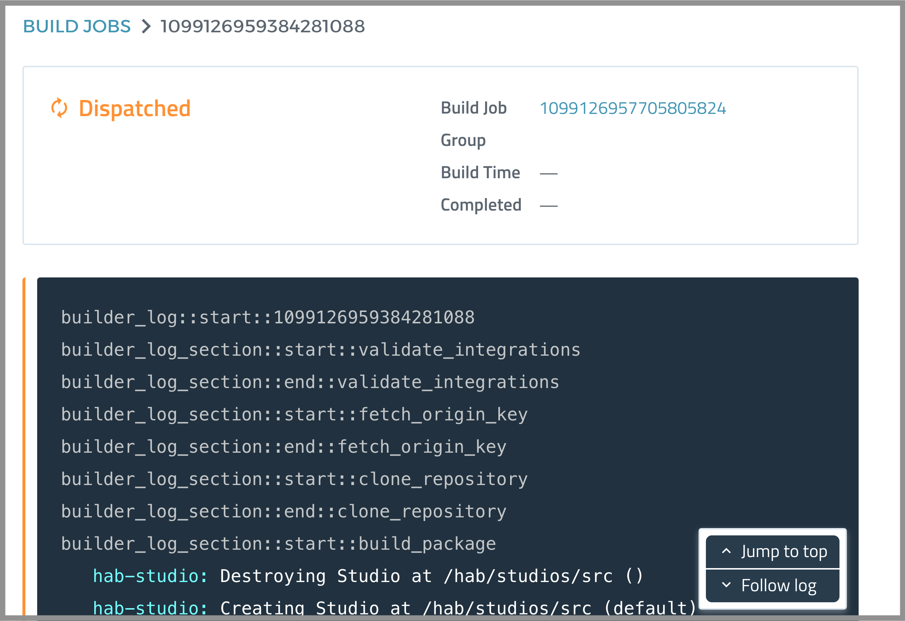
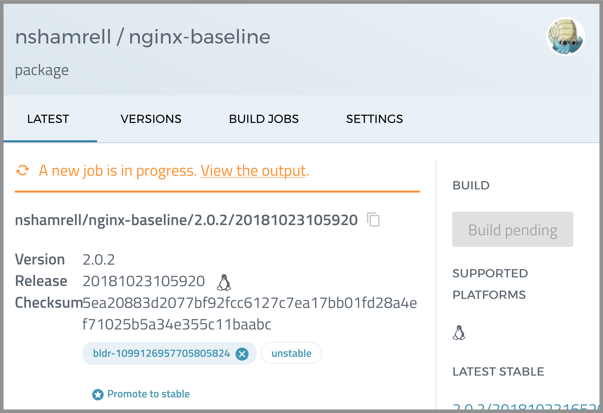
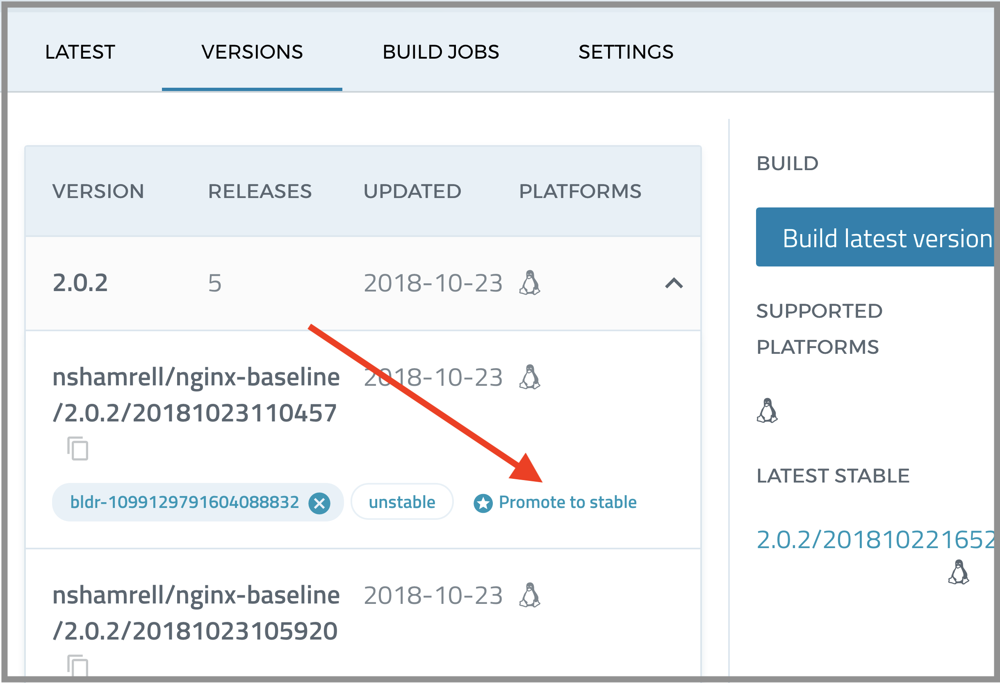

Let's package an InSpec profile for distribution with Habitat!

### Wait a minute...isn't there already an InSpec/Habitat integration?

Yes, there is, and it is awesome. [You can check out the docs here](https://www.inspec.io/docs/reference/habitat/). This integration creates a Habitat package (a HART artifact) which includes the profile itself, the latest version of InSpec, and the Habitat Supervisor.

However, this integration currently does not easily allow integration with Builder as, when run from within the directory of an InSpec profile, it does not create a habitat directory with a plan inside.

The purpose of this post is to show you how you can harness Builder's Github integration feature to automatically trigger new builds for your profiles whenever you commit a change to master. Additionally, you will also be able to take advantage of Builder's dependency management features. If your profile depends on another Builder package and that package is updated, Builder will automatically rebuild your package as well. This is one of the main advantages of Builder.

We could, of course, modify the integration to allow for this - but let's explore a different way for now.

## Pre-requisites
* A GitHub account
* Git installed on your workstation
* An account on [Builder](https://bldr.habitat.sh)
* An origin on Builder (see [these docs](https://www.habitat.sh/docs/using-builder/) for assistance)
* Habitat installed on your workstation (see [these docs](https://www.habitat.sh/docs/install-habitat/) for assistance)

## Setup

* Go ahead and fork this [nginx-baseline profile repo](https://github.com/dev-sec/nginx-baseline) to your personal Github account.
* Clone this repo to your workstation and change directories into it.

```
$ git clone git@github.com:<YOUR GITHUB NAME>/nginx-baseline.git
$ cd nginx-baseline
```

* Now, let's initialize Habitat

```
$ hab plan init
(...)
★ An abode for your code is initialized!
```

* This will create a "habitat" directory in this repo, along with a plan.sh file. Let's take a look at that file:

**plan.sh**
```
pkg_name=nginx-baseline
pkg_origin=<YOUR ORIGIN>
pkg_version="0.1.0"
pkg_scaffolding="core/scaffolding-ruby"
```

* Because InSpec profiles are written in ruby, Habitat automatically assumed we were creating a plan for a Ruby application and assumed it should use the ruby scaffolding.

* We don't need this scaffold for our purposes today, so let's remove that line

**plan.sh**
```
pkg_name=nginx-baseline
pkg_origin=nshamrell
pkg_version="0.1.0"
```

* Then add in this content (note that I've modified the pkg_version string to match the version of nginx-baseline):

**plan.sh**
```
pkg_name=nginx-baseline
pkg_origin=<YOUR ORIGIN>
pkg_version="2.0.2"
pkg_maintainer="The Habitat Maintainers <humans@habitat.sh>"
pkg_license=("Apache-2.0")
pkg_source=https://github.com/<YOUR GITHUB NAME>/nginx-baseline/archive/2.0.2.tar.gz
pkg_shasum="b546c3940ce03d72f4bbb77503ecf792fd54e608cd729f6511c03e11c5cd0727"
pkg_deps=(chef/inspec)
pkg_bin_dirs=(bin)

do_build() {
    return 0
}

do_install() {
    # Add InSpec to bin for packaged profile
    cp $(pkg_path_for inspec)/bin/inspec $pkg_prefix/bin/inspec

    # Copy profile code into easily accessible directory
    mkdir $pkg_prefix/$pkg_name
    cp -r ./* $pkg_prefix/$pkg_name
}
```

* Now, let's build this and see it in action.

```
$ hab studio enter
(studio) $ build
(studio) $ hab pkg binlink <YOUR ORIGIN>/nginx-baseline
(studio) $ inspec exec $(hab pkg path nshamrell/nginx-baseline)/nginx-baseline
```

* And you should see the profile run (it will likely skip all controls unless you have nginx running in your studio).

* Go ahead exit out of the studio, then commit this change to GitHub:

```
(studio) $ exit
$ git add .
$ git commit -m 'habitization start'
$ git push origin master
```

## Connecting to Builder

* Now, let's get this integrated into Builder. Open up your favorite web browser and navigate to [https://bldr.habitat.sh](https://bldr.habitat.sh)


* And head into your preferred origin and click the "Connect a plan file" button.



* If you have not already installed the Habitat Builder GitHub app, click the big orange button and go through the process



* Now, back at the "Connect a plan file" page, select your GitHub organization that contains your nginx-baseline repo (mine is "nellshamrell")



* Then select your nginx-baseline repo



* And click "Next"

* It should find your plan file in habitat/plan.sh automatically



* Make sure to turn on autobuilds and then click "Save Connection"



* And you'll see your connected plan! Go ahead and click "Build Jobs", then "Build Latest Version"


* And you'll see a new build start



* Now take a look at the Build output



* It should take a minute or two, and eventually you will see this output

```
Script done, file is /src/results/logs/nginx-baseline.2018-10-23-100703.log
builder_log_section::end::build_package
builder_log_section::start::publish_package
builder_log_section::end::publish_package
builder_log::end::1099100647114375168
```

## Making a Change and Auto-rebuild

* Now, let's make a change to plan. Head on back to you workstation and the nginx-baseline repo directory.

* Open up controls/nginx_spec.rb and comment out this section.

**controls/nginx_spec.rb**
```
#control 'nginx-01' do
#  impact 1.0
#  title 'Running worker process as non-privileged user'
#  desc 'The NGINX worker processes should run as non-privileged user. In case of compromise of the process, an attacker has full access to the system.'
#  describe user(nginx_lib.valid_users) do
#    it { should exist }
#  end
#  describe parse_config_file(nginx_conf, options) do
#    its('user') { should eq nginx_lib.valid_users }
#  end

#  describe parse_config_file(nginx_conf, options) do
#    its('group') { should_not eq 'root' }
#  end
#end
```

* This effectively removes this control from this profile. Save and exit the file, then commit it to master (yes, this would normally be done via Pull Request, but I've simplified the process for this example).

```
$ git add .
$ git commit -m 'removes control'
$ git push origin master
```

* Now, head back to Builder and look at the page for your package - you should see that a new build has been automatically triggered:



* When the build is complete, it will automatically be put in the "unstable" branch - go ahead and promote it to stable:



* And you have a fresh new stable build!

## Using the Packaged Profile

* This example involves running the Profile on a virtual machine (VM) - you can also run it anywhere you can run Habitat.

* Create new virtual machine (VM) in AWS (or Azure, GCP, etc.)
* SSH into that VM
* Install Habitat

```
$ curl https://raw.githubusercontent.com/habitat-sh/habitat/master/components/hab/install.sh | sudo bash
```

* Install the package you just created

```
$ sudo hab install nshamrell/nginx-baseline
$ sudo hab pkg binlink nshamrell/nginx-baseline
```

* Run the inspec profile

```
$ sudo inspec exec $(hab pkg path nshamrell/nginx-baseline)/nginx-baseline
```